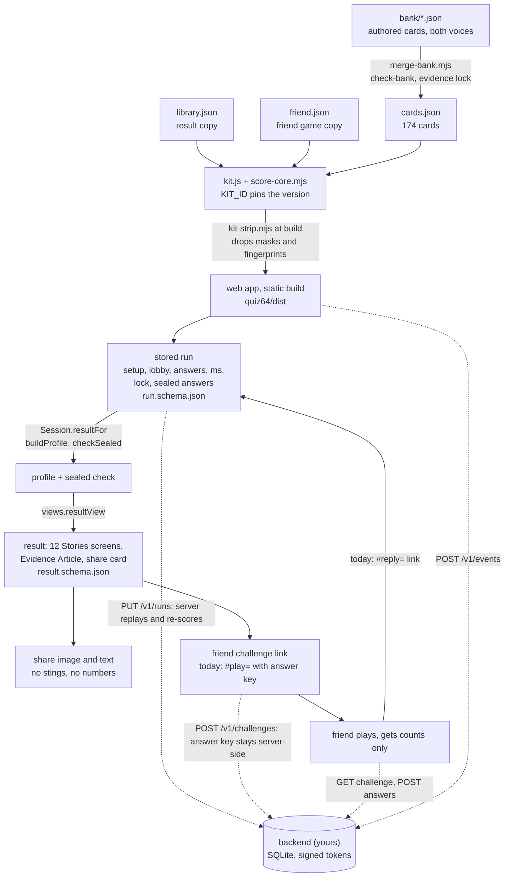

# Handoff for Desmond: the friend game and backend

**What you are picking up.** The MirrorMii launch survey: a phone-first web game where Genii (a glass slime) serves 40 quick cards, locks 8 guesses, plays 8 sealed cards, then reveals a 12-screen Stories result, an Evidence Article and a friend challenge ("Do you really know me?"). Everything runs in the browser today: no backend, accounts or analytics. Your part is the backend that makes the friend game safe and synced, plus deployment. The game, the question pack, the scorer, the evidence and the result copy are done and tested.

Read in this order (about 30 minutes):

1. This page.
2. [contracts/README.md](contracts/README.md), then [contracts/api.md](contracts/api.md) and [contracts/friend-challenge.md](contracts/friend-challenge.md).
3. [../quiz64/README.md](../quiz64/README.md): run, test, build, QA, folder map.
4. [LAUNCH-SPEC.md](LAUNCH-SPEC.md) sections 1, 4, 7, 14, 15, 17 and 25 (the product rules; the spec wins over anything else).
5. [question-pack/QUESTION-PACK.md](question-pack/QUESTION-PACK.md) if you touch content.

```sh
# from products/survey/, Node 22
npm ci --prefix quiz64
npm run dev --prefix quiz64 -- --port 5195     # the game at http://127.0.0.1:5195/
npm test --prefix quiz64                       # app tests, including the contract checks
node scripts/validate-contracts.mjs            # the backend contracts against real runs
(cd research/persona-quiz-v2/final && node --test tests.mjs)   # scorer and kit tests
```

## How data flows



Solid lines exist today; dotted lines are yours ([contracts/api.md](contracts/api.md)).

## What exists (built and tested)

| Part | Where | Notes |
|---|---|---|
| Question pack | `research/persona-quiz-v2/final/bank/`, merged `cards.json` | 174 cards (138 chapter, 12 extras, 24 sealed), 13 formats, two voices. Export: [question-pack/](question-pack/) |
| Evidence and scorer | `score-core.mjs`, `card-schema.mjs`, `evidence-lock.json` | One deterministic scorer for app, CLI, sim and tests. Sim: axis recovery about 95%, Genii's sealed guesses about 67% exact (chance 25%) |
| Result copy | `library.json` | Archetypes, stats, tags, rooms, insights, article frames, both voices |
| Web game | `quiz64/` | Setup, lobby, picker (40 + 8), lock, Stories reveal, share image, friend game v1 |
| Run state | `quiz64/src/persona/session.js` | Pure functions; a save is replayed card by card before use; Node runs it unchanged |
| Friend game v1 | `friend.js`, `links.js`, `FriendGame.jsx` | 4 relationships, 3 or 4 levels, owner comparison and ranking, all on URL-fragment links |
| Contracts | [contracts/](contracts/) | JSON Schemas for run, result, cards, library, friend content and friend links (today and proposed), events, API, reference mappings, examples, a validator in the test suite |

## What is yours

| Yours | Not yours (ask Jerry) |
|---|---|
| The backend service, storage (SQLite, LAUNCH-SPEC section 16), signed links, reply sync, delete-my-data on the server | Card content, tags, archetype names, result copy (Jerry changes them freely; ids stay) |
| The app's network layer (new modules; reuse [contracts/records.mjs](contracts/records.mjs)) | Scoring rules and thresholds (`score-core.mjs` `CONFIG`, LAUNCH-SPEC section 11) |
| Analytics wiring per [contracts/events.md](contracts/events.md) | Visual design (quiz64/docs/DESIGN-DIRECTION.md) |
| Hosting, domain, deployment, the placeholders below | Pushing or publishing anything: needs Jerry's go |

## Build order we recommend

| Step | Build | Done when |
|---|---|---|
| 1 | Service skeleton: Node, SQLite, the kit loaded by `KIT_ID`, schemas loaded in Ajv 2020 | `PUT /v1/runs` accepts `docs/contracts/examples/run.json`, replays it with `Session.restore`, returns the same record as `examples/result.json` |
| 2 | Tokens: HMAC run and challenge tokens, rate limits, CORS | a tampered token or run gets 401 or 409; limits return 429 |
| 3 | Friend challenge server-side: `POST /v1/challenges`, `GET /v1/challenges/{token}`, `POST .../answers` | the friend's device never receives the answer key (`publicChallenge`); scoring matches `scoreFriendGame` on the examples |
| 4 | Owner sync: challenges list, comparison, ranking, delete | a reply shows on a second device with the run token |
| 5 | App network layer behind a flag; old `#play=` and `#reply=` links keep working | `npm test` green, both paths played through (`quiz64/qa/play-through.mjs`) |
| 6 | Real placeholders (APP_LINK, share URL, link base), share page if wanted | Jerry approves the links |
| 7 | Analytics per events.md | the funnel reads end to end on a test run; no fragment, answer or identifier leaves the device |
| 8 | Deploy (below) | Jerry's go |

Tooling line (proposals, build over buy): Node 22 with Fastify or Hono, `better-sqlite3` (or Node's built-in `node:sqlite`, still experimental in 22), `node:crypto` HMAC for tokens (no JWT library needed), Ajv 2020 for the schemas. Hosting options: a small VM or Fly.io for Node plus SQLite; Cloudflare Workers with D1 also works because the app modules are plain JS, but check the JSON import attributes there first. Analytics: the `/v1/events` table first (build); self-hosted PostHog or Plausible only if the table falls short.

## Placeholders and stubs

| Where | What | Today |
|---|---|---|
| `quiz64/src/persona/stories/story-data.js` `APP_LINK` | the Get MirrorMii button | `"#get-mirrormii"` (public app link not decided) |
| `quiz64/src/persona/stories/story-data.js` `SHARE_URL_LABEL` | the address printed on the share image | `"mirrormii.ai"` (no digits allowed on the image) |
| `quiz64/src/persona/links.js` `linkFor(kind, payload, base)` | link base for challenge and reply links | the current page's origin and path; a backend issues `/c/{token}` short links instead |
| `quiz64/src/persona/friend.js` `invitesFor` | invite lines per relationship with conditions | not used by the UI (the panel uses `inviteText`) |

## Known limits today

- **Unsigned links, answer key in the link.** `#play=` carries the Level 1 to 4 truth; a friend who decodes the base64 can cheat, and the 8-hex SHA-256 is a damage check, not a signature. Approved for testing only (LAUNCH-SPEC section 19 item 8): a backend is needed before real players.
- **No sync.** A reply must be opened in the browser that holds the owner's run. Clearing storage loses the run and every link.
- **No accounts, no analytics, no server.** Storage is `localStorage` only (`genii.persona.v2.run`, `genii.persona.friend-play.v1`, `genii.motion.v1`); "Download my data" and "Delete my data" work locally.
- **Kit pinning.** Every save and link carries `KIT_ID`; any bank merge changes it and old saves and links are refused (by design, so evidence never mixes).
- **No real-person validation yet** (blind test 2 open).

## Deployment

- **Build:** `npm ci --prefix quiz64 && npm run build --prefix quiz64` gives a static `quiz64/dist` (Vite, `base: "./"`, so it serves from any path). The build reads the kit from `research/persona-quiz-v2/final/`, so deploy from a full checkout. Main chunk about 80 kB gzip; the three.js Genii scene loads lazily.
- **Host:** the live site today is the older dossier build on GitHub Pages (`Augustexe/Mirrormii-survey-main-publication-`, branch `codex/final-survey-dossier`, workflow `.github/workflows/deploy-pages.yml`, [STATE.md](STATE.md)). The launch build is branch `survey/launch`, **local only, never pushed**. Shipping it means pointing that workflow at the launch branch or merging, with Jerry's go.
- **Environment:** none today. The only build variable is Vite's `BASE_URL`. When the backend lands, add `VITE_API_BASE` (the service origin) and keep the app working without it (static-only mode). Server side: `TOKEN_KEYS` (HMAC keys by `kid`), `DATABASE_PATH`, `ALLOWED_ORIGIN`, `KIT_DIR`.
- **Checks before any deploy:** `npm test --prefix quiz64`, `node scripts/validate-contracts.mjs`, the kit tests, and the browser QA in quiz64/README.md.

## Open decisions

**Jerry holds these:**

| Decision | Where it stands |
|---|---|
| T02 tag (friendship silence, who reaches out first) | Round 4 moved two cards off T02 under the two-cards-per-concept rule; T02 now has 2 cards and still fires. Revert if Jerry prefers 4 T02 cards (`research/persona-quiz-v2/final/bank/ROUND4-LOG.md`) |
| "Your opposite: X and Y. Know one?" line on the share screen | Proposed (DESIGN-DIRECTION section 8 D3) and in the build; needs Jerry's yes or a cut |
| Copy approvals | LAUNCH-SPEC records Jerry's approval of the eight people archetype names only. The eight life names are Claude's working picks; the Heart to heart wording, tag names and Evidence Article copy have no recorded sign-off |
| Blind test 2 | Open: Jerry plus 3 to 5 real people, accuracy and "that's me" per line (LAUNCH-SPEC section 18 step B item 6) |
| Teens 13 to 17 | Open (conflicts with PRODUCT-TRUTH). The build has no age question and no age content; the backend must not collect or infer age |
| Public app link, share domain, when to push and deploy | Pending; the placeholders above wait on it |

**Desmond decides (proposals in api.md):** one accepted friend submission per link or last-wins (today last-wins per browser); run and link retention (proposed 12 months and 30 days); server-issued or client-made run ids; host and collector; whether to add a public share page.

## Round 4 note

Crews K1 (Evidence Article) and K2 (canon world assets) change the result presentation this round. The contracts are built from the code and re-validated on the latest tree; if `resultView` gains article fields, add them to `result.schema.json` `$defs/resultView`. The record already carries every claim the article can show.
