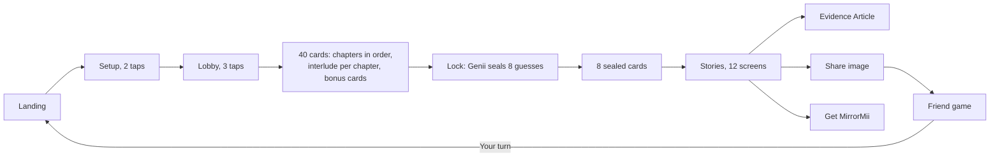

# MirrorMii launch survey: the locked spec

## 0. How to use this spec

- **One spec.** This file is the only spec for the launch survey. Every rule appears once, in its final form. Nothing superseded is kept here; the old wording lives in git history (`docs/history/LAUNCH-SPEC-2026-09-29-full.md`, removed 2026-09-30). Paths are relative to the repository root.
- **This file wins.** Where any other doc, skill, README or code comment disagrees, this file is right and the other one gets fixed. Design docs decide only how a screen looks, inside these rules.
- **Change only by a dated ruling.** A change needs a ruling from Jerry with its date. Edit the rule in place (never add a new "round" section on top), then add one line to section 11. Numbers are updated in place with the date they were measured.
- **Plan before build.** When Jerry asks for a plan or an audit, build nothing; answer with straight numbers. Evidence and tagging come first; copy and visuals after.
- **Read in this order:** this file, then [quiz64/README.md](../quiz64/README.md) (run, test, build, folder map), then [HANDOFF-DESMOND.md](HANDOFF-DESMOND.md) (backend and deployment).
- **Terms.** *Card*: one question with 2 to 8 options (per format, `card-schema.mjs`). *Chapter* (or *room*): one of 7 themed groups of cards; three rooms can be closed in the lobby. *Extras*: 12 axis cards the picker adds for coverage. *Sealed cards*: 24 cards Genii guesses before the player answers; 8 per run, never scored. *Axis*: one of six hidden scales (R1 to R3 the people half, L1 to L3 the life half). *Tag*: one of 50 traits in 25 opposite pairs. *Archetype*: the name a half resolves to (8 people, 8 life). *Sub-question* (`sq`): the plain question a card is built from. *World*: absurd, unusual or everyday. *Grade*: did, would or believe, which sets an answer's weight. *Voice*: Make it fun or Heart to heart. *Kit*: `research/persona-quiz-v2/final/`; `KIT_ID` pins saves and links to one version of it. *Lock*: the SHA-256 that freezes Genii's guesses. *Drama stats*: the six 1 to 20 display stats (section 6).
- **Guarded.** `node scripts/check-docs.mjs` (run inside `npm test --prefix quiz64`) fails if this file names a retired label or asset outside section 11, or if any file in `docs/` or `quiz64/docs/`, `AGENTS.md` or `quiz64/README.md` has an em dash.

## 1. Product and goal

A phone-first web game hosted by Genii, MirrorMii's glass slime. The player taps 40 quick cards, Genii locks 8 guesses, the player plays those 8 sealed cards, then gets a 12-screen Stories reveal and a long-form Evidence Article, a share image, a friend game ("How well do you know me?") and the get-the-app screen.

**Goal.** People finish it, get a read that feels accurate and a little spicy ("I didn't know that about me"), share it so friends play, and want the app. It must not read like another generic personality test.

**What it is not.** Entertainment and self-discovery, not a validated scale. No MBTI names, no health, no identity inference. Answers stay in the browser; there is no backend, account or analytics yet.

**State (2026-09-30).** Built on `main` and live on GitHub Pages at https://augustexe.github.io/mirrormii-survey/ ([STATE.md](STATE.md)). No real person has tested this build (blind test 2 is open, section 10).

| Part | Where |
|---|---|
| Card bank (authored) and merged bank | `research/persona-quiz-v2/final/bank/*.json`, merged by `merge-bank.mjs` into `cards.json` |
| Result copy (names, tags, lines, rooms, article frames) | `research/persona-quiz-v2/final/library.json` |
| Friend game copy | `research/persona-quiz-v2/final/friend.json` |
| The one scorer (app, CLI, sims, tests) | `research/persona-quiz-v2/final/score-core.mjs` (`CONFIG`), grades in `card-schema.mjs` |
| Evidence lock | `research/persona-quiz-v2/final/evidence-lock.json`, `lock-evidence.mjs` |
| Web game | `quiz64/` (entry `src/PersonaApp.jsx`, run state and picker `src/persona/session.js`) |
| Scale labels (kickers, axis stat ends, retired labels) | `quiz64/src/persona/stats.js` |
| Drama stats (the six numbers players see: formulas, calibration, top four, dump stat) | `quiz64/src/persona/rpg-stats.js`, calibrated by `quiz64/scripts/calibrate-drama.mjs`; copy in `library.json` `drama` |
| Backend contracts and question pack | `docs/contracts/`, `docs/question-pack/` |
| Card writing rules for agents | [VOICE.md](VOICE.md) and sections 2, 4 and 5 here; Jerry's agents also use `skills/shared/genii-card-writer/SKILL.md` in his workspace (not in this repository; follows this file) |

## 2. Jerry's standing rulings

One list, final wording. Dates are 2026.

**Process**
1. One build, one spec: this survey and this file. No parallel builds, specs or result design families (09-28).
2. Evidence and tagging first. Tags, questions, answers and result copy are Jerry's to change freely afterward; everything is keyed by id so a rename never touches evidence (09-28).
3. On a plan or audit request, build nothing and report numbers (09-28).
4. Local only. Push, deploy or publish only on Jerry's go (09-28).
5. Keep spend tight: small crews, then one integration and judge pass (09-29).

**Voice and copy** (the voice source for every card and chapter intro is `docs/VOICE.md`; the rulings below still bind)
6. Result voice is smooth and natural, like a perceptive friend saying it warmly. Spicy in content, never in snark (09-28).
7. No gotcha lines ("You'd say X. Last three times, you did Y.") and no sitcom or announcer lines ("Genii called this before you answered") (09-28).
8. Never quote the player's answers on the result, and show no data list. The read is written as fact, never as a science or accuracy claim (09-28).
9. No percentages on any player surface. The only numbers allowed are Genii's calls count ("5 guessed right") (09-29) and the drama stat scores, whole numbers from 1 to 20 (09-30).
10. Never-say list (from the company's product-truth doc, section 8; the list here is complete): (diagnose, treat, cure, prevent, clinically proven, anti-aging; streaks or absence guilt; "predicts"; DNA or genomics; wearable sync; competitor names; fabricated counts, ratings or reviews; "free forever"; 2.0 features described as live). Player screens also never show "evidence", "axis", "sealed", "run id", "hash", genie or lamp. The app screen promises only what the app does today (09-28).
11. No em dashes anywhere: copy, code comments and docs (standing).
12. Sally's v2 system (an earlier research template, removed from this repository; in git history) is a template for structure and humor, never a translation source. English names and tags are written natively (09-28).
13. Two voices with identical meaning: Make it fun and Heart to heart (09-28). How each one sounds, and Genii's angle per chapter, live in `docs/VOICE.md` sections 4 and 6 (09-30).
14. Multiple choice only, never free text (09-26).

**Questions**
15. Sub-question first: every card is built backward from a sub-question in `subquestions.json` (field `sq`), and each option lands on one side of it (09-29).
16. Unique situations: no two cards share a situation (trigger, setting, ask, who, stakes; field `fp`), and no answer line repeats anywhere (09-28).
17. At most 2 cards per concept or prop across the whole bank (a dragon, a time freeze, an AI confidant, a group chat name; field `fp.device`) (09-29).
18. Absurd, never-seen worlds: about 40% absurd, 40% unusual, 20% everyday. Everyday only for the "did" formats (real, receipts, bet). The magic never comes from Genii (09-29).
19. Spice: every card clears at least 3 of 5 marks (real stakes, no safe answer, the unsaid, self-question, group-chat test) (09-28).
20. Not too much agency: 3 or 4 tight answers (5 or 6 only where the format needs it), no escape hatches ("Both", "Depends", "Talk it through"), no answer that rewrites the premise (09-29).
21. Hook and shape variety: rotate hook types, prompt openers and closers, answer openers and rhythm; limits enforced by `check-bank.mjs` `SHAPE_LIMITS` (09-28, 09-29).
22. Masked and legible: never name the trait being measured, never ask "what would you do when"; every premise reads instantly (09-26, 09-29).
23. No sensitive asks: never ask the player to open an app, account, bank, messages or photos; nothing about health, body, politics, religion, orientation or party; no explicit sexual content (09-28).
24. No age screen and no age-based content: everyone plays the same bank. Marriage and kids cards are written so anyone can answer or skip (09-28).
25. Gender-neutral wording: "your partner" (never "your person"), "they" (09-26; "your partner" 09-30). A text thread names its sender in the prompt ("Then Robin, your partner, texts.").

**Visuals**
26. Canon world only, from the MirrorMii 2.0 game design document v0.2 (company docs, not in this repository; sections 3.2 and 3.4): a floating island of white pearl marble terraces, pools and waterfalls, the lavender tree, an arch pavilion and fountain, and at the center the World Mirror, a tall oval mirror with an iridescent opal frame on a round marble plinth (09-29).
27. Genii is our own 3D slime (`quiz64/src/genii`): a translucent lavender teardrop with a bead on top and two eyes. It starts as an orb and evolves to the full slime by the lock and the reveal. Never a genie, a lamp, smoke or a wish trope; never a library image (09-29).
28. No landing-page marketing media, old UI mockups, generic island stock or library Genii renders anywhere in the build (09-29).
29. Keep what works: the mirror mechanic (each answer becomes a clear glass shard that rebuilds the mirror), the chapter interludes and the Stories format (09-29).
30. In-product names such as Tree of Life stay out of player copy (09-29).
31. Scroll is never hijacked; only tab strips scroll themselves (09-29).

**Names**
32. Plain-names gate: every player-facing label passes the cold-reader gate in [NAMING-RULES.md](NAMING-RULES.md) before it ships (09-29).
33. One title, one line (Jerry, 09-30, decision 1a; replaces the side-by-side pair of 09-28): the people archetype is the single title and one story line under it merges both sides (`research/persona-quiz-v2/final/naming/names-64.json`, line per pair, both voices; its merged adjective names are rejected and never shown). The day-to-day archetype appears as a quiet labeled row, never as a second title. Never glued into one phrase, never "X with Y energy".
34. Inside the mirror only the title and its story line; labels, traits and the day-to-day name sit outside below it (09-30).
35. Labels describe behavior, never beliefs or identity, and both ends of every scale are flattering and shareable (09-29).

## 3. Flow

| # | Screen | What happens | Copy lives in |
|---|---|---|---|
| 1 | Landing | The World Mirror in the canon island; promise, "48 cards", "About 8 minutes" | `lobby.js` `LOBBY_COPY.landing` |
| 2 | Setup (2 taps) | Closest person (my best friend, my partner, a crush, a sibling, a parent, someone else) and pronoun (she, he, they; friend game only). No age question | `screens/Setup.jsx`, `session.js` |
| 3 | Lobby (3 taps, unscored) | "How should Genii talk to you?" Make it fun / Heart to heart / Just the cards (Make it fun wording, reactions hidden). "How personal can Genii get?" Keep it light (skips `intimate` cards) / Ask me anything. "Which rooms can Genii visit?" Love and dating, Work, school and ambition, Family and home (each can be closed) | `lobby.js` `LOBBY_COPY` |
| 4 | Play | 40 cards ("Card N of 40"), chapters in order, each opened by an island interlude; extras arrive as "A few bonus cards". Genii reacts between cards per voice. Every answer holds a beat, then flies home as a shard | `session.js`, `play/`, `reactions.js` |
| 5 | Lock | Genii locks its 8 guesses with a SHA-256 before the finale and cannot change them | `play/` lock ritual |
| 6 | Finale | 8 sealed cards ("Final N of 8"), drawn per run from the pool of 24 | `session.js` |
| 7 | Stories | The 12 screens below; tap through, share per screen | `stories/story-data.js` |
| 8 | Evidence Article | Opens after the last story and from "Read the long version"; 3 to 5 minutes | `persona/article/`, `library.json` `article` |
| 9 | Share, friend, app | Share image (story and post), "How well do you know me?" challenge, Get MirrorMii | `share-image.js`, `friend.js`, `story-data.js` |

**Chapters** (rooms): 1 Your phone (21 cards), 2 Friends (22), 4 Money and spending (20), 7 Play, rules and you (19) are always on. 3 Love and dating (18; intro "Partner, crush or situationship: I just want the gossip."), 5 Work, school and ambition (18), 6 Family and home (18) are rooms the player can close; the run stays 40 cards. Extras: 12 axis cards (2 per axis). Sealed pool: 24 (4 per axis).

**The 12 Stories screens** (order in `STORY_IDS`; screens 6 and 10 show only when they have content):

| # | Screen | Shows |
|---|---|---|
| 1 | Intro | "40 answers in." The shards assemble the World Mirror |
| 2 | Names | One title (the people archetype) and one story line inside the mirror; day to day and core traits as quiet rows below (ruling 33) |
| 3 | The short version | The read: one confident line per half |
| 4 | Your stats | The drama stats (section 6): four stat blocks, each its abbreviation and score in an oval (for example LOY 18), its name and one short line: the three highest, plus the most surprising stat (furthest from the population median for its spread) when it is not already among them, otherwise the fourth highest. Nothing else but the link "See all six in the long version", which opens the article at its stat block |
| 5 | What Genii is surest about | 5 to 6 findings, clearest first |
| 6 | In different parts of life | Room by room lines, and where a room leans the other way (needs 2 or more rooms) |
| 7 | A surprise about you | One warm insight from a believe-versus-did split, else the half's fallback line |
| 8 | Core traits | 5 to 6 keyword traits, each with one line |
| 9 | Every strength has a flip side | The stings, open-book tone |
| 10 | Genii guessed your answers | The locked guesses as panes and the one number (needs locked guesses) |
| 11 | Your card | The share image preview, Share image, Challenge a friend, Copy link, Read the long version |
| 12 | Get MirrorMii | One in-game moment and the store button; Read the long version; the friend game, Genii's guesses and "See or delete your data" as small links |

Share-worthy screens: 2, 8 and 11. Every displayed line traces to the player's own score (`quiz64/tests/reveal-accuracy.test.mjs`, `article-accuracy.test.mjs`).

**Evidence Article** ([quiz64/docs/ARTICLE-DESIGN.md](../quiz64/docs/ARTICLE-DESIGN.md), V2 pass 2026-09-30): an editorial grid around spot art (one small opal-glass object per section, `quiz64/public/assets/article/`, [ARTICLE-ART-SET.md](../quiz64/docs/ARTICLE-ART-SET.md)); the cover's sky band is the only full-width image, no banner photos. Cover: one title (the people archetype) with its one story line from `names-64.json` and the day-to-day half as a labeled row; nothing restated under it (the lede is merged into the cover). Part one walks the Stories beats in the deck's order, deeper: the stat block (all six drama stats, D&D style, with the top stat line and the dump stat line), room by room and the room where you flip, the thing you didn't know, core traits and where each comes from, Genii's calls. Part two is new: your heist crew role (the strongest day-to-day stat end picks the Planner, the Getaway Driver, the Inside Person or the Distraction), green flag and red flag (from the top shareable traits, never AI, kids or wedding traits), Genii's bets (three, from the shareable core traits), your people (click with is your people half with its closest-to-middle stat flipped; your opposite), and your island seed (labeled "Coming in MirrorMii 2.0"), which leads into Get MirrorMii. No section repeats another (cut 2026-09-30: the lede, the character sheet and its drawers, your two results side by side with its stat crossings, every strength has a flip side, the cover's trait chips, the repeated story line in your own party slot). Upright type only: no italic or script display anywhere in the deck, its images or the article. About a five-minute read; every line from the player's evidence (`article-accuracy.test.mjs`); copy in `library.json` (`article`, `drama`, tag `green`/`red`/`bet`, axis `plusGreen` to `minusBet`, half `seed`).

**Friend game.** The owner picks a relationship (partner, crush, friend or coworker, bestie) and sends a link. Level 1: 6 either-or guesses, one per axis. Level 2: 12 of the owner's cards in third person. Level 3: 12 trait cards (the owner's, opposites, decoys). Level 4 (bestie, owner opt-in): which sting hits hardest. The owner sees "You, through {friend}'s eyes"; the friend sees only counts, then "Your turn". Links carry the answer key and are unsigned: fine for testing, a backend is needed before real players (section 9).

## 4. Scoring and evidence model

Every answer option carries its own evidence; the scorer only adds up what options say. No hidden topic scores.

| Field | Rule |
|---|---|
| `axes` | Signed -2 to +2 on the six axes (+ is the first pole). Usually one axis, never more than two; only when the behavior implies the pole |
| `tags` | Strength 1 to 3, usually 1 or 2 tags, never more than 3. Support for a tag counts against its pair |
| `emotion` | Optional, research record only |
| `circumstance` | The option is a situation, not a choice. Scores nothing; at most one per card |
| `depends` | Rare. Scores nothing; opens "What would flip you?" with 3 presets |
| `none` | Receipts only: "None of these", exclusive, scores nothing |
| Exits | Skip, Not my life (real cards add No recent example). Never score |

**Axes** (internal: the pole names and the axis stat names never reach a player; the player sees the drama stats in section 6):

| Axis | + pole | - pole | Meaning | Cards carrying it (pool of 141, `audit.mjs`, 2026-09-30) |
|---|---|---|---|---|
| R1 | We | Me | close means shared, versus close still means space | 22 |
| R2 | Direct | Soft | says the hard thing now, versus holds the person first | 21 |
| R3 | Classic | Own | the traditional script for love, home and holidays, versus writing your own | 19 |
| L1 | Steady | Venture | the known, versus the new | 16 |
| L2 | Push | Easy | visible progress, versus your own pace | 17 |
| L3 | Rules | Context | the fair process, versus the situation and the need | 18 |

People half = R1 x R2 x R3 (8 archetypes); life half = L1 x L2 x L3 (8 archetypes); a player gets one of each. An axis too close to call (normalized score under `flexBand` 0.12) shows as "Right in the middle"; the pole then follows real-behavior evidence first.

**Grades and weights** (`cards.json` `weights`, `card-schema.mjs`):

| Grade | Formats | Weight |
|---|---|---|
| did | real, bet | 0.80 |
| did | receipts | 0.40 per tick; past 3 ticks each tick is scaled to 3/ticks |
| would | scenario, reply | 0.55 |
| believe | others, this or that, role, pick two (per pick), rank (positions 1, 0.5, 0, -0.5), eyes | 0.45 |
| none | feeling (emotion only), sealed (never scored) | 0 |

Absurd cards are capped at 0.35 (`ABSURD_WEIGHT_CAP`). Answers under 1.5 s count at 0.3.

**Tags.** 50 tags in 25 opposite pairs across the 7 chapters (`library.json` `tags`). A tag fires with net support of at least 2.0 (2026-09-30; 2.25 before one card per sub-question) from at least 2 separate cards, one of them calm; "strong" at 3.0; if nothing fires, the best candidate above 1.25 shows. Up to 5 shown, spread over at least 3 chapters where possible, ranked strong first, then by coverage share.

**Scorer settings** (`score-core.mjs` `CONFIG`, set by simulation): rushedMs 1500, rushedFactor 0.3, minAxisCards 2, flexBand 0.12, tagFire 2.0, tagStrong 3.0, tagFloor 1.25, tagMinCards 2, maxTags 5, minChapters 3, tagRank "share", receiptsCap 3, splitMin 0.4, sealedTagWeight 0.6, sealedPairScale 1.2, finaleSize 8.

**Sealed guesses.** Before the finale Genii picks, for each of the 8 drawn sealed cards, the option that best fits the profile, or passes when the card's main axis is in the middle or unfinished. The 8 guesses are hashed and cannot change; a tampered save refuses to score. Sealed answers never feed the profile. Exact hits (chance about 25%) and right-side hits (chance 50%) are counted.

**The picker** (`session.js`). Every player answers exactly 40 cards (`RUN_SIZE`) then the 8 sealed cards. Deterministic: the only randomness is seeded from the run id, and a restored save replays the same route. Pool: open chapters plus the 12 extras, after the depth filter, the C3-9 gate (shown only if the C3-8 picks include a T11A line); feeling cards are never served (below). Chapters play in order, each opening with its first authored card. Per pick, in priority order:
1. **Coverage:** every axis gets at least 2 valid cards; if a closed room carries an axis, other chapters and extras cover it.
2. **Retention:** after an exit, the next card targets the same axis; after 3 rushed taps, the next card is a quick one.
3. **Flow:** no two cards of the same type in a row (except this-or-that rounds); no two neighbors on the same axis or tag pair; receipts and bet cards spread out.
4. **Value:** balance the axes and favor tag pairs the player leans on; each run focuses on 10 of the 25 tag pairs (seeded).
5. **One card per sub-question:** a run never serves two cards on one `sq`, the 8 sealed cards included (the sealed draw never repeats an sq either); the only exception is coverage, a second card (never a third, never right after its twin) when an axis could not otherwise reach 2 valid cards.

**Feeling cards are off** (2026-09-30): the picker never serves them. They score nothing and every option already records its emotion. They stay in the bank untouched, with their `follows` links; the one switch is `SERVE_FEELING` in `score-core.mjs` (read as `CONFIG.serveFeeling`); set to true, each plays right after the picked card it follows.

Measured 2026-09-30 after BATCH-02 (`node quiz64/tests/sq-measure.mjs --n 100`, 1,600 runs over 8 room sets x 2 depths): 31 runs (1.9%) serve one coverage repeat (2 cards on one sq), none serve 3, 0 back-to-back cards on one sq, 0 feeling cards, 16 sealed cards on a played sq (package P0: 22 runs, 5 sealed; the cut of C1-161 leaves R2 one card thinner). Before one card per sub-question (commit f288cd5): every run repeated, 23.9 cards per run shared an sq, up to 6 on one sq, 1,911 back-to-back.

**Coverage targets and where they stand** (2026-09-30 after BATCH-02, `node audit.mjs` in `research/persona-quiz-v2/final`):

| Target | Now |
|---|---|
| Every axis on 15+ pool cards, 6+ in the always-on chapters | Met: 16 to 22 cards, 7 to 12 always-on |
| Every tag on 4+ cards, 1+ of them "did" | 37 of 50 met; every tag has did evidence. Short: T01A/B, T03A/B, T15A/B (3 cards), T06B, T14B, T22B (3; T22B lost the cut C7-142), T02A/B (2, concept cap), T11A/B (2, kids cards) |
| Random clickers 45 to 55% on every axis | Full walk met: 45.7 to 53.8% (`audit.mjs`). At 40 cards 49.5 to 55.3%: L3 is 0.3 points over (55.1% at 89bb012, before BATCH-02; the most-served leaning card is C2-144, +0.25 on L3 per random pick, in about two thirds of runs). Decision 15 |

**Simulation**:
- Full walk (`node sim.mjs`, `SIM-REPORT.md`, 640 consistent players, 2026-09-30 after BATCH-02): axis recovery 94.9%, 100% get 3 to 5 tags, 0 get none, shown tags match the hidden profile 86.8%, sealed exact 66.8% (random clickers 24.8%, chance), all 50 tags fire. The report's 400 random clickers land 47.3 to 56.8% on the first pole; L3's 56.8% is that fixed seed's sampling (4,000 random clickers on the same walk: 46.5 to 52.7%; `audit.mjs`: 45.7 to 53.8%).
- Web picker at 40 cards (`node quiz64/tests/persona-sim.mjs --acceptance`, 2,000 consistent players, every room open, 2026-09-30 after BATCH-02, one card per sub-question, tagFire 2.0): sealed exact 63.7%, 0% with no tags, mean 4.09 tags shown; random clickers 49.5 to 55.3% (L3 over, decision 15). Under 1%: T05A/B never fire (the chapter 2 opener C2-160 always takes SQ-T05-1, so at most one more T05 card, the receipts card, can follow) and T21A/B at 0.1%. At tagFire 2.25 the mean falls to 3.63 and T22A/B never fire too, hence 2.0 (measured before BATCH-02). With a room closed, that room's tags stay silent, as designed.

**Evidence lock.** `evidence-lock.json` holds a SHA-256 of every normalized card text (both voices, threads, friend sides) next to the evidence it carries; the kit tests fail while any text or evidence differs from its entry. After re-reading a changed card, `node lock-evidence.mjs --confirm <cardId>` re-locks it (no flag lists what changed). Library renames never reach it.

## 5. Question bank

**Formats** (13; counts from `cards.json`, 2026-09-30 after BATCH-02):

| Format | The player | Grade | Count |
|---|---|---|---|
| Scenario | Picks a move in a vivid imagined moment | would | 43 |
| Real moment | "The last time..." picks what they actually did | did | 16 |
| Receipts | Taps every ordinary fact that is true, or "None of these" | did | 7 |
| Genii's bet | Genii bets on a specific thing they did; 3 to 5 answers written for that bet, never Guilty/Never | did | 18 |
| Reply | Picks the reply they'd send in a mock text thread | would | 14 |
| Other people | First thought about what someone else did | believe | 13 |
| This or that | 2 punchy options, in quick rounds of 2 or 3 | believe | 15 |
| Role | "In your group chat, you're the..." | believe | 5 |
| Pick two | 2 of 6 short lines most like them | believe | 4 |
| Rank it | Orders 4 items (C2-142 and X-L2-40; runs almost never reach one, decision 13) | believe | 2 |
| Friend's-eye view | The line their best friend would use about them | believe | 4 |
| Feeling | Right after a card: the first feeling (not served in runs, section 4) | emotion | 7 |
| Sealed | A new moment for Genii's locked guess | never scored | 24 |

**Card template.** Hook (one concrete scene-setter, 15 words or fewer, one true detail) then Event (what just happened that forces a response) then Ask (the format's stem, usually implied) then Moves (3 or 4 distinct actions, first person, action first, 12 words or fewer, equally charming, no ladders). Prompt under about 30 words.

**Voices.** Top-level text is Make it fun (playful, specific, roast the move never the person). The `heart` object holds Heart to heart (sincere, calm, full sentences, no exclamation marks, no grading words), same option order and meaning; evidence is shared. Just the cards reads Make it fun.

**Schema.** One card: skill section 7 (`skills/shared/genii-card-writer/SKILL.md`); build-time grades in `card-schema.mjs`; the published shape in `docs/contracts/` (card schema) and the export in `docs/question-pack/`. `privacy` is `normal` or `intimate`.

**Bank** (2026-09-30 after BATCH-02): 172 cards = 136 chapter (21, 22, 18, 20, 18, 18, 19) + 12 extras + 24 sealed. Worlds: absurd 54 (31%), unusual 79 (46%), everyday 39 (23%). Both voices on all 172; friend versions on 115; 67 of 68 sub-questions used. Against `check-bank.mjs` `TARGETS` (reported, never failed) the cuts and format moves leave chapter 1 at 21 (others 1 of 2), chapter 5 quick 2 of 3 and chapter 7 at 19 (quick 2 of 4); decision 3. Cut cards and their full text are in git history (the round 4 log, `bank/ROUND4-LOG.md`, removed 2026-09-30). Ids: new cards continue each chapter's numbering; kept cards keep their ids.

**Change flow.** Edit `bank/*.json` (never `cards.json`; chapter titles and intros live in `cards.json` and carry over on merge), then `node merge-bank.mjs`, `node check-bank.mjs --kit`, `node shape-audit.mjs --limits`, re-lock changed cards, `node friend-snapshot.mjs --write`, `node sim.mjs` (refreshes `SIM-REPORT.md` and the `sim-example/` the kit tests read), `node --test tests.mjs`, then from the repository root `node scripts/validate-contracts.mjs --write-examples` and `node scripts/export-question-pack.mjs`, then `npm test --prefix quiz64` (the kit parity test proves the stripped kit scores the same). Record concept or evidence moves in the commit message and one line in section 11.

**Checker** (`check-bank.mjs`): schema and format rules, `sq` and `world` present and valid, everyday only on did formats, unique fingerprints, no repeated answer lines, shape limits (opening words, "Verdict. Reason." share, prompt openers and closers, clock-time hooks, crutch words), genie words and "your person" in both voices, friend texts and thread senders, bans, scene links (a shared `fp.device`, a fingerprint that points at a card, a prompt that replays another card: errors, only warnings on feeling cards while they are not served). Last run (2026-10-01): 172 of 172 cards, 0 errors, 24 warnings (13 scene links on the unserved feeling cards; 8 this-or-that cards without a round id; 2 length warnings on approved text; 1 soft prompt overlap between C7-134 and C7-161). The same-move rule (no two answers in a card open with the same word or share a core move) is an error, including on sealed cards.

## 6. Result copy and names

**Sources.** Kickers, axis stat ends: `quiz64/src/persona/stats.js` (`HALVES`, `STATS`, `RETIRED_LABELS`). Drama stat names and formulas: `quiz64/src/persona/rpg-stats.js`; their lines: `library.json` `drama`. Archetype names, defining lines (`define`), tag names and keywords: `library.json`. Result chrome: `STORY_COPY`, `UI_COPY`, `GUESS_COPY` in `stories/story-data.js`; article frames in `library.json` `article`. Nothing else spells a label out.

**Title card format.** Kicker (sentence case), then the name, then one plain defining line directly under it, on every screen that shows an archetype name: the names screen, the share image (story and post), the article cover and the party slots.

| Half | Kicker |
|---|---|
| People | With the people you love |
| Life | Day to day |

| People archetype | Code | Defining line |
|---|---|---|
| Golden Retriever | We·Soft·Own | Warm, loyal and happy to see everyone. |
| Comfort Person | We·Soft·Classic | Kind, caring and easy to talk to. |
| Ride-or-Die | We·Direct·Own | Loyal, honest and always there. |
| The Glue | We·Direct·Classic | Brings people together. |
| Lone Wolf | Me·Direct·Own | Enjoys time alone and a few close friends. |
| Straight Shooter | Me·Direct·Classic | Speaks plainly and kindly. |
| Free Spirit | Me·Soft·Own | Gentle, relaxed and one of a kind. |
| Old Soul | Me·Soft·Classic | Loves cozy nights, old favorites and alone time. |

Jerry approved the eight people names (09-28); they are exempt from the gate.

| Life archetype | Code | Defining line |
|---|---|---|
| The Planner | Steady·Push·Rules | Plans ahead and sees it through. |
| The Quiet Achiever | Steady·Push·Context | Gets big things done without the spotlight. |
| The Routine Lover | Steady·Easy·Rules | Enjoys a good routine and favorite things. |
| The Calm One | Steady·Easy·Context | Stays calm and takes life as it comes. |
| The Strategist | Venture·Push·Rules | Goes after big goals with a clear plan. |
| The Go-Getter | Venture·Push·Context | Sees a goal and goes for it. |
| The Explorer | Venture·Easy·Rules | Tries new things, with good judgment. |
| The Spontaneous One | Venture·Easy·Context | Follows curiosity wherever it goes. |

**Drama stats** (Jerry, 2026-09-30; they replace the character sheet on every player surface). Six display stats, D&D style, for a women-first 20 to 35 audience: group chat, drama, affectionate, never mean. Each is a whole number from 1 to 20, computed from the profile by `quiz64/src/persona/rpg-stats.js`; the six axes stay hidden as the scoring engine and nothing about cards, evidence, axes or the picker changed. Same names in both voices.

| Stat | Name | Formula (weights; poles and tag ids from `library.json`) |
|---|---|---|
| CHA | Charm | R1 We, stays close (1.0); R2 Soft, says it gently (1.0); T04B Makes friends easily (1.0); T08A Believes in second chances (0.8) |
| ROM | Romance | T09A Loves deeply, all in on us (1.5); T05B Puts feelings into words (1.0); T10A Talks problems through (0.5); never a kids or wedding tag |
| LOY | Loyalty | R1 We (1.0); T18A First to help family (1.0); T05A Shows care through actions (0.8); T10A Talks problems through (0.8) |
| PEACE | Peacemaker | R2 Soft (1.0); T08A Believes in second chances (1.0); T10B Knows when to move on (0.8); T25B Makes room for exceptions (0.8) |
| TEA | Tea Radar | L3 Context, case by case (1.0); T02B Loves hearing from friends, notices who texts first (1.0); T08B Remembers the details (1.0); T24A Plans with lists (0.6) |
| PETTY | Petty | R2 Direct, says it straight (1.0); T08B Remembers the details, keeps the receipts (1.0); T02B (0.8); T12A Splits the bill evenly (0.6) |

How a score is made: each part gives a lean from -1 to 1 (an axis's normalized score toward the named pole; a tag's net support against its pair through tanh(net / 2.5)) and a confidence from the cards behind it; raw = the weighted sum of lean times confidence over the weights, so thin evidence pulls toward zero. The raw value maps through that stat's population percentiles (1st to 3, 5th to 6, 25th to 9, median to 12, 75th to 15, 95th to 18, 99th to 20; constants in `CALIBRATION`, measured on 1600 simulated players by `scripts/calibrate-drama.mjs`, 2026-09-30: every stat spreads 6 to 18 from the 5th to the 95th percentile, median 12). Below the confidence `CONF_FULL` (0.29, about the 10th percentile) the score is pulled toward 12, so an unfinished or thin run reads soft, never extreme. The most surprising stat is the one whose raw value sits furthest from its population median in units of the middle half (25th to 75th percentile). The top stat is the highest; the dump stat is the lowest (gamer slang).

Copy per stat in `library.json` `drama.stats`, both voices: `high` and `low` (the short line on a Stories block, high at 11 or more), `top` (the article's top stat line) and `dump` (the article's dump stat line). A low stat reads as a flex or a cute quirk, never an insult; no gendered stereotype words. Labels: "Your stats", "Where you max out" (Heart to heart: "Where you shine most"), "Most surprising", "See all six in the long version", "Your stat block", "Top stat", "Dump stat".

**Internal axis labels** (`stats.js`; the stat names Closeness, Hard truths, Traditions, New things and Pace are retired from player surfaces and sit in `RETIRED_LABELS`; the ends below still render in core traits, findings, rooms and flags):

| Axis | Stat (internal) | Left end (+ pole) | Right end (- pole) |
|---|---|---|---|
| R1 | Closeness | Stays close | Keeps some space |
| R2 | Hard truths | Says it straight | Says it gently |
| R3 | Traditions | Carries them on | Starts new ones |
| L1 | New things | Sticks with favorites | Tries new things |
| L2 | Pace | Goes fast | Takes it slow and steady |
| L3 | Rules | By the book | Case by case |

| Label set | Words |
|---|---|
| Level words and badges (internal since 2026-09-30, no longer rendered) | A little, Somewhat, Moderately, Strongly, Very strongly; Right in the middle; Not enough answers yet; Your strongest stat; Closest to the middle |
| What Genii is surest about | Came through clearly; Genii is fairly sure; Genii has a hunch; Genii can't tell yet |
| Genii's calls | Guessed right; Close, not exact; Surprised Genii; No guess; You skipped. The count reads "N guessed right" |
| Rooms | Phone habits, Friends, Love and dating, Spending and saving, Work and school, Family and home, Free time |
| Friend game and share invite | How well do you know me? |

**Traits and keywords.** 5 to 6 core traits per player, one or two plain words each, evidence-backed from the top tags and the strongest stat ends. Tag names are plain phrases of 4 words or fewer that a stranger gets at once, each with one confident line. Keywords follow the same rules: everyday words, behavior not beliefs (for example "Keeps traditions alive", not a political label), both sides of a pair flattering. The full current lists are `library.json` `tags[].name` and the keyword fields; 48 of 50 tag names and 39 keywords were replaced on 09-29 (git history).

**What the result never shows.** Quoted answers, ids, percentages or numbers (except the calls count and the drama stat scores 1 to 20), the words in ruling 10, science or accuracy claims. The share image shows the one title and its story line, the core traits with their lines, the invite and the address label; never stings, marriage or kids tags, answers or numbers.

**The gate.** `node scripts/naming-inventory.mjs` lists every label with where it sits. A Codex panel of six cold readers aged 20 to 35 (a progressive activist, a religious conservative, an ESL speaker, a Gen Z TikTok user, a nurse, an engineer) scores clear, hurt and share 1 to 5. Pass: clear 4.5 or more, hurt 2 or less, share 3.5 or more (share only for labels about the player); final labels are scored by 18 readers. Now: 193 of 278 final labels pass (69%; the panel's raw scores are in git history, `docs/NAMING-PANEL.json`). The residuals are mostly the exempt people names, Traditions and Rules sitting just over the hurt line (every alternative tested scored the same or worse), sensitive topics (kids, weddings, AI, phone privacy) and short UI chrome that needs its screen. `quiz64/tests/naming-retired.test.mjs` fails if any label in `RETIRED_LABELS` renders anywhere or a title card lacks its kicker or line.

## 7. Visual system

**Design docs.** [quiz64/docs/DESIGN-DIRECTION.md](../quiz64/docs/DESIGN-DIRECTION.md) holds the system (type, color, materials, motion tokens, accessibility contract, per-screen specs, QA checklist); [quiz64/docs/ARTICLE-DESIGN.md](../quiz64/docs/ARTICLE-DESIGN.md) holds the article. Both predate some rulings. Where they disagree with section 2, section 2 wins: the mirror is the oval World Mirror (not an arched mirror), Genii is the 3D slime (not light only), the backgrounds are the canon island renders (not code-made islands), the stats are the drama stat blocks in section 6 (not a facet gem, not a character sheet), and every label is from section 6.

**Type: one font, Satoshi** (ruling 2026-09-30, Jerry: "Select one super clean looking font and stick with it. Nothing AI."). Satoshi (variable, 300 to 900, ITF Free Font License, vendored at `quiz64/src/system/fonts/satoshi-variable.woff2`) sets every word on every surface: Stories, cards, lobby, landing, friend game, edge screens, the Evidence Article and the share images. Why: a clean geometric sans, the closest free match to the brand's Avenir (licensed, marketing only); Fraunces read squiggly. Hierarchy comes from weight, size and tracking only (headings 700 to 800, big numbers 900 tabular, body 400 to 500, kickers 600 uppercase). No italic anywhere (no italic face loaded, `font-synthesis: none`). No other family except the system fallback stack after Satoshi. Token `--font` (`tokens.css`) and `fonts.family` (`tokens.js`); guarded by `tests/system-style.test.mjs`.

**Canon assets** (`quiz64/public/assets/island/`, sizes and sources in `MANIFEST.json`; generated from the GDD references):

| Asset | Files | Used on |
|---|---|---|
| Island hero, day portrait | `hero-portrait-720/1080.webp` | Landing, product screens |
| Island hero, wide | `hero-wide-960/1600.webp` | Desktop backdrops |
| Island hero, night | `hero-night-720/1080.webp` | Night screens of the reveal |
| World Mirror frame (opal, alpha) | `mirror-frame-240/480/900.webp` | Landing, lock, names, share image |
| Room inside the mirror | `mirror-inside-360/720/1080.webp` | The glass of the mirror |
| Chapter islets 1 to 7 | `ch1-360.webp` to `ch7-720.webp` | Interludes, chapter map, rooms |
| Still of our 3D Genii | `genii-still.png`, `genii-still.webp` | Share image, static fallbacks |

Also `quiz64/public/assets/mirrormii-wordmark.svg` (used as is) and `genii-opal-alert.webp` (the canon render our 3D Genii is checked against in `qa/genii-lab`, not shown in the game). Glyphs, shards, rails and panes are code-made in `quiz64/src/art`. Genii's evolution stages are in `quiz64/src/genii/evolution.js` (three.js, lazy; SVG fallback).

**Motion.** Headings and primary controls readable within 300 ms of any screen change; total stagger at most 280 ms; one hero motion per screen; taps during an animation finish it and act; every answer holds a beat before the next card (the reply format holds 1.18 s); every motion has a reduced-motion path (crossfades, no travel); at most one WebGL canvas alive, paused off screen; card screens run no shader.

**Layout.** Phone first (390 x 844 reference, 16 px gutters), then desktop. Every card's answers and exits sit above the fold at 390 x 844. Tap targets at least 48 px; WCAG 2.2 AA; 200% text zoom without horizontal scroll. The layout guard (`qa/layout-guard.mjs`) fails on text over text or controls, text showing through a fixed bar, clipped text, offscreen text, labels squeezed into pills and focus targets covered by a sticky bar; run it after any CSS change.

## 8. Quality gates

Commands run from the repository root unless noted. "Last" is the latest verified result with its date or source; the 2026-09-29 numbers in sections 4, 5 and 8 were measured at commit 556cf94; the 2026-09-30 numbers after BATCH-02 (package Z1, the full gate) on the 172-card bank with one card per sub-question and feeling cards off.

| Gate | Command | Pass bar | Last |
|---|---|---|---|
| App tests | `npm test --prefix quiz64` | all pass | 166 of 166 (2026-09-30; includes `tests/drama-stats.test.mjs`) |
| Kit tests | `node --test tests.mjs` in `research/persona-quiz-v2/final` | all pass | 45 of 45 (2026-09-30; the retired `assemble.mjs` and its test were removed) |
| Bank checker | `node check-bank.mjs --kit` (same folder) | 0 errors | 172 cards, 0 errors, 24 warnings (2026-10-01) |
| Shape audit | `node shape-audit.mjs --limits` (same folder) | passes | enforced inside check-bank |
| Evidence audit | `node audit.mjs` (same folder) | section 4 targets | axes met, 13 tags short, random clickers 45.7 to 53.8% (2026-09-30) |
| Evidence lock | `node lock-evidence.mjs` (same folder) | nothing changed unconfirmed | holds, 172 cards (2026-09-30) |
| Kit simulation | `node sim.mjs` (same folder) | SIM-REPORT targets | all pass except random strong tags on the full walk (reported only): axis recovery 94.9%, sealed exact 66.8%, 50 of 50 tags (2026-09-30) |
| Picker simulation | `node quiz64/tests/persona-sim.mjs --acceptance` | no player with 0 tags; random clickers 45 to 55% | 0%; 49.5 to 55.3% (L3 over, decision 15); sealed exact 63.7%; T05A/B never fire (2026-09-30) |
| Contracts | `node scripts/validate-contracts.mjs` (also in `npm test`) | all checks pass | 43 of 43, examples rewritten from a real run, question pack regenerated (2026-09-30) |
| Docs | `node scripts/check-docs.mjs` (also in `npm test`) | no retired labels here, no em dash in `docs/` | pass (2026-09-30) |
| Retired labels, title cards | `quiz64/tests/naming-retired.test.mjs` (in `npm test`) | pass | pass |
| Display accuracy | `quiz64/tests/reveal-accuracy.test.mjs`, `article-accuracy.test.mjs` (in `npm test`) | pass | pass (2026-09-30: drama stat blocks, the stat block, the cuts, upright type) |
| Drama stats | `quiz64/tests/drama-stats.test.mjs` (in `npm test`); `node quiz64/scripts/calibrate-drama.mjs` | formulas recomputed, 1 to 20, top four and dump rules, spread about 6 to 18 | pass; 1600 players, every stat p05 6, median 12, p95 18 (2026-09-30) |
| Naming panel | `node scripts/naming-inventory.mjs`, then the Codex panel | section 6 gate | 193 of 278 pass (raw scores in git history) |
| Layout guard | `npm run qa:layout --prefix quiz64 -- <dev url>` (dev server, `PLAYWRIGHT_MODULE` set) | 0 failures, 0 errors | 376 steps, 0 failures, 0 errors; feeling and rank not reached are notes (2026-09-30); rerun after CSS changes |
| Fold | `node quiz64/tests/visual/fold.mjs` | every option above the fold | 344 renders, 0 failures (2026-09-30) |
| axe, CLS, LCP, never-say, share PNGs | `node quiz64/qa/qa-checks.mjs <dev url>`; article: `quiz64/qa/article-axe.mjs` | axe 0, CLS under 0.02, LCP 2.0 s or less on a mid phone | axe 0 on 193 screens (the feeling and rank screens are unreachable notes), never-say and "your person" 0, overflow 0, 5 share PNGs, friend flow on phone and desktop, dev-server CLS 0 (2026-09-30); article axe clean; LCP 276 ms fast and 3.1 s cold slow 4G (round 3, production build) |
| Play-through | `node quiz64/qa/play-through.mjs <dev url> fun\|heart\|cards` (`KEYS=1` for keyboard) | no errors | fun, heart, cards and keyboard clean (2026-09-30) |
| Codex judges | `codex exec -s read-only -o out.json "prompt" -i imgs... < /dev/null` | target 8 | visual 6.8 (round 5); article 7.73 and 7.64; bank rounds R1 to R5 (judge outputs in git history) |

Known gaps: the cold slow-4G first paint (about 3 s) comes from bundle size (PersonaApp about 212 kB gzip, three.js scene about 146 kB gzip, lazy, main 74 kB; 2026-09-30); no real-person validation.

## 9. Handoff

Desmond builds the backend (signed links with the answer key server-side, reply sync, storage, analytics, deployment). His entry is [HANDOFF-DESMOND.md](HANDOFF-DESMOND.md): data flow, what is built, build order, the contracts in [contracts/](contracts/) (checked against real runs by `scripts/validate-contracts.mjs`), the question pack in [question-pack/](question-pack/), deployment. Storage when a backend exists: SQLite (09-24/26). Card content, names, result copy, scoring rules and visual design stay Jerry's.

| Placeholder | Where | Today |
|---|---|---|
| Get MirrorMii button target | `quiz64/src/persona/stories/story-data.js` `APP_LINK` | `"#get-mirrormii"` |
| Address on the share image | `story-data.js` `SHARE_URL_LABEL` | `"mirrormii.ai"` (no digits on the image) |
| Challenge and reply link base | `quiz64/src/persona/links.js` `linkFor` | the current page; a backend issues short links |
| Invite lines per relationship | `quiz64/src/persona/friend.js` `invitesFor` | not used by the UI yet |

Known limits today: unsigned fragment links carrying the answer key; no cross-device sync; `localStorage` only; every save and link is pinned to `KIT_ID`, so a bank merge refuses old saves and links by design.

## 10. Open decisions for Jerry

Only real open decisions. The build ships the default until Jerry rules.

| # | Decision | Default in the build | Where it stands |
|---|---|---|---|
| 1 | People kicker | "With the people you love" | Jerry locked "With your people"; it failed the gate three times (read as an ethnic or political group, clear 4.0). The replacement passed; needs his yes |
| 2 | Hard truths wording | Moot on screen since 2026-09-30 | The stat name no longer renders (drama stats, section 6); only the ends "Says it straight / Says it gently" still show. Close, or pick new ends |
| 3 | T02, short tags and thin formats | T02 on 2 cards | The 2-per-concept rule moved two T02 cards to T04 and T05 (round 4, 2026-09-29); T02 still fires. The 4-cards-per-tag target is unmet for 13 tags (section 4; T22B joined after the C7-142 cut). The BATCH-02 cuts and format moves leave chapter 1 one others card short, chapter 5 one quick card short and chapter 7 two quick cards short (section 5). Choose: concept rule wins, or write more cards for the short tags and formats |
| 4 | "Your opposite: X and Y. Know one?" on the share screen and in the article | In | Proposed by Claude; needs a yes or a cut |
| 5 | Copy sign-off | Shipping as written | No recorded sign-off for the eight life names, the Heart to heart wording, the tag names, the Evidence Article copy and the DESIGN-DIRECTION D6 proposed copy |
| 6 | Blind test 2 | Not run | Jerry plus 3 to 5 real people: accuracy and "that's me" per line |
| 7 | Teens 13 to 17 | No age question, no age content | Conflicts with PRODUCT-TRUTH; the backend must not collect or infer age |
| 8 | Public app link and share domain | Placeholders (section 9) | Waiting on Jerry |
| 9 | Push and the Pages workflow | Resolved | `main` deploys to GitHub Pages on every push (`.github/workflows/deploy-pages.yml`); the build is live. Push only on Jerry's go |
| 10 | Lone Wolf | Kept (approved, exempt) | The panel reads it as antisocial (hurt over the line); keep or rename |
| 11 | Virality pass on the mirror text | Not started | The words on the names mirror and the share image; proposed, scope to set |
| 12 | "Treats" in the Spending and saving line | Resolved 2026-09-30 | BATCH-02 pass (delegated by Jerry): "Savings first, fun money second." and "You like a cushion first. Fun money comes after the saving is done."; the article never-say test passes |
| 13 | T05 under one card per sub-question | T05A/B never fire in runs | Its cards sit on 2 sub-questions and the chapter 2 opener C2-160 takes one. That sub-question also holds C2-142, the only chapter rank card, so since C7-147 became a scenario (BATCH-02) runs almost never show a rank card (only the extra X-L2-40, for L2 coverage); the layout guard and qa-checks report rank as a note. Choose: a third T05 sub-question card, re-tag a card, or accept |
| 14 | Feeling cards | Off (`SERVE_FEELING`) | Standalone rewrites of the 7 were drafted, not applied (text frozen); turn back on only with reviewed text |
| 15 | Random clickers on L3 at 40 cards | As is | 55.3% on the first pole (bar 45 to 55%; 55.1% before BATCH-02, so the lean predates it); the full walk is 45.7 to 53.8%. The most-served leaning card is C2-144 (+0.25 on L3 per random pick). Choose: re-derive C2-144's evidence, accept, or a picker balance tweak |
| 16 | One name or two (package N1) | Two archetype names | `naming/names-64.json` holds 64 single names (review in git history, `docs/NAMES-64-REVIEW.md`) with lines in both voices, panel-tested and not wired (The Glue becomes Team Captain; Go-To Friend held as a Comfort Person swap). Choose: ship two names, or wire the 64 |
| 17 | Everyday worlds on any format | Rule 18 as written | The card audit of 2026-09-30 (pattern 3; in git history): everyday scored best, and rule 18 allows it only on did formats. Choose: keep, or allow everyday on any format when the card rides a specific micro-behavior |
| 18 | "Money and treats" chapter title | Resolved 2026-09-30 | Renamed "Money and spending" per `docs/VOICE.md` section 6 (voice pass); the intro no longer says "treat" |

## 11. Changes

- 2026-09-30: Handoff cleanup (Jerry: "the docs are super clean for handoff"). Superseded docs, iteration sheets, judge rounds, research drafts, the older prototypes (`demo30/`, `pilot/`) and `docs/history/` removed from the repository (all in git history); references here repointed; a short Terms list in section 0; section 1 state and decision 9 updated to the live Pages build; kit tests 45 (the retired `assemble.mjs` and its test removed). No rule, card, copy or scoring changed.
- 2026-09-30: One font (Jerry: "The text is still super squiggly... Select one super clean looking font and stick with it. Nothing AI."). Satoshi replaces Fraunces (display, with its SOFT and WONK axes) and Figtree (text) everywhere, the canvas share images and the OG image included; no italic; Manrope and Fontaine removed. Section 7 holds the rule; `quiz64/docs/DESIGN-DIRECTION.md` 4.1 the type scale.
- 2026-09-30: Drama stats (Jerry approved, display only; scoring engine, evidence, axes, picker and cards unchanged). Six display stats (Charm, Romance, Loyalty, Peacemaker, Tea Radar, Petty), 1 to 20, replace the character sheet everywhere players see stats (section 6; `rpg-stats.js`, calibrated on 1600 simulated players). Story 4 shows four stat blocks (three highest plus the most surprising, else the fourth highest) and links to all six; the article shows the six as a stat block with the top stat and dump stat lines. Ruling 9: the stat scores join the calls count as the only numbers. Article cuts (no section repeats another): the lede (merged into the cover), the character sheet and its drawers, your two results side by side, every strength has a flip side, the cover's trait chips, the line repeated in your party slot; about a five-minute read. Upright type only in the deck, its images and the article. Closeness, Hard truths, Traditions, New things and Pace retired from player surfaces (`RETIRED_LABELS`; internal names stay). Copy in `library.json` `drama` and `article.stats` (both voices); contact sheet from `qa/drama-sheet.mjs`.
- 2026-09-30: Evidence Article V2 (package V2; Jerry: "20x better; it still reads very bland"). Spot art and an editorial grid replace the banner photos; one title and its story line on the cover and in the party slots; part one follows the Stories order; part two adds the heist crew role, green flag and red flag, Genii's bets and the island seed (coming in 2.0). New copy in `library.json` in both voices (388 lines, never-say and voice checked by `article-accuracy.test.mjs`); `library.schema.json` knows the new fields; contact sheet from `qa/article-sheet.mjs`.
- 2026-09-30: Voice pass per `docs/VOICE.md` (package Z2): 30 weak cards got new Make it fun text, Heart to heart rewritten on all 172 cards, each chapter intro now carries Genii's angle (VOICE.md section 6), chapter 4 is "Money and spending". Text only: evidence unchanged (lock re-confirmed on 172 cards, 0 evidence differences; sim identical at 94.9% axis recovery, 66.8% sealed exact, 50 of 50 tags). Decision 18 resolved; section 2's voice rulings point to `docs/VOICE.md`.
- 2026-09-30: BATCH-02 pass and full gate (package Z1; Jerry delegated the verdicts: "One more time, pass on all these new things we built, as well as these cards, then implement it fully to spec"). Applied A1 to A5, B1 to B4 and B6 as proposed (C7-147, X-L1-40, C6-110, C5-51, C4-142, C3-123, C1-1, C6-162, C4-82, C7-143) with Heart to heart and friend text; B5 (C6-125) kept. C7-147 rank to scenario; C5-51 this or that to scenario with evidence re-derived as listed; C6-110 and C5-51 absurd to unusual. Rule 25: "your partner" replaces "your person" on every player surface (25 cards in both voices and friend texts, the library calls and room label, the lobby label, the setup note); text threads name their sender (Robin C3-101, Alex C3-161, Jordan C4-126); chapter 3 is "Love and dating"; `check-bank.mjs` and the kit tests fail "your person", and `qa-checks.mjs` reports it with the never-say copy. Cut C1-161 and C7-142 (text in git history); C5-1 and C7-161 lost their round partners and play as single cards. Decision 12 resolved ("fun money"). Engineering: the layout guard and qa-checks report formats no run reaches (feeling while off, rank) as notes; the play-through no longer waits on a leaving receipts card; the device table dropped cut and unusual cards' devices and learned `parachute-jackets`; `qa/qa-report/` is ignored; the change flow lists every regeneration step. Numbers in sections 4, 5 and 8 re-measured; decisions 15 to 18 added.

- 2026-09-30: Package P0 (engine only, no player text changed). One card per sub-question per run, sealed draw included, with the coverage exception; feeling cards off (`SERVE_FEELING` in `score-core.mjs`); tagFire 2.25 to 2.0; the checker's scene-link rule; chapters close early only with 2 spare later cards, and a fill step keeps every run at 40.
- 2026-09-29: Locked. Rewritten from the 26-section spec into this one (every rule once, final form); the old file moved to `docs/history/LAUNCH-SPEC-2026-09-29-full.md` (removed 2026-09-30, in git history); `scripts/check-docs.mjs` added to `npm test`. Superseded content removed here: the round 2 map stat labels (Orbit, Delivery, Blueprint, Compass, Engine, Code), the first life names (The Slow Burner, Creature of Habit, The Easygoer, The Wanderer), "With your people" and "With your life", "Do you really know me?", round 3's library assets on product screens (`quiz64/public/assets/world/`), the gothic arch and stained glass mirror, Genii as light only, the 9-screen deck, the ending-style lobby tap, the age question and teen prompts, the facet gem.
- 2026-09-29: Plain names (old spec section 26): naming rules, cold-reader gate and panel; new life names, kickers, stats, level words, badges, calls, rooms, keywords and tag names; every title card shows kicker, name and defining line.
- 2026-09-29: Round 4 (old spec section 25): canon GDD world and oval World Mirror; Evidence Article (C with A's type); Desmond's handoff, contracts and question pack.
- 2026-09-29: Round 3 (old spec section 24): stats without percentages, 5 to 6 core traits, spicier rooms, open-book stings, bank legibility pass, handoff cleanup.
- 2026-09-29: Round 2 (old spec section 23): Genii evolves from orb to slime; no lamps or genie tropes; hold beat and one selected state; card variety pass; 12-screen reveal with a display-accuracy test.
- 2026-09-29: Sub-question first and worlds; absurd weight cap 0.35; overnight build of the full 174-card bank and the visual rebuild.
- 2026-09-28: Build C grill (old spec sections 21 and 22): bank size and uniqueness, spice, card template, 13 formats, two voices, no age screen, classic archetype names, no quotes on the result; 2-tap setup and 3-tap lobby.
- 2026-09-28: Step B evidence lock: axis depth, tag support with did evidence, random-clicker balance, text-change guard.
- 2026-09-28: One spec created from six earlier documents; Jerry approved the formats, 40 + 8, two voices, the guard, the app promise and the testing-only friend links.
