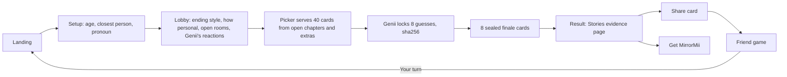

# MirrorMii launch survey: the one build spec

**This is the only spec.** Rules, rulings, numbers, status, open decisions and the plan all live here and are updated here. Content lives in data files (section 3). Code notes live in `quiz64/docs/PERSONA-MVP.md` and never override this file. Paths are relative to `products/survey/`.

## 1. Purpose

People **finish** it, get a personality read that feels accurate and a little spicy ("I didn't know that about me"), **share** it so friends play "Do you really know me?", and **want the app**. It must not read like another generic personality test.

**Order of work (Jerry, 2026-09-28):** the evidence framework and the tagging must be right first. Tags, questions, answers and the final page are Jerry's to change freely afterward, without breaking the evidence.

## 2. The build in numbers (2026-09-28)

| What | Count |
|---|---|
| Taps per player | 55: setup 3, lobby 4, cards 40, sealed finale 8 |
| Questions built | 81: 61 chapter cards, 12 extra cards, 8 sealed cards |
| Answer options | 331: 159 carry axis values, 240 carry tags, 120 carry an emotion, 15 circumstance (score nothing), 4 "depends" with a follow-up |
| Chapters (categories) | 7: 4 always on, 3 optional rooms |
| Card types (question formats) | 7 today; 7 more proposed (section 6) |
| Axes | 6 (3 relationship, 3 life) |
| Types | 64 (16 half-names) |
| Tags | 50 in 25 opposite pairs (4 are 18+ only) |
| Genii's calls | 150 one-liners |
| Setup and lobby combinations | 13,824 |
| Combinations that change the cards | 48 (age 2 × depth 3 × rooms 8) |
| Distinct routes | 1,768 distinct card orders from 1,920 simulated players; nearly every player gets a unique route |
| Types reached in simulation | 64 of 64 |
| Tests | 136 app, 27 kit, all pass |
| Real-person accuracy | untested (blind test 1 on the older kit: 0 of 6) |

## 3. Where everything lives

| Part | File |
|---|---|
| Cards (content and evidence) | `research/persona-quiz-v2/final/cards.json` |
| Types, axes, tags and result lines | `research/persona-quiz-v2/final/library.json` |
| Friend game content | `research/persona-quiz-v2/final/friend.json` |
| Scorer (one scorer for app, CLI, sim, tests) | `research/persona-quiz-v2/final/score-core.mjs`; `score.mjs` CLI; `sim.mjs`; `tests.mjs` |
| Web game | `quiz64/src/PersonaApp.jsx`, `quiz64/src/persona/` (lobby `lobby.js`, picker and state `session.js`) |
| Result page drafts | `research/result-page-wireframes/` (`stories.html` is the chosen direction) |
| Structure source | Sally's v2 system, `research/sally-v2-2026-09-26/` (Chinese). A template, never a translation source |
| Branch | local `survey/launch`, not pushed. The live site (older dossier build) is untouched |

## 4. Flow

## 5. Onboarding and chapters

**Setup** (3 taps): age band (18+, 13 to 17, under 13 stops and stores nothing), closest person (best friend, partner, crush, sibling, parent, someone else), pronoun (she, he, they; used in the friend game).

**Lobby** (4 taps, unscored, all copy in `quiz64/src/persona/lobby.js` `LOBBY_COPY`):

| Tap | Options | Effect |
|---|---|---|
| How should your ending read? | one sharp read / the read plus what I said / make me laugh / go easy on me | How the result is told (section 13) |
| How personal can Genii get? | keep it light / a little personal / ask me anything | light: no 18+ or intimate cards; a little: no 18+; anything: all the age band allows |
| Which rooms can Genii visit? | love, work, family (each can be closed) | Closed rooms drop their chapter; the run stays 40 cards |
| How should Genii react between cards? | gently / playful / straight to the point / quietly | Genii's between-card lines; quietly hides them. Answers count the same |

**Chapters:**

| # | Chapter | Cards | On |
|---|---|---|---|
| 1 | Your phone | 8 | always |
| 2 | Friends | 9 | always |
| 3 | Love and your person | 9 | room: love |
| 4 | Money and treats | 7 | always |
| 5 | Work, school and ambition | 9 | room: work |
| 6 | Family and home | 10 | room: family |
| 7 | Play, rules and you | 9 | always |
| Extras | Axis cards (6 scenario, 6 this-or-that) | 12 | pool, used by the picker |
| Finale | Sealed guesses | 8 | always |

## 6. Question formats

**Principle.** Players should never feel asked "what would you do when X happens?" The format is the fun layer; the evidence contract underneath never changes: every option carries its axes and tags, and the card's grade says how strong the evidence is. The grade follows what the format actually observes: something you did (strongest), something you'd do in a situation, or what you believe or how you see yourself (weakest). Indirect is not hidden: the masking rule holds either way (never name the trait being measured).

**Built (in `cards.json`):**

| Format | What the player does | Grade, weight | Count |
|---|---|---|---|
| Scenario | Picks a move in a vivid imagined moment | would, 0.55 | 22 + 6 extras |
| Real moment | "The last time..." picks what they actually did | did, 0.80 | 13 |
| This or that | 2 punchy options, in quick rounds of 3 | believe, 0.45 | 12 + 6 extras |
| Pick two | 2 of 6 short lines most like them | believe, 0.45 per pick | 7 |
| Role | "In your group chat, you're the..." | believe, 0.45 | 5 |
| Feeling | After a card: which feeling showed up first | emotion only, 0 | 2 |
| Sealed | New moment; Genii locked its guess first | never scored | 8 |

**Indirect formats** (approved 2026-09-28: the first four now; Rank it, Friend's-eye view and Vibe pick held until after blind test 2):

| Format | What the player does | Example | Grade, weight |
|---|---|---|---|
| Receipts check | Taps everything that's true right now; items are ordinary facts, never traits | "Tap what's on your phone right now: 3+ alarms / a screenshot of someone else's text / an unread from your mom / a notes-app list titled 'ideas'" | did, 0.40 per tick, max 3 ticks count |
| Guilty or not | Genii bets on a specific thing they've done; tap Guilty or Never | "I bet you've rewritten a text three times, then sent 'k'." | did, 0.80 |
| Reply picker | A mock text thread or notification; pick the reply they'd send | Group chat: "who's booking the Airbnb??" | would, 0.55 |
| Other people | Reacts to what someone else did; judging others reveals their own line | "Your friend reads their partner's texts while they shower. Your first thought?" | believe, 0.45 |
| Rank it | Drags 4 things into order | "Rank what you'd cancel first: gym, date, family dinner, group project" | believe, 0.45 split by rank |
| Friend's-eye view | Picks the line their best friend would use to describe them | "Your best friend describes you to a stranger. Which line?" | believe, 0.45 |
| Vibe pick | Picks an object, room or name; flavor only | "Pick your group chat name" | tags only, 0.20, never axes |

## 7. The evidence layer

Every answer option carries its own evidence. The scorer only adds up what options say. No hidden topic scores.

| Field | Rule |
|---|---|
| `axes` | Signed -2 to +2 on the six axes (+ is the first pole). Usually one axis, never more than two |
| `tags` | Strength 1 to 3. Usually 1 or 2 tags, never more than 3. Support for a tag counts against its pair |
| `emotion` | Optional, research record only |
| `circumstance` | The option is a situation, not a choice (money pressure, no real choice). Scores nothing (Sally's "only way right now") |
| `depends` | Scores nothing; opens "What would flip you?" with 3 presets |
| Exits | Skip, Not my life, No recent example (real cards). Never score |
| Grade weight | did 0.80, would 0.55, believe 0.45, emotion 0, sealed 0 (plus section 6 proposals) |
| Rushed | Under 1.5 s counts at 0.3. A tag also needs at least one calm card |
| `mask` | Internal: what the card looks like versus what it measures |
| `friend` | Third-person version for friend game Level 2 (51 cards) |

**Content can change, evidence can't drift (approved, built in step B).** Tag and type names and all result lines are keyed by id, so renaming never touches evidence. Card and answer text can be rewritten freely, but a check will fail the tests when an option's text changes without its evidence being re-confirmed, so a rewrite can never silently change what an answer means.

## 8. Axes and types

| Axis | + pole | - pole | Cards carrying it (pool) |
|---|---|---|---|
| R1 | We | Me | 7 |
| R2 | Direct | Soft | 7 |
| R3 | Classic | Own | 7 |
| L1 | Steady | Venture | 7 |
| L2 | Push | Easy | 7 |
| L3 | Rules | Context | 8 |

Relationship half = R1 × R2 × R3 (8 names). Life half = L1 × L2 × L3 (8 names). Type = one of each (64). The 16 current names are literal translations of Sally's Chinese and will be rewritten English-native (section 18, step C). Flex badge when an axis is too close to call; the pole then follows real-behavior evidence first.

## 9. Tags

50 tags in 25 opposite pairs across the 7 chapters. Each tag: id, pair, chapter, name, sting (owner only), heart, 2 or 3 calls, what it must never be read as, 18+ flag, friend-game setting. A tag fires with net support of at least 2.25 from at least 2 separate cards, one of them calm; "strong" at 3.0; if nothing fires, the best candidate above 1.25 shows as "leaning". Up to 5 shown, spread over at least 3 chapters where possible. Names: meme-style, never a diagnosis or a moral grade, gender neutral. Tag names and lines can be rewritten any time (ids stay).

## 10. The picker

Every player answers exactly 40 cards (`RUN_SIZE` in `session.js`) then the 8 sealed cards. Deterministic: the only randomness is seeded from the run id, and a restored save replays the same route. Pool: open chapters plus the 12 extras, after age, depth, the C3-9 gate and feeling-card rules. Chapters play in order, each opening with its first authored card. Per pick, in priority order:

1. **Coverage:** every axis gets at least 2 valid cards; if a closed room carries an axis, other chapters and extras cover it.
2. **Retention:** after Skip, Not my life or No recent example, the next card targets the same axis. After 3 rushed taps, the next card is a quick this-or-that or role card.
3. **Flow:** no two cards of the same type in a row (except this-or-that rounds); no two neighbors on the same axis or tag pair.
4. **Value:** otherwise, balance the axes and favor tag pairs the player is already leaning on.

Simulation (14,400 runs over every room combination): 0% unfinished sides, 89 to 98% of players get 3 to 5 tags, none get 0, sealed accuracy 57 to 61% exact (69-card baseline 59.6%, chance 25%).

## 11. Scoring settings

All in `score-core.mjs` `CONFIG`, set by simulation: weights (section 7), rushed 0.3, minAxisCards 2, flexBand 0.12, tagFire 2.25, tagStrong 3.0, tagFloor 1.25, maxTags 5, minChapters 3, tagRank "share", splitMin 0.4, sealedTagWeight 0.6, sealedPairScale 1.2.

## 12. Genii's sealed guesses

Before the finale, Genii locks its 8 guesses with a sha256 and cannot change them. Genii picks the option that best matches the profile, or passes when the card's main axis is Flex or unfinished. Exact hits (chance about 25%) and right-side hits (chance 50%) are scored. Sealed answers never feed the profile. A tampered save refuses to score.

## 13. The evidence page (result)

**Direction: Stories** (tap-through, like Spotify Wrapped), 7 to 9 screens, type revealed by screen 3 or 4, told in the ending style picked in the lobby. Draft: `research/result-page-wireframes/stories.html` (13 screens, placeholder copy). Principles from the Wrapped research: one type name the data can justify; each claim carries its evidence in one soft clause; contradictions shown warmly as range, never as a catch; one surprising, checkable fact; every screen shareable; sensitive lines never on share cards; ends with the friend invite and the app.

**Content per player (from the scorer):** type and its two halves, 6 axis positions, up to 5 tags with the player's own answers behind each, 2 stings (owner only), 2 hearts, 3 calls, a split if one exists, Genii's 8 guesses with hits. Never shown: numbers, ids, the words "evidence", "axis" or "sealed".

**Voice (rulings):** smooth and natural; no gotcha lines ("You'd say X. Last three times, you did Y.") and no sitcom lines ("Genii called this before you answered"). The current plot-twist template breaks this and will be replaced.

**Share card:** type name, tag names with hearts, "Do you really know me?". No stings, answers or scores.

## 14. Friend game

The owner picks a relationship (partner, crush, friend or coworker, bestie) and sends a link. Level 1: 6 either-or guesses, one per axis. Level 2: 12 of the owner's cards in third person, 2 options each. Level 3: 12 tag cards (the owner's, their opposites, decoys), pick the right ones. Level 4 (bestie, owner opt-in): which sting hits hardest, plus pick a preset roast. The owner sees "You, through {friend}'s eyes" with They get you / What they don't see / Who they think you are. The friend sees only scores, then "Your turn". Links carry the answer key and are unsigned (fine for testing; a backend is needed before real players).

## 15. Safety and privacy

Teen-safe by default (18+ cards need 18+ setup; teens never get the marriage and kids tags). No health, no politics, no identity inference (orientation, religion, party, health). Circumstance answers never become personality. Stings are owner only. Friend answers are private to the owner. Entertainment and self-discovery, not a validated scale; no MBTI names. Answers stay in the browser; no backend yet.

## 16. Rulings in force (Jerry)

| Ruling | Date |
|---|---|
| One build: this survey. No parallel builds or specs; this file is the only spec | 09-28 |
| Evidence and tagging first; tags, questions, answers and the result page are changeable after | 09-28 |
| Result voice: smooth, natural; no gotcha or sitcom lines | 09-28 |
| Result must be spicy ("I didn't know that about me") and distinct from generic tests | 09-28 |
| Sally's system is a template, not a translation source; English names and tags may be rewritten | 09-28 |
| Result display: Stories format | 09-28 |
| Run length 40 + 8; indirect formats (receipts, guilty or not, reply picker, other people); two distinct voices; text-change guard | 09-28 |
| Multiple choice only, never free text | 09-26 |
| Every question masked; vivid scenarios are the main format | 09-26 |
| Every answer option tagged; no topic scores | 09-26 |
| Onboarding: a few routing taps, then scored cards | 09-26 |
| Gender-neutral questions; teens 13 to 17 in scope (conflicts with PRODUCT-TRUTH, open) | 09-26 |
| Web game; no health data; storage SQLite when a backend exists | 09-24/26 |

## 17. Status and known gaps

| Part | Status |
|---|---|
| Setup, lobby, picker, 40 + 8 | Built, tested, played in the browser |
| Cards and evidence | Built; gaps below |
| Names, tags, result lines | Built as literal translations; to rewrite |
| Voices | One voice; 2 + Be kind planned |
| Evidence page | Old template in the app; Stories drafted |
| Friend game | Built |
| Real-person validation | None |

**Evidence gaps (step B fixes these):**

| # | Gap | Count |
|---|---|---|
| 1 | Cards per axis in the pool | 7 (L3: 8) |
| 2 | Tags backed by only 2 cards | 9 |
| 3 | Tags that never fired at 40 cards with every room open | 8 |
| 4 | Tags firing for under 1% of players | 8 |
| 5 | Tags with no "what you did" evidence | 19 |
| 6 | Axes where random clickers lean (R3, L2, L3) | 3 |
| 7 | Guard against answer rewrites changing meaning | missing |
| 8 | Real-person accuracy | untested |

## 18. Plan

**Step A (done 2026-09-28):** this file.

**Step B: evidence lock.** Acceptance: every item below passes, tests green, simulation rerun.
1. Every axis has at least 9 cards in the pool, by adding axis values to existing options first and new cards only if needed.
2. Every tag has at least 3 supporting cards, at least 1 of them "did" evidence, using the approved formats of section 6 (receipts check and guilty-or-not cover many tags per card).
3. Every tag fires for at least 1% of consistent simulated players at 40 cards with every room open.
4. Random clickers land 45 to 55% on every axis.
5. Text-change guard in the tests (section 7).
6. Blind test 2 with Jerry and 3 to 5 real people: accuracy and "that's me" per line.

**Step C (after B):** English-native names, tags and result lines (5 samples to Jerry first); voices; the Stories evidence page in the app; remove the old dossier code from `quiz64`.

## 19. Decisions

| # | Decision | Status |
|---|---|---|
| 1 | Indirect formats | **Approved 09-28:** Receipts check, Guilty or not, Reply picker, Other people. Held: Rank it, Friend's-eye view, Vibe pick |
| 2 | Weights for the new formats | **Approved 09-28** as in section 6 |
| 3 | Run length | **Approved 09-28:** 40 cards + 8 sealed |
| 4 | Voices | **Approved 09-28:** two distinct voices, Make it fun plus one more, picked by the player in onboarding. Principle (Jerry): everyone has their own circumstances and likes to be addressed differently, so onboarding learns who they are and the voice meets them there. The second voice is proposed with samples in step C |
| 5 | Text-change guard | **Approved 09-28** |
| 6 | App ending promise | **Approved 09-28:** only what the app does today |
| 7 | Teens 13 to 17 | Open (conflicts with PRODUCT-TRUTH) |
| 8 | Friend link answer key | **Approved 09-28:** fine for testing; backend before real players |

## 20. Superseded documents

Replaced by this file; kept only as history: `research/persona-quiz-v2/BRIEF.md`, `docs/questions/PERSONA-QUIZ-SPEC-V2.md`, `research/persona-quiz-v2/final/RESULT-TEMPLATE.md`, `docs/questions/RUN-SPEC-LEDGER.md`, the launch sections of `docs/STATE.md` and `docs/OPEN-QUESTIONS.md`. `quiz64/docs/PERSONA-MVP.md` stays as code notes only. Build history: `docs/history/BUILD-ITERATIONS.md`.

## Changes

- 2026-09-28: Jerry approved section 19 (formats, 40 + 8, two voices, guard, app promise, friend link); step B started.
- 2026-09-28: Created by consolidating six documents; added the question format catalog (section 6), the evidence gaps and plan (sections 17 and 18) and the approval list (section 19).
