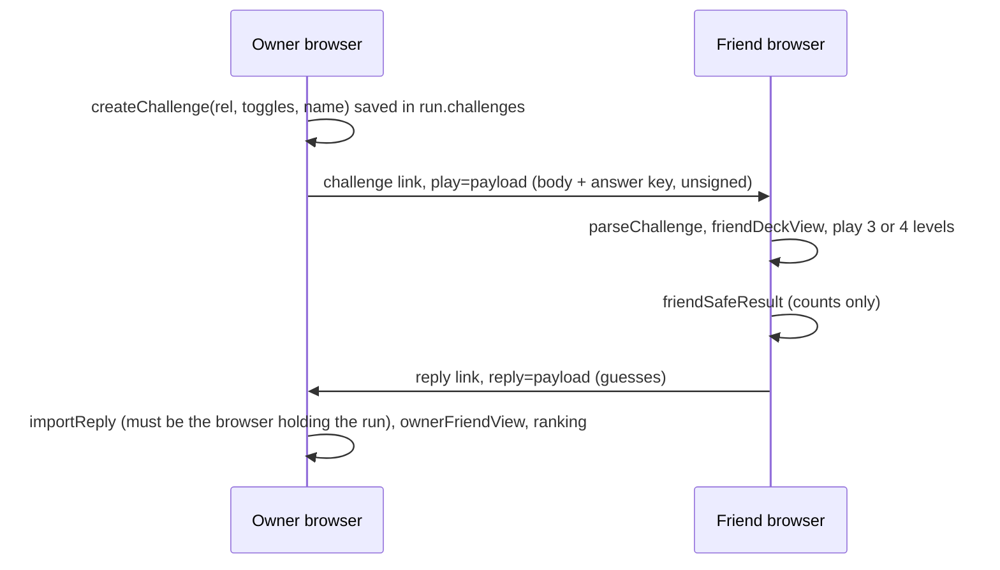

# Friend challenge (`friend-challenge.schema.json`, `friend-content.schema.json`)

"How well do you know me?" Game rules: [LAUNCH-SPEC section 3](../LAUNCH-SPEC.md). Content: `friend.json` ([friend-content.schema.json](friend-content.schema.json)). Code: `quiz64/src/persona/friend.js`, `links.js`; deck and scoring in `score-core.mjs` (`buildFriendDeck`, `scoreFriendGame`, `rankFriends`).

## Today (built, browser only)

| Def | What |
|---|---|
| `linkPayload` | `base64url(JSON).sha256[0:8]`, 6000 chars max, in the URL fragment |
| `challengeLinkBody` | `v k i r n p e s w o` plus the **answer key** `a` (Level 1 truth per axis), `b` (Level 2 owner side per card), `c.t` (true tags), `d.t` (true sting) |
| `replyLinkBody` | the friend's guesses: `a` per axis, `b` [card, side, why chip], `c` tags, `d` [sting, roast] |
| `savedChallenge`, `savedReply` | what the owner's run stores (decks are rebuilt from the run and the seed, never stored) |
| `guesses` | the cleaned guess set `scoreFriendGame` reads |
| `friendSafeResult` | what the friend sees: counts only, never which ones, never Level 4, the owner's type only if allowed |
| `ownerComparison` | "You, through {friend}'s eyes": owner only |

Known limits (approved for testing only, LAUNCH-SPEC section 9): the answer key rides in the link, so a friend who decodes it can cheat; the SHA-256 prefix is not a signature, so a link can be edited or forged (content is limited to kit ids plus a 24-letter name); replies do not sync across devices; nothing expires.

## Proposed (backend)

| Def | Endpoint ([api.md](api.md)) |
|---|---|
| `challengeRecord` | stored server-side on `POST /v1/challenges`: owner choices, seed, and `answerKey` (today's a, b, c.t, d.t) |
| `publicChallenge` | `GET /v1/challenges/{token}`: the playable deck with no truth (no Level 1 truth, no Level 2 answer, no Level 3 role, no true sting) |
| `friendSubmission` | `POST /v1/challenges/{token}/answers`: the friend's `guesses`; the server scores them and returns a `friendSafeResult` |

`records.mjs` builds `challengeRecord` and `publicChallenge` from today's code, and the validator proves both on real runs, so the move is a transport change: the deck logic and scoring stay in `score-core.mjs`.
