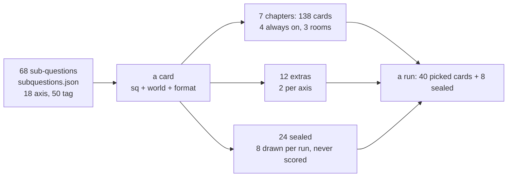

# Question pack

The launch survey's questions (cards), for developers and future content work. The rules live in [LAUNCH-SPEC](../LAUNCH-SPEC.md) (sections 5 to 12, 21, 22); this page explains how the bank is organized and how to change it safely, and points at a generated export.

| File | What |
|---|---|
| `research/persona-quiz-v2/final/bank/*.json` | **Source.** Authored per chapter: `ch1.json` to `ch7.json`, `extras.json`, `sealed.json` |
| `research/persona-quiz-v2/final/cards.json` | Merged kit the app and scorer read (`merge-bank.mjs`). Contract: [card.schema.json](../contracts/card.schema.json) |
| [question-pack.csv](question-pack.csv) | **Generated export**, one row per card (below). Opens in any spreadsheet (UTF-8) |
| [question-pack.json](question-pack.json) | Generated version and counts: `kitId`, `cardsSha256`, counts by chapter, format, grade, world, privacy, cards per axis and per tag, weights |

Regenerate after every bank merge: `node scripts/export-question-pack.mjs` (`--check` only compares). `scripts/validate-contracts.mjs` and `npm test --prefix quiz64` fail while the export is stale.

## How the bank is organized

Snapshot 2026-09-29, kit `persona-quiz-v2@2026-09-30` (live numbers: `question-pack.json`).

- **Chapters** (LAUNCH-SPEC section 5): 1 Your phone (22), 2 Friends (22), 3 Love and your person (18, room: love), 4 Money and treats (20), 5 Work, school and ambition (18, room: work), 6 Family and home (18, room: family), 7 Play, rules and you (20). A closed room drops its chapter; the run stays 40 cards. Each chapter opens with its first authored card.
- **Extras** (12): two per axis, used by the picker to finish an axis a closed room leaves thin.
- **Sealed** (24): the finale pool. Genii locks a guess for 8 of them (seeded by the run id) before the player answers; they are checked against `checks.primary` and `checks.pairs` and never feed the profile.
- **Sub-questions** (`sq`, `subquestions.json`): every card is built backward from one of 68 questions (18 on the axes, 50 on the tags), so each option lands on a side. Feeling cards have none.
- **Worlds** (`world`): absurd 61, unusual 74, everyday 39. Absurd cards are capped at weight 0.35; did formats stay real.
- **Voices**: every card exists in Make it fun (top-level `prompt`, `options[].t`) and Heart to heart (`heart.prompt`, `heart.options`, same order and meaning). The lobby's "Just the cards" reads Make it fun.
- **Privacy**: 7 `intimate` cards are skipped under "Keep it light". No age gating and no age content.
- **Friend cards**: 117 cards carry a `friend` field (third person, sides a and b) for friend game Level 2. Receipts and rank cards never do.
- **Rounds and follows**: cards sharing a `round` play back to back (quick rounds of up to 3); a `feeling` card plays right after the card in `follows`.

## Formats (13)

| Format | Player does | Grade | Weight | Cards |
|---|---|---|---|---|
| scenario | picks a move in a vivid moment | would | 0.55 | 41 |
| real | "the last time...": what they did | did | 0.80 | 16 |
| receipts | ticks every ordinary fact that is true | did | 0.40 per tick (past 3 ticks, scaled to 3) | 7 |
| bet | Genii bets on something they did; 3 to 5 own answers | did | 0.80 | 18 |
| reply | picks the reply in a mock chat | would | 0.55 | 14 |
| others | reacts to what someone else did | believe | 0.45 | 14 |
| this_or_that | two punchy options | believe | 0.45 | 17 |
| role | "in your group chat, you're the..." | believe | 0.45 | 5 |
| pick_two | 2 of 6 lines | believe | 0.45 per pick | 4 |
| rank | orders 4 items | believe | 0.45 x position (1, 0.5, 0, -0.5) | 3 |
| eyes | the line a friend would use about them | believe | 0.45 | 4 |
| feeling | first feeling after a card | emotion | 0 | 7 |
| sealed | Genii locked its guess first | none | 0 | 24 |

Grade, weight and exits come from the format (`card-schema.mjs`), never from the writer.

## Evidence model (summary; full rules in LAUNCH-SPEC sections 7 to 12)

- **Every option carries its own evidence**; the scorer only adds up what options say. `axes`: -2 to +2 on up to two of six axes (+ is the first pole). `tags`: strength 1 to 3 on up to three of 50 tags in 25 opposite pairs; support for a tag counts against its pair. `emotion` is recorded, never scored.
- **Weight of a pick** = format weight (above), x 0.3 if answered in under 1.5 s (rushed). Exits (Skip, Not my life, No recent example), `circumstance`, `depends` and "None of these" score nothing.
- **Axes**: a pole needs at least 2 cards; within 0.12 of even it reads Flex, broken by did cards first. Six poles give two archetypes (8 people x 8 life).
- **Tags**: fire at net support 2.25 from 2 separate cards (one calm), strong at 3.0; up to 5 shown from at least 3 chapters; if none fire, the best above 1.25 shows as leaning.
- **Splits**: believe-grade evidence one way and did or would the other way on the same axis becomes "the thing you didn't know".
- **Evidence lock**: `evidence-lock.json` holds a hash of every text next to the evidence it carries. Rewording is free; a changed text fails the kit tests until someone re-reads the card and re-locks it.
- Current coverage (scored pool): R1 22, R2 22, R3 19, L1 17, L2 17, L3 18 cards per axis; every tag 2 to 12 cards (T02A, T02B, T11A, T11B at 2; see ROUND4-LOG for T02).

## The CSV

One row per card, in authored order (chapters, then extras, then sealed). Columns:

| Column | Meaning |
|---|---|
| `id`, `group`, `chapter`, `chapter_title`, `position` | where the card sits (`group`: chapter, extra, sealed) |
| `format`, `grade`, `weight`, `world`, `privacy` | format and evidence strength |
| `sq`, `sub_question` | the sub-question it was built from |
| `prompt_fun`, `prompt_heart`, `thread_fun` | the question in both voices; chat thread for reply cards |
| `options_fun`, `options_heart` | numbered options, ` \|\| ` between them |
| `evidence` | per option: `R1+2 T02B:2 (envy)`; axes signed, tags with strength, emotion in brackets |
| `axes`, `tag_pairs` | what the card can move |
| `sealed_checks`, `follows`, `round`, `friend_card` | sealed check axis and pairs (or the extra's axis), feeling link, quick round, friend Level 2 |
| `mask` | authoring note: what it looks like versus what it measures. Never shipped to players |

## Adding or changing a card safely

1. **Write it with the card-writer skill**: `skills/shared/genii-card-writer/SKILL.md` in the central workspace (sub-question first, world, hook, event, moves, spice, uniqueness, both voices, JSON shape in its section 7). Put it in the right `bank/*.json`; new ids continue the chapter's numbering.
2. **Check**: `node check-bank.mjs` (schema per format, option counts, both voices, fingerprints, bans, evidence rules) and `node shape-audit.mjs --limits` (repeated shapes), inside `research/persona-quiz-v2/final/`.
3. **Merge**: `node merge-bank.mjs` builds `cards.json` (fills grade, weight, exits and checks).
4. **Lock the evidence**: `node lock-evidence.mjs` lists what changed; after re-reading, `node lock-evidence.mjs --confirm <cardId>`.
5. **Friend snapshot** when a `friend` field changed: `node friend-snapshot.mjs` (check), then `node friend-snapshot.mjs --write`.
6. **Prove it**: `node --test tests.mjs`, `node audit.mjs` (coverage), `node sim.mjs --quick`, then `npm test --prefix quiz64` (kit parity, picker, contracts) and `node quiz64/tests/persona-sim.mjs --acceptance`.
7. **Export**: `node scripts/export-question-pack.mjs` and commit the CSV with the bank change.
8. Every merge stamps `cards.json` with the day's date, which changes `KIT_ID`: saves and links from the old kit are refused. Batch content changes into releases.
