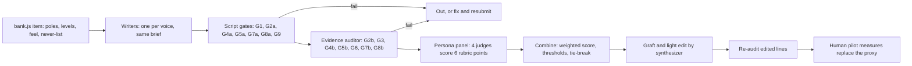

> **Superseded: history only.** The launch survey's one spec is [LAUNCH-SPEC.md](../LAUNCH-SPEC.md) (locked 2026-09-29); nothing here governs the build.

# Question gauntlet spec V1

## a. Verdict in five lines

1. Ship three voices: **Make it fun** (17 tags won, weighted 4.07) and **Call me out** (13 won, 4.06) are tied on quality. Fun wins on honesty, Call me out on laughs. **Be kind** (3.41) ships as the calm option, not as a growth voice.
2. No candidate voice earns a slot. Scenario (3.90) has the best *prompts*, so its technique goes into all three voices. Quest (3.57) and Oracle (3.34) are cut: judges flagged the game words and the card frame as noise, and they hurt clarity.
3. The gates caught what the judges loved. The funniest prompt in the run (plane clapping) failed, and all six writers made the same `lending` error. Rule 2 (same meaning, same level) caused 13 of the 20 failure notes.
4. A single evidence auditor under-enforces rule 3 (no cool answer). The virality judge (Theo) caught 12 more cool-answer leaks in the production voices that the auditor passed. I fixed them in winners.json, and 24 entries need a second audit.
5. The structure matters more than the voice. Scene tags average 4.03 and quick-only tags 3.52. The eight flat tags are all quick-only or 18+, and no voice fixes them. They need scenes or should be accepted as plain.

## b. The gauntlet method (reusable for any future question)

### Hard gates (pass or fail; a failure is out no matter the score)

| Gate | Rule | Who checks | Pass condition |
|---|---|---|---|
| G1 | Multiple choice only | Script | No free-text field in the item schema |
| G2a | Same option count and order | Script | Option count equals bank.js, and levels in bank.js order (including out-of-order items like `celebration_budget` -2,-1,+2,+1 and null options) |
| G2b | Same meaning, same level | Judge | Every option keeps its meaning and extremity; hedges kept ("don't lead with" is not "never"); no detail that narrows the event (a birthday, a dinner) or changes the motive |
| G3 | No cool answer, both poles reachable | Judge (2 passes, see below) | Equal charm on every option; no grading words; no example in the prompt that sets the stakes; no caption lines |
| G4a | Masked: trait words | Script | No word from the trait list (boundary, attachment, introvert, people-pleaser, healthy, toxic, mature, selfish, generous, loyal, jealous and so on) and none from the tag's own `never` field |
| G4b | Masked: subtle naming | Judge | The visible topic is the everyday moment; no option credits a virtue ("the honest answer") |
| G5a | Scene framing | Script | Scene prompt contains "last" |
| G5b | Scene is a real past event | Judge | Did-grade: a real recent event, not a hypothetical in disguise |
| G6 | Emotion codes carried | Judge | Options marked guilt, sting, worry, resentment or longing still carry that private feeling |
| G7a | Gender and teen words | Script | No gendered words; no alcohol, sex or dating-only words outside 18+ tags |
| G7b | Gender and teen framing | Judge | No gendered defaults or jokes; teen versions exist where the adult prompt assumes rent, work or dating |
| G8a | Length | Script | Options 10 words or fewer; prompts 20 or fewer |
| G8b | Plain and true | Judge | Option starts with the action; one idea; the joke is a true, specific detail, not a metaphor; a real person would text it word for word |
| G9 | Scan and punctuation | Script | Options start with different words; no em dashes |

Script coverage: G1, G2a, G4a, G5a, G7a, G8a and G9 are mechanical. Everything with "b" plus G3 and G6 needs a judge. This run's checker (run over all six writer files and winners.json) found only one script-level failure: Oracle's `betrayal_line`, where both options start with "The". Every other failure needed a judge.

**Rule 3 needs its own pass.** The evidence auditor passed 12 production lines that the virality judge flagged as cool answers (see section d). From now on, G3 runs as a separate judge prompt with one question per item: "Which option makes the person who picks it look best? If there is a clear answer, fail." Two auditors run independently, and any disagreement goes to the synthesizer.

### Scored rubric (1 to 5, each persona judge scores every item)

| Point | 1 | 3 | 5 |
|---|---|---|---|
| Clarity | Had to reread; unsure what an option means | Clear after one read, one option slightly vague | Picked in under 5 seconds; every option obvious |
| Funny | No smile; or a joke that needs decoding | A light, pleasant detail | A true detail that makes me laugh because I did exactly that |
| Recognition | None of these is me | One option is roughly me | "That's exactly me": one option names my actual move |
| Emotion | Flat; no feeling | Mild pull of the target feel | Pulls the item's `feel` (guilt, sting, envy and so on) and I feel it privately |
| Honest | One option is clearly the right or cool pick | Slight tilt; I might shade my answer | Every option is fine to pick; I would answer truthfully |
| Share | Would not send | Might send to one friend if asked | Would screenshot it or send "this is you" unprompted |

### Judge panel

| Seat | Persona in this run | Job |
|---|---|---|
| Evidence auditor | `evidence` | Gates only, pass or fail with the rule cited. No taste. |
| Core ICP | Jasmine, woman 18 to 34, cozy gamer | Recognition and emotion for the lead audience |
| Male reader | Jordan, man in his 20s, gym group chat, not a gamer | Gender-neutral check: does it travel beyond the ICP? |
| Teen | Riley, 13 to 17, plays Minecraft | Teen-safe and teen-real check; catches adult details |
| Virality | Theo, games creator and reviewer | Share and cool-answer detection |

Changes for the next run: (1) the teen judge does not score 18+ items (Riley gave them a mean share of 1.04 for items a teen never sees, which drags the average for no reason); (2) add a second G3 auditor; (3) add a Canadian or non-coastal North American reader so "North America" is tested, not assumed; (4) all personas come from one model family, so their agreement (r = 0.71 to 0.87) is inflated by shared priors. Treat agreement as weak evidence.

### How scores combine

1. **Gates first.** Any gate failure removes the line from ranking. It can come back only after a fix and a re-audit.
2. **Weighted score per judge**, then averaged over judges:
   `score = 0.25 recognition + 0.20 honest + 0.15 clarity + 0.15 funny + 0.15 share + 0.10 emotion`
   - Recognition carries the most weight because the product is tags accurate enough to send to friends. "That's exactly me" is the end feeling.
   - Honest is second because a cool answer corrupts the tag, and no joke can buy that back.
   - Clarity is a floor. It sat at 4.9 for five of six writers, so it rarely decides anything, but a drop (Oracle, 4.11) is a real warning.
   - Funny and share together get 0.30. They drive the viral goal, but they are the proxies we trust least (section c), so they cannot outvote accuracy.
   - Emotion gets 0.10 because the bank item already fixes most of the target feeling. The voice only has to keep it.
3. **Thresholds.** Ship: weighted 3.8 or more, honest mean 4.0 or more, clarity mean 4.5 or more, and no single persona below 3.0. Watch list: 3.4 to 3.8, which goes to the pilot and lets human data decide. Rewrite: below 3.4. Quick-only items sit about 0.5 lower than scenes by structure (3.52 against 4.03). A quick-only item on the watch list needs a scene, not a joke.
4. **Tie-break.** When the top two are within 0.10: the higher honest mean wins. If still tied, the higher lowest-judge score wins, because that is the version no audience hates. If still tied, the one with fewer words wins.

## c. How we evaluate "funny", "good" and "viral" honestly

LLM persona judges are a proxy. They are cheap, fast and good at catching rule breaks and adult-sounding lines. They cannot tell us what a real 16-year-old or a real 30-year-old man finds funny, or what anyone will actually share. Their numbers rank drafts. They do not predict behavior. The pilot replaces them with these measures:

| Measure | What it tells us | Target |
|---|---|---|
| Completion rate | The run is not too long or too boring | 75% or more of starters finish the scored run; no single item loses more than 2% |
| Time per item | Clear, and actually read | Median 4 to 12 s for quick takes, 6 to 15 s for scenes. Flag an item if its median is over 20 s (confusing) or if more than 25% of answers take under 2.5 s (not read) |
| Answer spread per item | No cool answer, no dead option | No option above 70%; minority pole 20% or more; no option under 5%; "depends/none" 35% or less |
| Voice invariance | The human test of "same meaning, same level" | Voice randomized per person; on every item, no option's share differs by more than 10 points between voices |
| "That's me" rating | Recognition | 80% or more rate their tag list 4 or 5 out of 5; each tag line 70% or more |
| Share-button taps | Viral pull | 10% or more of finishers tap share; 30% or more of shared links bring back a finished friend answer |
| Swap test | Accuracy, the real bar | 80% or more pick their own tag list over a random other person's (TAG-VALIDATION-SPEC section 5) |
| Sealed-check lift | The tag knows the person, not the crowd | H01 to H08 predictions beat the popularity baseline by a margin set before launch (proposal: 10 points) |
| Funny, qualitative | Whether the jokes land | In 5 to 8 think-aloud sessions, an unprompted laugh or "that's me" on at least 1 item in 3; any line two or more people say they would text goes to the "keep" list |

Order of trust when proxy and human disagree: human spread and swap test first, then the "that's me" rating, then share taps, and persona scores last.

## d. Results

### Per writer

| Writer | Gate pass | Clarity | Funny | Recognition | Emotion | Honest | Share | Weighted | Tags won (tie-break) | Tags won (raw top) |
|---|---|---|---|---|---|---|---|---|---|---|
| Be kind | 43/45 (0.956) | 4.95 | 1.24 | 3.72 | 3.43 | 4.63 | 1.89 | 3.41 | 1 | 0 |
| Make it fun | 42/45 (0.933) | 4.99 | 2.97 | 4.30 | 3.95 | 4.64 | 3.17 | **4.07** | **17** | 13 |
| Call me out | 40/45 (0.889) | 4.93 | **3.17** | 4.30 | **4.02** | 4.32 | **3.38** | 4.06 | 13 | **17** |
| Cozy quest | **44/45 (0.978)** | 4.91 | 1.77 | 3.89 | 3.48 | 4.61 | 2.15 | 3.57 | 0 | 0 |
| Scenario director | 43/45 (0.956) | 4.96 | 2.46 | 4.21 | 3.86 | 4.63 | 2.84 | 3.90 | 5 | 6 |
| The Oracle | 40/45 (0.889) | 4.11 | 1.63 | 3.74 | 3.37 | **4.67** | 1.80 | 3.34 | 0 | 0 |

The 45 units per writer are 37 tags plus 8 sealed checks. Rubric means are over 4 judges and 37 tags. Tags won counts only gate-passing lines. `lending` has no winner because all six failed. Judges' own "best per tag" votes (148 total): Call me out 62, fun 56, scenario 22, kind 6, quest 2, Oracle 0. Rankings: Jasmine, Jordan and Theo put Call me out first; Riley alone put fun first. All four ranked Oracle last and kind fifth.

### What each voice is good and bad at

- **Make it fun.** The most balanced voice. Its jokes are softer and land on both poles ("a week in my cart", "someone actually likes vacuuming", "my replies got slower and slower"). It has the best honesty of the three production voices and the most tags won once honesty breaks ties. Weakness: it sometimes gives one pole the only joke (passcode "my birthday anyway", "Wait, you made that?", marriage "paperwork"). All three are fixed in winners.json.
- **Call me out.** It has the most screenshot lines ("Still annoyed about my salad", "Stayed till 2am. Again.", "Checked their stories. Twice."). It is top on funny, emotion and share. Weakness: the lowest honesty of the three (4.32), and 5 gate failures. The jab tips a pole into the "fun rebel" answer ("Oops"), and it adds stakes-setting examples (plane clapping) and motive drift ("not knowing anyone"). Some jabs read as an adult doing a bit to Riley ("Yawns quietly", "food pics").
- **Be kind.** The clearest voice, and Riley rated it the fairest (the only one where helping people is not the automatic good-kid pick). Funny 1.24 and share 1.89 mean nobody sends it. Jordan's share for it is 1.51, the lowest cell in the panel. Its warm adjectives also leak grades ("a nice gesture", "Fair deal", "mostly kind"). It is the right voice for heavy items (caregiving, AI companion).
- **Scenario director.** It writes the best setups (the "can you talk tonight?" text, the bill landing between you, late-night talks) and won `betrayal_line` 4 of 4 and `explore_or_root` 3 of 4. Its options mostly borrow fun's lines, and its setups drift adult (brunch, roommates) for Riley.
- **Cozy quest.** It has the fewest gate failures (1), but it plays safe: funny 1.77. "Side quest", "daily tasks" and "level up" read as a brand pretending to be a gamer to Theo (who reviews games), Riley and Jordan. "The right move is" and "not something to get close to" felt judgy to Jasmine.
- **The Oracle.** Judges mentioned the card frame in 128 of 148 Oracle comments (86%). It is the only voice with clarity below 4.9 (4.11), and it changed the tested condition twice: "an empty night" lost the exhaustion, and "The cards advise…" asks for the cards' advice instead of the person's own. Theo said cards next to money prompts look like a slot machine ad, the wrong look for a game with no dark patterns.

### Judge disagreements worth knowing

- **Jordan (male reader) against Jasmine (core ICP).** Correlation 0.77. They rank the writers the same, and their weighted means for fun and Call me out sit within 0.06 of each other (Jasmine fun 4.16, Call me out 4.13; Jordan 4.16, 4.19). Jordan scores funny higher (+0.32) and recognition lower (-0.22). In this proxy, the gender-neutral goal holds for the two lead voices and fails for Be kind (Jordan share 1.51). One persona is not evidence: the pilot's 80-per-gender split is the real test.
- **Riley (teen) against Jasmine.** This is the least-aligned pair (r = 0.71). Riley scores recognition 0.32 lower and emotion 0.24 lower, and is the only judge who ranks fun above Call me out. Riley's honesty for Call me out is 4.27, the lowest Riley gave any voice: the jabs tip answers. On the 18+ tags, Riley's weighted score is 2.71 against 3.83 on the rest. Those are items a teen never sees, which is a panel design flaw, not a copy flaw. Scored without Riley, the 18+ winners move up: `wedding_budget` Call me out 3.88, `marriage_meaning` fun 3.97, `kids_someday` scenario 3.87 and Call me out 3.67. `commitment_pace` stays weak: Call me out 3.73, and fun 3.55 is the entry that ships. Riley and Theo agree against Jasmine that game words are cringe (Jasmine found "daily tasks" cute).
- **Theo (virality) against everyone.** Theo's honesty mean is 3.89 against 4.73 to 4.86 for the others. He is the only judge who consistently caught cool answers: "Their timeline isn't mine" is the Instagram answer in all six writers, volunteering reads as the good-person pick in `self_or_others`, and a joke on one pole only makes that pole cool. The evidence auditor missed all of these. For honesty, Theo is the most valuable judge on the panel.
- **Evidence auditor inconsistency.** On `wedding_budget`, it failed fun's "Everyone I love, one dance floor" and Oracle's "All our people there" for rule 3, but passed scenario's "Everyone we love, one night". Same payload. The auditor needs calibration examples, which is one more reason for two independent auditors.

## e. Per-domain findings

Best gate-passing weighted score by domain: Friends 4.55, Money 4.29, Online 4.14, Work 4.09, Me 4.09, Love 4.03, Family 3.92. Share is lowest in Family (2.14) and Me (2.20).

- **Love.** The 18+ values tags (`commitment_pace`, `marriage_meaning`, `kids_someday`) are **flat by nature**, and I rate them unfixable as jokes. They are values with no everyday moment, and every attempt to add a detail tilted a pole ("paperwork", "wedding vows", "It's in the plan", "Everyone I love"). Keep them plain and stance-only, and treat them as "finally, an answer" items and the couples angle, not share items. Candidate move: an optional "big life stuff" pack after the main run. `wedding_budget` is fixable (Call me out's "Full dance floor" against "Save the rest" is balanced). `standards` is strong, but its best joke failed G3. `phone_privacy` works once the one-pole joke is removed.
- **Friends.** The strongest domain, and nothing is unfixable. `repair_or_release` scored 4.69, the best of the five new tags; its quick-take prompts needed fixes ("The better move is…", "keeps leaving you drained"). `second_chances` is fine but quick-only (4.06).
- **Family.** `caregiving` is heavy, so the plain line is right in every voice (every judge scored funny 1 and said so). Make it a voice-exempt item. `strings_attached` (3.77) assumes rent, and its teen version (curfew and location sharing) is a different deal. Hold the teen variant to separate analysis. Nothing in Family is broken, but it will never be the share engine.
- **Money.** Strong: `fairness_rule` 4.85 is the best item in the run. `lending` failed in all six writers the same way. The bank's A ("Don't lead with the payback date") is an order distinction that does not survive compression to 10 words. The fix keeps the hedge ("Payback talk can wait"), and this is now rewrite rule 12. `effort_vs_start` is fine at 3.88.
- **Work or school.** `stay_late` and `pay_or_passion` are **flat** (best funny 2.0 and 2.25) and quick-only. `stay_late` also skews adult: Riley scored share 2 or lower for every writer. Fix: give both a scene ("Last time someone asked you to stay late or pick up extra…"), with a teen version set in school or a group project. `success_meaning` and `risk_style` are strong, carried by their scenes.
- **Online life.** `ai_companion` is **flat** (3.59; Jordan's share is 2 or lower for every writer). It is a tech opinion with no moment. Accept it as plain or cut it to a sealed or bonus item. `posting_person` is strong (4.56), but "food pics" reads millennial to Riley.
- **Me and my future.** `life_timeline` is the one tag where every writer kept a cool answer ("Their timeline isn't mine"). My fix in winners.json has not been tested, and the original is kept in `alt` for Jerry. `self_or_others` has a social-desirability problem that four writers could not remove (honesty under 4.0). Only fun's balanced pair works. Long term, it needs a did-grade scene ("Your last free Saturday: what got most of it?"). `explore_or_root` is strong.

**Bank-level issues found (not the writers' fault):**
- H08: "Save it for somewhere familiar" contradicts a ticket good "anywhere you've never been". Sally should fix the sealed item.
- bank.js mask metadata says "for herself" (`looking_put_together`) and has "to their" typos (`success_meaning`, `ai_apology`). None of this is user-facing, but it is a gendered default in the source of truth.
- TAG-VALIDATION-SPEC 3.4's stance says "The mature move is…", a grading word. All writers dropped it correctly, and the spec should follow.
- The scene option order is not always level order. Build tests must assert by level, never by position.
- PRODUCT-TRUTH lists minors as anti-ICP for the app, while this brief puts teens 13 to 17 in scope for the survey. Jerry should rule on that tension before any teen pilot.

## f. Recommendations

**Ship Be kind, Make it fun and Call me out**, with the lines in winners.json (111 production entries plus 24 sealed entries).
- **Pilot default: Make it fun.** It is tied on quality with Call me out, wins more tags once honesty breaks ties, is the teen judge's first pick, and stays within 0.15 of Call me out for the other three judges. Running one voice keeps tag validation clean, as PILOT-VOICES-V1 already recommends. A second arm with voice randomization runs the voice-invariance test.
- **Call me out** is the opt-in for people who want the roast. It carries the most share lines, and its tilt risks are now patched.
- **Be kind** is the calm option and the voice for heavy items.

**Candidate voices.**
- **Scenario: no slot as a voice, but its method is adopted.** Its prompt technique (one concrete, recognizable moment, like the text, the bill or the late-night talks) becomes the default way to write quick-take prompts in all three voices. It is a prompt style, not a tone, so it does not belong among the opening style choices. Two of its lines are recorded in winners.json as clear wins (`betrayal_line`, `explore_or_root`), and fun's `betrayal_line` grafts its "late-night talks".
- **Cozy quest: cut.** It won no tags. The cozy flavor belongs in Genii's host lines and art, not in the items.
- **The Oracle: cut from items.** If the team wants a mystic option among the opening style choices, it lives in Genii's intro and results copy, never in a measured prompt, and at most once per section.

**Rewrite rules learned.** These extend the nine writing rules in PILOT-VOICES-V1 and are proposed for Jerry's approval.

10. **Keep the condition.** Flavor may sit before the tested condition, never replace it ("an empty night" lost the exhaustion).
11. **Don't narrow the event.** Every detail must fit any instance of the scene. No "birthday lunch" when the scene is any plan above budget.
12. **Keep the hedge.** When a pole is about order or degree ("don't lead with", "most", "some"), the short version keeps the hedge. `lending` failed 6 of 6 on this.
13. **Joke both poles or neither.** A detail on one pole only is a cool-answer leak.
14. **No grading words** in prompts or options: fair, nice, honest, kind, mature, healthy, right, better. No "the right move is" or "the better move is".
15. **No stakes-setting examples in prompts.** An example decides the answer (plane clapping makes the ick petty).
16. **No filler jabs.** "Oops" and "Yawns quietly" are sound effects, not true details. Every judge named them as the worst line.
17. **No caption lines.** If an option could be an Instagram caption ("Their timeline isn't mine"), it is the cool answer.
18. **Heavy items go plain in every voice** (caregiving). Mark them voice-exempt.
19. **Teen-proof the details.** Brunch, roommates, rent, food pics and clients read as adult to a teen. Use school, the group chat and part-time jobs, or stay neutral.
20. **Game words only when literal.** "4%" works. "Side quest", "daily tasks" and "level up" do not.
21. **Character frames at most once per section, never per item.**

## g. Before and after

| Tag | Original (bank.js or spec) | Winning line | Why it won |
|---|---|---|---|
| `support_capacity` scene -2 | Showed up, full session. Sleep is a social construct. | Stayed till 2am. Again. (Call me out) | A true detail replaced a metaphor Jerry rejected; "Again." is the confession every judge quoted; top of the tag at 4.70 |
| `support_capacity` scene -1 | Showed up, and quietly set a timer in my head. | Gave them one hour, then said goodnight. (fun) | Same level (showed up, kept it short) with no decoding needed |
| `fairness_rule` scene -1 (resentment) | Even split, and I did the math on it later. | Agreed to even. Still annoyed about my salad. (Call me out) | Keeps the resentment in one concrete, shared detail; the best item in the run at 4.85 |
| `contact_needs` scene +1 (worry) | Checked their stories to see if they were alive. | Checked their stories. Twice. They were alive. (Call me out) | "Twice." is the private worry made visible; 4 of 4 judge votes |
| `favorite_premium` scene -1 | The favorite, after a week of deliberating. | Bought the favorite after a week in my cart. (fun) | "A week in my cart" is the most-quoted line of the run; 4.74 |
| `risk_style` scene none | Still planning it, honestly. | Still planning it. The notes app is full. (fun) | Gives the watcher option the same charm as the starter options, so it is not the loser pick |
| `repair_or_release` scene +1 (new tag) | It faded and I let it. (TAG-VALIDATION-SPEC 3.4) | Let it fade. My replies got slower and slower. (fun) | Every judge recognized it as how friendships actually end; 4.69 |
| `betrayal_line` quick A | The closeness itself. That was ours. | Losing the late-night talks. Those were ours. (scenario, grafted into fun) | A specific loss hurts more than an abstract one; 4 of 4 votes |
| `lending` quick A | Give what I can afford to lose. Don't lead with the payback date. | Send what I can lose. Payback talk can wait. (Call me out, fixed) | All six writers wrote "No payback talk", which is the -2 extreme. The fix keeps the hedge at 9 words |
| `standards` prompt | Someone great does one small thing that gives you the ick. | Someone great does one tiny thing that gives you the ick. (fun wins; Call me out's plane-clapping version failed) | The funniest prompt in the run failed G3: a harmless example makes trusting the ick look petty. The gate beat the joke, as designed |

## h. Next steps

1. **Claude:** run two independent evidence auditors plus the new G3 "who looks best" pass on the 24 winners.json entries marked `rejudge: true`, and report any that fail. Needs: nothing.
2. **Jerry:** approve the three voices, the pilot default (fun) and rewrite rules 10 to 21 for PILOT-VOICES-V1. Rule on the `life_timeline` edit (the original is kept in `alt`) and on the teen-scope conflict with PRODUCT-TRUTH. Needs: this spec and winners.json.
3. **Sally:** fix H08; confirm the `repair_or_release` levels and write its sealed check (the canceled-three-times item in TAG-VALIDATION-SPEC 3.4); confirm that the four 18+ tags stay plain, stance-only and optionally in a separate pack; confirm `caregiving` is voice-exempt. Needs: winners.json entries for those tags.
4. **Claude:** write did-grade scenes for the flat quick-only tags (`stay_late`, `pay_or_passion`, `self_or_others`, `ai_companion`, `strings_attached`, `life_timeline`), each with a teen version, and run them through this gauntlet with the panel changes from section b. Needs: Sally's sign-off on the scene premises.
5. **Claude, after Jerry's go on step 2:** merge winners.json into the bank.js `voices` object. Add tests for option count and level order by level (not position), word limits, first-word distinctness, no em dashes, and the trait and gender lists. Commit the gate checker used here as a reusable script. Needs: permission to edit `products/survey/pilot`, which this plan task did not have.
6. **Claude:** fix the bank.js mask metadata ("for herself", "to their") and the TAG-VALIDATION-SPEC 3.4 "mature move" wording in the same change. Needs: the same permission as step 5.
7. **Sally:** run 5 to 8 think-aloud sessions on the fun voice, with at least 2 men and, only once counsel approves the consent path, 2 teens. Record which lines people say they would text. Needs: the build from step 5.
8. **Claude:** write the pilot analysis script covering every measure and target in section c, including voice invariance and gender split tables. Needs: the collection backend decision.
9. **Jerry:** decide the collection backend and the panel budget (open in TAG-VALIDATION-SPEC section 9). Needs: nothing new.
10. **Team:** run the 30-person soft launch, then the 200-person pilot with one voice arm plus a voice-randomized arm. Tags that miss the section c targets come back through this gauntlet. Needs: steps 5, 8 and 9.

Tooling: for step 7, a plain video call with screen share and a notes template is enough (build over buy). Maze or Lookback only if the sessions scale past 10. For step 10, Prolific is still the standard panel for US and Canadian adults. The analysis stays a local node script over the exports, not a paid analytics tool.

## i. Postmortem (Jerry, 2026-09-26): the winners read as boring

Jerry rejected the winning lines as bland. Causes, all in the method, not the writers:
1. Clarity was treated as plainness. The 10-word cap and no-metaphor rule also removed the vivid situation, which is where the fun lives in his reference (lost friends at a festival, phone at 2%).
2. Scenes were forced into "last time" recall, which is plain by nature.
3. The weights favored honesty and recognition (45%) over funny and share (30%), and the gates removed stakes-setting examples.
4. The quick takes are A/B opinion polls, a survey format in costume.

Direction for the next run (pending Jerry's go): replace quick takes with imagined scenarios in the reference style (hypothetical choice weighs 0.55 against 0.45 for a stated preference, so this is also stronger evidence); keep a few real "last time" scenes as anchors; allow answers up to about 12 words when the extra words carry character; funny plus share get half the weight, and "no cool answer" becomes a gate floor instead of a weight; writers get the reference example as the target.

## Changes

- 2026-09-26: Created by the lead synthesizer (workflow run wf_005e3ab1-eae: 6 writers, 5 judges, 1 synthesizer, about 1.65M subagent tokens) from 6 writer files and 5 judge files. winners.json written alongside.
- 2026-09-26: Moved from research/gauntlet-2026-09-26 into docs/questions as the proposed spec. Reviewer note: add the `repair_or_release` quick take B ("Not every friendship lasts") to the rejudge list; it reads as a caption line under rule 17.
