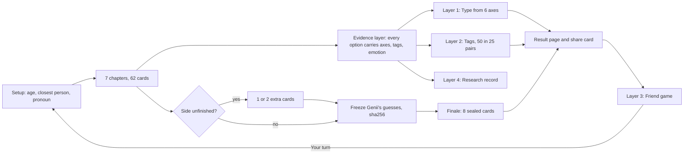

# Persona quiz spec V2

Paths below are relative to `products/survey/`. The build lives in `research/persona-quiz-v2/final/`. When this doc and the kit disagree, the kit's data files are the truth for content and this doc is the truth for rules. Fix whichever is wrong and note it here.

## 1. What it is

A free web personality game hosted by Genii. You play about 62 cards in 7 chapters, get a two-part type, up to 5 persona tags and Genii's predictions, then send "Do you really know me?" to friends.
Central purpose: people **finish** it, the result feels **uncannily accurate, fun and a little spicy**, and they **share** it. The friend loop lowers acquisition cost.
Everything else in this doc serves those three verbs: finish, feel seen, share.

## 2. Architecture: Sally's four layers

| Layer | What the player sees | Produced by | Shareable |
|---|---|---|---|
| 1. Type (64) | Relationship half-name × life half-name, code, two descriptions, stings and hearts | 6 axes, each scored from option evidence | Type name, yes |
| 2. Tags (up to 5) | Persona tags, each with "you told Genii" quotes, a sting and a heart | 50 tags in 25 opposite pairs | Name and heart, yes. Sting, owner only |
| 3. Friend game | "Do you really know me?": guess the type, the choices, the tags (bestie: the sting) | The result, plus opposite tags as decoys | Yes. This is the growth engine |
| 4. Research record | Nothing | Circumstance picks, "Not my life", "depends" plus flip, feelings, emotions, rushed taps | No |

Rules that hold across all layers:
- No MBTI names, letters or type names. Every name is our own.
- Outward copy never claims "scientifically measured". It is entertainment and self-discovery.
- No hidden topic scores. Every point on the result traces to an answer option.

## 3. The evidence layer

Every answer option carries its own evidence. The scorer only adds up what options say.

| Field | Values | Rule |
|---|---|---|
| `axes` | `{"L1": -2}` | Signed −2 to +2 on the six axes (+ is the first pole). Usually one axis, never more than two. |
| `tags` | `[{"id":"T13A","s":2}]` | Strength 1 slight, 2 moderate, 3 strong. Usually 1 or 2 tags, never more than 3. Support for a tag counts against its pair. |
| `emotion` | guilt, sting, worry, resentment, envy, relief, pride, delight, cringe, longing, irritation, warmth (also hope, tension, recognition as card `feel`) | Optional. Research record only. |
| `circumstance: true` | the option is a situation, not a choice | Scores nothing. Logged to research. Sally's "only way right now" (只能這樣) built into the options. 18 cards carry one. |
| `depends: true` | a "Depends..." option | Scores nothing. Opens "What would flip you?" with 3 presets (4 cards: C2-3, C3-9, C6-6, C7-3). Never free text. |
| exits | Skip, Not my life, No recent example (real cards only) | Never score. "Not my life" is Sally's premise check (前提不符). |
| card `grade` | real = did (0.80), scenario = would (0.55), this_or_that, role, pick_two = believe (0.45), feeling = emotion only (0), sealed = never profile evidence (0) | The weight multiplies every value on the card. Each pick of a pick_two counts. |
| rushed | answer under 1500 ms | Counts at 0.3 of its weight. A tag also needs at least one calm card. |
| `ae` | A action, B bond, C context, D desire, E emotion | Evidence types the card covers. Internal. |
| `mask` | "looks like X; measures Y" | Internal. The player never sees what is measured. |
| `friend` | third-person prompt, sides a and b, each with its own evidence | Feeds friend game Level 2. 50 cards have one. |

Every axis value and tag must follow from the behavior, not from the joke.

**Worked card: C4-1** (scenario, would, 0.55; Sally Q33; opens chapter 4; from the golden set)

> You find $200 in a jacket you haven't worn since last winter.

| Option | axes | tags | emotion | What it records (calm tap) |
|---|---|---|---|---|
| Concert tickets. Tonight if possible. | L1 −2 | T13A s2 | delight | L1 −1.10 (toward Venture); T13A +1.10, which is T13B −1.10 |
| Straight into savings. Future me says thanks. | L1 +2 | T13B s2 | relief | L1 +1.10 (Steady); T13B +1.10 |
| Dinner for my people. Found money gets shared. | none | T06A s1 | warmth | T06A +0.55 only (generosity is not R1) |
| It went to a bill. Romance is dead. | | | | `circumstance`: nothing scored, logged to research, card dropped from this owner's friend deck |
| Skip / Not my life | | | | nothing scored |

The same "Concert tickets" tap in 900 ms counts at 0.3: L1 −0.33, T13A +0.33. Friend field: "{name} finds $200 in an old jacket. Where does it go?" a "Concert tickets, tonight." / b "Straight into savings."

## 4. The six axes and the 16 half-names

| Axis | + pole (zh) | − pole (zh) | Sally questions | Chapter cards carrying it |
|---|---|---|---|---|
| R1 | We 我們 | Me 我 | Q05, Q21, Q24, Q41 | C1-2, C3-2, C3-4, C6-6, C6-2 |
| R2 | Direct 直 | Soft 柔 | Q25, Q37 (Q27, Q28 moved to tags) | C2-1, C2-5, C2-8, C3-12 |
| R3 | Classic 舊 | Own 新 | Q01, Q04, Q09, Q12 | C3-1, C6-3, C6-9 🔒, C6-1, C6-7 |
| L1 | Steady 穩 | Venture 闖 | Q17, Q19, Q33, Q46 | C4-1, C4-8, C5-2, C5-6, C7-3 |
| L2 | Push 衝 | Easy 鬆 | Q20, Q45, Q48 | C3-9 🔒, C5-1, C5-4, C5-9, C5-7 |
| L3 | Rules 規 | Context 情 | Q02, Q38, Q40 (as everyday rules) | C4-7, C6-10, C6-1, C7-1, C7-4, C7-7 |

R2 measures one thing: saying the hard thing directly versus holding the person first. Support-capacity cards (C2-2, C2-7, C5-5) feed T06, not R2. Each axis also has 2 extras and at least one finale check.

Relationship half = R1 × R2 × R3. Life half = L1 × L2 × L3. Type = one of each (64). Type code example: `We·Direct·Classic | Steady·Push·Rules`.

| Code | Name | zh | One line |
|---|---|---|---|
| We·Direct·Own | Trash-Talking Cuddle Bug | 嘴硬黏人精 | Wants people close, shows it by roasting them and saying it straight. |
| We·Direct·Classic | Family CEO | 家族CEO | The hub: carries the load, makes the call, keeps traditions on time. |
| We·Soft·Own | Open-Book Golden Retriever | 全透明暖寶 | Loves out loud, warm and all in, by nobody else's rulebook. |
| We·Soft·Classic | Human Weighted Blanket | 溫柔守家人 | Keeps everyone's feelings and every tradition safe. |
| Me·Direct·Own | No-Filter Free Agent | 清醒獨行俠 | Yourself first; boundaries said out loud, script written by you. |
| Me·Direct·Classic | Old-School Final Boss | 老派硬核 | Believes in the classic way, but nobody makes your decisions. |
| Me·Soft·Own | Soft-Spoken Rebel | 溫柔自由派 | Gentle voice, iron line, no template. |
| Me·Soft·Classic | Do-Not-Disturb Homebody | 安靜老靈魂 | Loves a cozy traditional home and still needs hours behind a closed door. |
| Steady·Push·Rules | Color-Coded Overachiever | 步步為營野心家 | Big wins, every step planned and done by the book. |
| Steady·Push·Context | Low-Key Tryhard | 低調野心家 | Climbing, takes side roads, never bets the safety net. |
| Steady·Easy·Rules | Slow-and-Steady Regular | 規律生活家 | Routine and order, no rush to prove anything. |
| Steady·Easy·Context | Chill Personified | 松弛感本人 | Races nobody's timeline, goes with the flow. |
| Venture·Push·Rules | Calculated Daredevil | 有計畫的冒險家 | Jumps after scouting the landing and packing plan B. |
| Venture·Push·Context | Full-Send Trailblazer | 野生開拓者 | Trades certainty for something big; rules are negotiable. |
| Venture·Easy·Rules | Side-Quest Knight | 有底線的流浪者 | Chases the new, skips the main quest, keeps a personal code. |
| Venture·Easy·Context | Vibes-Based Wanderer | 隨風型旅人 | Follows curiosity; rules and timelines are suggestions. |

Full `desc`, `sting` and `heart` per half: `final/library.json` (`relationship`, `life`). Each axis pole also has a chip line (`axes[].plusLine`, `minusLine`), and Flex has its own badge line.

## 5. The tag library

50 tags in 25 clean opposite pairs. Each tag has `id`, `pair`, `chapter`, `name`, `zh`, `sting` (owner only), `heart`, `calls` (2 or 3 Genii predictions), `never` (what it must never be read as), `triggers`, `locked18`, `friendGame`, `loveTag`, `origin`. Full text: `final/library.json` `tags`.

Friend game setting: **open** = any relationship. **love** = partner and bestie on by default, crush opt-in, friend or coworker never. **18+ opt-in** = locked18, default off, partner or bestie only, owner 18+ only.

| Pair | Tag A | Tag B | Ch | Friend game | Can't fire today (VERIFY) |
|---|---|---|---|---|---|
| T01 | Here, scroll my phone (手機隨便看) | My passcode, my dignity (密碼是我最後的尊嚴) | 1 | love | A, B |
| T02 | Leaves you on read, still loves you (已讀不回但真心) | Waiting for you to text first (需要被主動的人) | 1 | open | A |
| T03 | Tells the AI first (AI知己派) | Typos and all, my own words (真人原話派) | 1 | open | B |
| T04 | Close Friends list: 4 (挑人型溫暖) | Mayor of every group chat (全服都是朋友) | 1 | open | |
| T05 | Rolls eyes, grabs keys (嘴硬心軟) | Writes the birthday paragraph (長文告白派) | 2 | open | A, B |
| T06 | Yes first, bank app later (人情VIP) | Limited-edition energy (能量限量版) | 2 | open | |
| T07 | The honest review nobody asked for (直球選手) | Compliment sandwich chef (溫柔刺客) | 2 | open | |
| T08 | Redemption arc believer (相信浪子回頭) | Keeps the receipts (截圖都留著) | 2 | open | A |
| T09 | Head over heels, eyes open (有原則的戀愛腦) | Dating, not merging (清醒戀愛派) | 3 | love | |
| T10 | Relationship mechanic (關係修理工) | Knows when to log off (好聚好散派) | 3 | love | |
| T11 | Future parent, with terms (想當爸媽，但有條件) | Full life, no kids required (人生不一定要有娃) | 3 | 18+ opt-in | A, B |
| T12 | Splits it to the cent (AB制信徒) | Splits by who can afford it (一樣痛才叫公平) | 4 | open | A, B |
| T13 | Books it, figures it out later (賭徒體質) | Rainy-day fund devotee (穩字當頭) | 4 | open | |
| T14 | Skips the dupe (取悅自己專業戶) | Minimalist on purpose (極簡清醒派) | 4 | open | |
| T15 | Earned, not given (努力信仰者) | Head-start detector (起跑線偵測器) | 4 | open | A, B |
| T16 | Building the trophy shelf (想被看見的成績派) | Clocks out on the dot (準時下線派) | 5 | open | A, B |
| T17 | Needs a save point (需要存檔點) | Still loading, and that's fine (人生選項保留派) | 5 | open | |
| T18 | Family's backup battery (全家的備用電源) | Helps, with an end date (幫忙有期限) | 6 | open | B |
| T19 | Moves out, still calls on Sundays (溫柔的叛逃者) | Runs it by the family group chat (家人點頭才安心) | 6 | open | |
| T20 | Modern for you, classic for me (嘴上新派，心裡傳統) | Writes my own house rules (說到做到的新派) | 6 | open | |
| T21 | The wedding's for the family (婚禮是辦給爸媽看的) | Love without the paperwork (不婚也完整) | 6 | 18+ opt-in | A, B |
| T22 | Always has a flight tab open (出走型靈魂) | Same order, every time (老位子老點單) | 7 | open | A, B |
| T23 | Team healer, IRL (志工心) | Booked solid, all me (先愛自己派) | 7 | open | |
| T24 | There's a spreadsheet for that (萬物皆可表格) | Eyeballs everything (快樂優先體) | 7 | open | |
| T25 | Actually read the rulebook (規則守門員) | Bends rules for good reasons (情境主義者) | 7 | open | |

Naming rules: meme-style names people would proudly share. Never a diagnosis (anxious, avoidant, narcissist) or a moral grade (selfish, toxic, gold-digger). No tag duplicates a half-name. No gendered words in any player line. Renames and reasons: `research/persona-quiz-v2/library/CRITIC-NOTES.md`.

## 6. Card types, chapters and run order

**Card types** (counts from `final/cards.json`):

| Type | Grade, weight | Shape | Count |
|---|---|---|---|
| scenario | would, 0.55 | A vivid imagined situation, 4 or 5 distinct moves. The main format. | 22 |
| real | did, 0.80 | "The last time..." with a vivid setup, 4 or 5 things you actually did. Openers vary. | 12 |
| this_or_that | believe, 0.45 | 2 punchy options, served as a "Quick round" of 3 | 12 (4 rounds) |
| pick_two | believe, 0.45 each pick | Pick the 2 of 6 short lines most like you | 7 |
| feeling | emotion only | Right after a scenario or real card (`follows`): 5 feelings, varied stems | 5 |
| role | believe, 0.45 | "In your group chat, you're the...": 1 of 5 or 6 archetypes | 4 |
| sealed | none | A new situation; Genii locks a guess first | 8 (finale) |
| extras | scenario or this_or_that | Axis evidence only; played only for an unfinished side | 12 (2 per axis) |

Totals: 82 cards (62 chapter, 8 finale, 12 extras). Adult run 62 plus 8 = 70; teen run 59 plus 8 = 67. Locked18: C3-8, C3-9, C6-9. C3-9 is gated: it shows only if a C3-8 pick carries T11A. 16 cards have a `teenPrompt`.

**Writing rules** (the gauntlet; a card ships only if all hold): multiple choice only, never free text anywhere. Every option is a distinct behavior, never a ladder of one action. No cool answer: every option gets the same charm. Reads in one pass. Answers start with the action, stay under about 12 words, use true specific details, no metaphors that need decoding. Masked: never name the trait, axis, tag or type. Gender neutral ("your person", "they"). Teen-safe unless locked18. No health, no politics. Roast the move, never the person. Funny or emotionally sharp. It does not visibly repeat another card.

**Chapters** (setup first: age, closest person, pronoun):

| # | Title | Genii's intro | Cards adult / teen | Run order | Sally questions |
|---|---|---|---|---|---|
| 1 | Your phone | Your phone already knows too much about you. I just want the highlights. | 8 / 8 | C1-1 role, C1-2 scen, C1-3 feel, C1-4 real, C1-5 scen, C1-7 / C1-6 / C1-8 round | Q26, Q41, Q42, Q43, Q44 |
| 2 | Friends | Your friends have seen your 2am face. Now it's my turn. | 9 / 9 | C2-1 scen, C2-2 real, C2-3 scen, C2-4 pick2, C2-7 scen, C2-5 real, C2-6 feel, C2-9 scen, C2-8 role | Q15, Q25, Q27, Q28, Q30, Q37, Q39 |
| 3 | Love and your person | Your person can be a crush, a partner or your closest friend. I just want the gossip. | 10 / 8 | C3-1 scen, C3-2 real, C3-8 pick2 🔒, C3-3 scen, C3-5 real, C3-6 feel, C3-7 scen, C3-12 real, C3-9 scen 🔒, C3-4 pick2 | Q05, Q06, Q08, Q10, Q11, Q14 |
| 4 | Money and treats | Money talk. No judgment. Okay, a little judgment. | 7 / 7 | C4-1 scen, C4-5 real, C4-2 / C4-4 / C4-3 round, C4-7 scen, C4-8 pick2 | Q13, Q16, Q33, Q34, Q35, Q36 |
| 5 | Work, school and ambition | Grades, shifts, big dreams. Let's see what you're actually working for. | 9 / 9 | C5-1 / C5-2 / C5-10 round, C5-4 scen, C5-5 real, C5-9 pick2, C5-6 scen, C5-7 real, C5-8 feel | Q17, Q18, Q19, Q20, Q45, Q48 |
| 6 | Family and home | Let's go home for a bit. Genii promises not to ask about your grades. Mostly. | 10 / 9 | C6-6 scen, C6-3 / C6-10 / C6-9 🔒 round, C6-4 scen, C6-5 feel, C6-2 real, C6-1 scen, C6-8 role, C6-7 pick2 | Q01, Q04, Q09, Q12, Q21, Q22, Q23, Q24 |
| 7 | Play, rules and you | Game night, free time and the rules nobody reads. Let's see how you play. | 9 / 9 | C7-1 scen, C7-6 real, C7-5 scen, C7-4 real, C7-3 scen, C7-2 role, C7-7 scen, C7-9 pick2, C7-10 scen | Q02, Q29, Q31, Q32, Q38, Q40, Q46, Q47 |
| Finale | Genii has made its guesses. Your move. | | 8 sealed | C2-10 (R2), C4-10 (L1), C6-S1 (R3), C5-S1 (L2), C7-S1 (L3), C3-10 (R1), C2-11 (T05, T06), C7-S2 (L1, T22) | |

All 48 Sally questions have a card except Q03 and Q07 (dropped). No card is shared between chapters.

**Run order rules** (checked by `tests.mjs`):
- Never two cards of the same type in a row, except this_or_that rounds of up to 3.
- Never two neighbors that evidence the same axis or tag pair, across chapter borders and into the finale.
- At least half the real cards in the first two thirds (built: 8 of 12).
- Each chapter opens with its most fun card. A feeling card always plays right after the card it `follows`.
- After chapter 7: score; play extras for any unfinished side; freeze; then the finale.

## 7. Scoring and firing rules

All values live in `final/score.mjs` `CONFIG`. They were set by simulation (`final/SIM-REPORT.md`): 400 random clickers, 640 consistent synthetic respondents, 160 skippers, 120 speed-tappers, 30% of each on the teen run, deterministic seed.

| Setting | Value | Rule |
|---|---|---|
| weights | real 0.80, scenario 0.55, believe types 0.45, feeling and sealed 0 | Value × weight per valid answer |
| rushed | under 1500 ms counts at 0.3 | From the brief |
| minAxisCards | 2 | Fewer valid cards: "This side isn't finished yet", 2 extras offered |
| flexBand | 0.12 | Axis score is normalized by the maximum the answered cards could give. Below 0.12: Flex badge; pole from real-card evidence first, then the first card |
| tagFire | 2.25 | Net support (tag minus its pair) to fire. Also needs 2 separate cards, at least 1 not rushed |
| tagStrong | 3.0 | Marks a fired tag "strong" |
| tagFloor | 1.25 | If nothing fires, the best candidate above 1.25 (same card rules) shows as "leaning" |
| maxTags, minChapters | 5, 3 | Strongest first, swapped to cover 3 chapters where possible |
| splitMin | 0.4 | Split = believe evidence one way, did or would the other, on one axis or tag pair, each side at least 0.4 |
| sealedTagWeight, sealedPairScale | 0.6, 1.2 | How much tag evidence counts next to axes when Genii picks its sealed guess |

Never scored: circumstance options, "depends" options, Skip, Not my life, No recent example. Locked18 tags (T11, T21) are never scored or shown for a teen.

**Why these values.** 69 of 87 grid combinations meet every target; the shipped values are chosen within that set:
- **tagFire 2.25** is the highest value that keeps consistent respondents at 3 to 5 tags. Lower (1.5 to 2.0) also passes but shows random clickers 3.4 to 4.7 tags. At 2.75 and up, consistent respondents drop under 3 and some get none. Support moves in steps (0.45, 0.55 or 0.80 × strength), so the grid jumps.
- **tagStrong 3.0**: random clickers average 0.53 strong tags (target under 1.5); consistent respondents about 3.
- **tagFloor 1.25**: keeps "nobody gets 0 tags" true at a fire threshold high enough to hold random clickers down. It rescued the one consistent respondent who had none.
- **flexBand 0.12**: the middle value. Wider bands raise Genii's sealed passes without more exact hits; narrower ones call more near-ties.

**Plot twist.** The strongest split that includes a real card becomes the twist: "You'd say: '...' Last time, you did: '...'" (or "Put on the spot, you'd go with" when the acted side is a scenario).

**Sealed finale.** After chapter 7, `score.mjs freeze` writes Genii's 8 guesses plus a sha256, and refuses a second freeze. The player sees the hash before the finale. Genii picks the option whose axes and tags best match the profile. It **passes** (not counted) when the card's main axis is Flex or unfinished, or a tag-only card has no evidence. `check` scores exact hits (chance about 25%) and right side (chance 50%), and refuses if the predictions changed after the freeze. A side hit counts only when both the guess and the answer carry a value on the main axis.

## 8. The result page and share card

Every line is a library line or the player's own answer. Nothing is written by hand or by a model. Source: `final/RESULT-TEMPLATE.md`.

| # | Section | Content | Owner only |
|---|---|---|---|
| 1 | Type | Type name as headline, six-part code, badges (Flex line; Unfinished prints "?" for that code part) | |
| 2 | The two halves | Each half's name, `desc`, three pole chips (tap for the pole line) | |
| 3 | What stings | The two half stings, relationship first | yes |
| 4 | What you love about it | The two half hearts | |
| 5 | Your tags | Up to 5, strongest first, labeled strong / showing / leaning. Each: "You told Genii:" up to 3 of the player's own answers (real first, then scenario, then quick picks), the sting, the heart | sting only |
| 6 | Genii's calls | 3 one-liners from the shown tags' `calls` | |
| 7 | Plot twist | Only when a split exists | yes |
| 8 | Genii's guesses | "Genii called 5 of 7 exactly (chance about 25%)." Then each sealed card: guess, answer, hit or miss, or "Genii passed: you're flex here" | |
| 9 | Share card and invite | See below | |

**Share card:** type name, tag names each with its heart, and the button "Do you really know me?". No code, badges, stings, answers, plot twist or sealed score.

**Never shown anywhere:** axis scores, tag ids, support numbers, card ids, masks, research fields, or the words "sealed", "evidence" or "axis". "Tags" appears only as the heading "Your tags".

## 9. The friend game: "Do you really know me?"

Content: `final/friend.json`. Deck builder: `node score.mjs friend --rel <partner|crush|friendOrCoworker|bestie> [--stings on]`. About 5 minutes (6 for bestie). Multiple choice only: Sally's "why did you guess this?" box became 4 one-tap chips (Seen them do it / They told me / Pure gut / It's what I'd do), and the friend label is a relationship word plus a preset emoji, never typed.

**Relationship chooser** ("Who are you sending this to?"). One link per person.

| Relationship | Level 2 card levels | Love tags (T01, T09, T10) | Marriage and kids tags (T11, T21) | Level 4 |
|---|---|---|---|---|
| Partner | everyday, love, couple | on, owner can switch off | off, opt-in, owner 18+ only | no |
| Crush | everyday, love | off, opt-in | never | no |
| Friend or coworker | everyday | never | never | no |
| Bestie | everyday, love, couple | on, owner can switch off | off, opt-in, owner 18+ only | only if the owner turns on sting lines (default off) |

Pronouns come from the owner's setting (she / he / they); the friend is always "they". `{they}` is followed only by a modal, a past tense verb or 'd, so lines read right for every pronoun.

**Levels**

| Level | What the friend does | Rules |
|---|---|---|
| 1. Guess the type | 6 either-or calls, one per axis (R1 to L3), third person | Hit when the pole matches the owner's sign. Flex or unfinished axis accepts either. The 6 picks build the guessed type, shown after question 6. R2 asks about directness only; R3 asks about holidays and home, so teens' friends can answer. Bestie has its own wording set. |
| 2. Guess their choices | 12 run cards, third person, 2 options each (card `friend` field) | Right side = the side the owner's answer maps to (dot product of evidence). Excluded: skipped, Not my life, No recent example, circumstance, depends, rushed, no clear side, locked18 or intimate, wrong level for the relationship, teen owner with a card not `teenOk`, cards the owner never saw. Primary list per relationship (12 cards, 12 pairs, 6+ chapters), then axis rescue, then the fixed backup order. Under 6 eligible: skip the level. |
| 3. Guess the tags | 12 cards: the owner's N shown tags, their N opposites, 12 − 2N decoys; pick exactly N | Card face is name and heart only. Decoys come from allowed pairs the owner has no fired tag in, one per pair; only if those run out does a fired-but-not-shown pair fill in, showing the side the owner did not fire. Shuffled. N of 1 or 2 shows "{name} only has {N} tags, so this one is hard." |
| 4. Bestie only | Which of 4 sting lines would leave them speechless for three seconds; then optional "pick the roast" | 1 true sting (owner's strongest allowed tag) plus 3 from pairs the owner has no fired tag in. Roasts: 6 of 12 preset lines, never free text, never looks, body, health or diagnoses; the owner can hide any roast. |

**Result copy**

- **Owner sees:** "You, through {friend}'s eyes"; "{friend} thinks you're {guessed type}. You're {true type}. They read {x}/6 sides of you."; a band line by Level 1 hits (friend set: 6 "sees right through you. Slightly scary." / 4 to 5 "gets most of you" / 2 to 3 "sees half of you. The other half is worth a talk tonight." / 0 to 1 "almost two different people. That's the fun part."; bestie set has its own four); three zones: **They get you** (hits with hearts), **What they don't see** (missed tags with stings, "best screenshot on this page"), **Who they think you are** (opposites picked: "{friend} thinks you're X. You're actually Y."); decoys under "Other sides they guessed", no penalty; Level 2 and 3 counts; the **biggest surprise** Level 2 miss with the friend's why-chip; Level 4 result and roast for a bestie.
- **Friend sees:** only "You read {x}/6 sides of {name}. Everything you missed, {name} can see. Want to know which? Ask {them}.", counts for Levels 2 and 3 (never which ones), the owner's real type if the owner allows it, and "Your turn: see if {name} really knows you", which starts their own run with a pre-made link back.
- **Advanced, owner only:** Bestie vs partner (crush can stand in) with rows who wins / both see / only bestie / only partner / neither; and "Who knows you best", ranked by (Level 1 + Level 3 hits) / (6 + N). Nobody is notified.

## 10. Safety and privacy rules

- **Teen-safe by default.** Locked18 cards (marriage, kids, sex topics) show only when setup says 18+, with a 🔒 18+ label. Sally's Q07 (sex before commitment) is dropped entirely. Teens never get T11 or T21, even with the opt-in on.
- **No health data or health items.** No politics or public policy. Q31/Q32 became "track everything vs go by feel" (budgets, calendars, streaks). Q30 (a friend's body) became a friend's new look.
- **No identity inference.** Never infer feminist identity, party, religion, sexual orientation or health (Sally's rule).
- **Circumstance is not personality.** Circumstance, "Not my life" and "depends" answers go to the research record only, never to the type or tags. Money pressure must never read as a trait (open item: T06B `never`, section 12).
- **Stings are owner only.** The share card and friend game show names and hearts. The only exception is the bestie Level 4 sting pick, which the owner switches on.
- **Friend answers are private to the owner.** The friend sees scores and counts, never which ones they missed. Comparisons and rankings are owner only and notify nobody.
- **Rushed owner taps never judge a friend.** Level 2 drops rushed cards.
- **Language:** meme names allowed; diagnosis and moral-grade labels banned; roast the move, never the person; gender neutral everywhere.
- **Research record** is stored apart from the user-facing result (circumstance picks, flip answers, feelings, emotions, rushed taps).
- **Positioning:** entertainment and self-discovery, not a validated scale. No MBTI names or letters. Legal check of names and copy is still pending.

## 11. What changed from Sally's v2 and why

| Area | Sally's v2 | Ours | Reason |
|---|---|---|---|
| Answer format | Each question: A/B on a 5-point scale (+2 to −2), plus "both", "none fit", "not applicable" | 4 to 6 distinct behaviors per card, 7 card types, grade weights | Test 1: ladder answers and one format made people tap without reading. Distinct moves are more fun and carry clearer evidence. |
| Want vs have-to | A separate follow-up on every question | A `circumstance` option inside the card | Same rule, one tap instead of three |
| Premise check | A separate "does this fit you?" step | "Not my life" exit on every card; "No recent example" on real cards | Same rule, fewer taps |
| "Both" answers | Free-text conditions for each side | A "depends" option plus "What would flip you?" with 3 presets | No free text anywhere |
| "Why?" and "last time you actually did" | Optional free text | Real cards ("did", 0.80) ask for the last actual behavior; no why field | Behavior beats self-report; no typing |
| Length | 48 questions, 15 to 20 minutes, one topic per question | 62 cards in 7 themed chapters plus an 8-card finale | Test 1: no sections, fatigue. Chapters give pacing |
| Dropped | Q03, Q07 in the bank | Q03 and Q07 cut | Q03 is a public gender-politics debate; Q07 is sex before commitment (never, per the brief) |
| R2 | Q25, Q27, Q28, Q37: responding to a wrong mixed with your own capacity; both test people tied | Directness only (Q25, Q37 plus a haircut and a party-story card). Capacity (Q27, Q28, Q18) feeds T06 | Sally's own simulation flagged the mix |
| R3 | Marriage, gender roles, weddings | Home, holidays, house rules and "someday"; marriage cards locked18 | Teens must be measurable; gender neutral |
| L3 | Q02 gender-based funding, Q38, Q40 subsidies (policy) | Everyday rules: Uno stacking, rules that make no sense, lines and tickets, group projects | No politics |
| Health | Q31/Q32 habits and tracking your body; Q30 a friend's body | Track vs feel in budgets and calendars; a friend's new look | No health data |
| Tag library | "42" tags (41 listed) in 21 pairs, some pairs not true opposites, some duplicating half-names, some gendered (想當媽) | 50 tags, 25 clean pairs, 4 new or rebuilt pairs (T08 from Q39, T10 split from Q08, T19, T22), English meme names, zh kept | Clean pairs make Level 3 decoys fair; no duplicate names on one page; gender neutral |
| Tag firing | At least 2 of the listed questions hit | Net weighted support ≥ 2.25 from 2+ cards, 1+ calm, pair subtracts, 3+ chapters, "leaning" floor | Test 1 fired "strong" from two sub-second taps; sim tuned |
| Axis ties | Sum 0: look at the latest real behavior, then the first question; Flex badge | Normalized score under 0.12: Flex; real-card evidence first, then the first card | Same idea, with a band instead of exact zero |
| New layers | none | Rushed-answer weight, sealed finale with sha256, plot twist from splits, Genii's calls, "you told Genii" quotes | Test 1: sealed 0 of 6, the result did not feel like him (2 of 5); quotes make it feel specific |
| Option order | Randomize A/B left and right to cancel a "modern B" lean | Main run in authored order; the friend game randomizes | Options are distinct behaviors, not A/B. Unchecked for bias (see section 12) |
| Friend game audience | A woman sending to a boyfriend, crush or male friend; bestie is 姐妹 | Partner, crush, friend or coworker, bestie; owner pronouns from settings | Gender neutral, target everyone |
| Level 1 | F2 asked about being exhausted (R2); F3 about marriage (R3) | F2 directness only; F3 holidays and home | R2 fix; teens |
| Level 2 | Sally's 12 fixed questions, backup order Q37 → Q28 → Q48 → Q34 → Q18 → Q29; her set repeated pairs | Cards from the run's `friend` fields, 12 different pairs, primary list per relationship, rushed answers excluded | Avoid repetition; never mark a friend wrong on a tap the owner did not mean |
| Roast | Free-text roast with a word filter | "Pick the roast" from 12 presets | No free text; nothing to moderate |
| Marriage and kids tags | Opt-in for any recipient | Opt-in for partner and bestie only, owner 18+ | "Friend or coworker" includes coworkers |
| Level 4 decoys | 3 random other stings | Never from a pair the owner fired | So exactly one line is true |
| Half-names | Chinese only | English meme names, gender neutral, zh kept | English first; shareable |

## 12. Validation status

**Tests.** `node --test tests.mjs`: 20 of 20 pass (rerun 2026-09-26). They cover format, evidence validity, tag and axis reachability, run order, finale coverage, no em dash, the teen run, the C3-9 gate, weights and rushed taps, exits, unfinished and extras, Flex, splits, tag firing, the research record, sealed passes, the freeze and tamper CLI, friend decks and the sim targets.

**Simulation** (`SIM-REPORT.md`, shipped thresholds):

| Group | n | Tags shown | Strong | 3 to 5 tags | 0 tags | Shown tags match hidden | Axis recovery | Sealed exact | Sealed right side | Genii passes |
|---|---|---|---|---|---|---|---|---|---|---|
| Random | 400 | 2.43 | 0.53 | 44.3% | 0 | 46.9% | 51.8% | 25.6% | 49.9% | 20.6% |
| Consistent | 640 | 4.89 | 2.91 | 99.4% | 0 | 86.3% | 88.3% | 61.2% | 83.7% | 7.7% |
| Skipper | 160 | 3.96 | 1.52 | 88.1% | 0 | 86.3% | 86.3% | 58.6% | 81.8% | 8.3% |
| Speed-tapper | 120 | 2.13 | 0.91 | 33.3% | 0 | 93.4% | 79.6% | 56.0% | 77.1% | 9.3% |

Every target passes: random clickers under 1.5 strong tags; consistent players 3 to 5 tags, none 0; no axis above 80% on one pole (max 53.1%); no tag ever fires from rushed taps alone; sealed exact well above chance. Caveat: recovery is measured against synthetic profiles. It proves the scorer is consistent with the card evidence, not that the cards read a real person. Watch item: random clickers land on Classic only 38.8% on R3 and on Rules 57.5% on L3, so those cards lean a little by themselves.

**Judges.** Eight judges (evidence auditor; Jasmine, Jordan, Riley, Mika, Wei, Theo; flow) scored the 76-card draft. Evidence: 42 keep, 33 fix, 1 cut. Flow: cut 10 repeats and moved sealed cards into one finale. All seven chapters were rewritten from those notes (`chapters/*.changes.md`), giving today's 62 plus 8.

**Verifier** (`VERIFY.md`): three synthetic players (27 partnered gamer, 25 trainer, 16 teen) get clearly different, specific results. 54 requirements: 40 met, 11 partial, 3 missing. 11 fixes were made (pronoun bugs, decoy and sting-pick rules, T15 and T10 triggers, one scoreless real option).

**Open items** (owner decisions, most important first):

| # | Item | Proposed next step |
|---|---|---|
| 1 | **Blocker: 20 of 50 tags can never fire** at tagFire 2.25 (see section 5). Most thin pairs have only two scenario or quick-pick triggers (2 × 0.55 × 2 = 2.2). Chapter 1 adds almost nothing to results. | Keep strong tags first by net, fill the rest by share of what the player's cards could give, and add a third trigger to thin pairs. The two unused golden cards ("'Read' and no reply" for T02, "1am, one more match?" for T05/T06) are natural candidates. Re-simulate with a coverage target. |
| 2 | Three repeats a player would call "the same": C2-3 vs C7-10 (let the wrongdoer back in); C2-1, C2-8, C2-10, C3-12 (your friend's thing isn't good); C5-2 vs C5-6 (safe pay vs what you love) | Rewrite, not cut: cutting C7-10 leaves T08A one card |
| 3 | Ladder answers left in C1-5, C5-4, C2-9, C4-7 | Rewrite the near-duplicate option |
| 4 | Plot twist can join unrelated situations through a tag pair | Prefer axis splits, or require a shared Sally question or chapter |
| 5 | Result contradictions: Chill Personified's "never blow the budget" next to "Yes first, bank app later"; Color-Coded Overachiever's "keep not pressing start"; T20A fires on plain classic answers | Library line edits and a T20A trigger check |
| 6 | 8 options carry no evidence (C1-4.3, C1-4.4, C2-5.4, C4-7.4, C7-7.3, C7-7.4, C7-10.3, C7-S1.2) | Tag them or make them circumstance |
| 7 | Run length 70 with the finale (brief: 56 to 64) | Flow judge's next cuts: C3-6 and C6-5 (feeling cards) |
| 8 | No code scores a friend's guesses into the result screens; friend difficulty ("friends guess about half") not simulated | Build the friend scorer and simulate |
| 9 | Level 1 for a coworker still says "In love and with family" | Add a coworker wording |
| 10 | T22B's call repeats the C7-S2 finale prompt | Swap the call once T22 can fire |
| 11 | Mika's library fix not applied: add "Not having the money." to T06B `never` | One-line library edit |
| 12 | Real-data checks: R2 split, type spread over 30 to 50 people, sting offense rate, legal check of names | After blind test 2 |

Also noted: 27 of 50 tags have no real-card trigger, and 4 of the 6 golden cards are in the run.

## 13. How to run blind test 2

Full prompt: `research/persona-quiz-v2/final/PROMPT.md`. The runner is a fresh Claude Code session inside a copy of `final/` outside the workspace, so no memory or workspace notes about the player load. Pages are built and polled with lavish-axi.

**Before running:** decide on open item 1 (the unreachable tags); if the kit changes, rerun `node assemble.mjs`, `node --test tests.mjs` and `node sim.mjs`. Make sure `final/` holds no `answers.json`, `profile.json` or `sealed-predictions.json`.

**Steps**
1. `rm -rf /private/tmp/genii-blind-test-2 && cp -r .../persona-quiz-v2/final /private/tmp/genii-blind-test-2 && cd /private/tmp/genii-blind-test-2 && claude`, then paste the prompt.
2. Page 0 setup (age, closest person, pronoun). Pages 1 to 7, one per chapter, one card at a time, no back button, ms recorded per card.
3. `node score.mjs profile answers.json`. If a side is unfinished, one extras page, then profile again.
4. `node score.mjs freeze`. The runner posts the sha256 in chat **before** the finale.
5. Page 8 finale (8 sealed cards), then `node score.mjs check sealed-answers.json`.
6. Page 9 result, exactly per `RESULT-TEMPLATE.md`, owner view.
7. Page 10 feedback, multiple choice: "That's me / Kind of / Not me" per half, tag, call and plot twist; "Called it / Too harsh / Nothing" per sting; overall 1 to 5; most-you and least-you line; most fun chapter; up to 3 cards that felt repeated.
8. `node score.mjs friend --rel bestie --stings on` (counts only). Write `REPORT.md`. The runner never edits the kit.

**What to measure** (test 1 baseline from `LESSONS-FROM-TEST-1.md`; bars are proposed):

| Measure | Test 1 | Proposed bar for test 2 |
|---|---|---|
| Sealed exact hits (chance 25%) | 0 of 6 | 4 or more of the scored cards (sim: 61%) |
| Sealed right side (chance 50%) | 2 of 6 | 5 or more of 6 |
| "That's me" share of rated lines | 9 of 14 (64%) | 75% or more, and no "Not me" on a type half |
| Overall rating | 2 of 5 | 4 or more |
| Cards picked as "felt repeated" | Many ("three of the same answers") | 0 or 1 |
| Rushed taps (under 1.5 s) | 19 of the last 23 under 1 s | Under 20% in every chapter; note where rushing starts |
| Stings rated "Too harsh" | not measured | At most 1 |
| Tags shown | not applicable | 3 to 5, from 3 or more chapters |
| Every "Not me" | | Traced to its cards and classed as a card, scoring or writing problem |
| Exits and research | | Skips, Not my life, No recent example, circumstance picks, flip answers |
| Friend deck | | Builds: L1 6, L2 12, L3 12, L4 on |

A pass on sealed hits plus "That's me" answers "can it read him?". A pass on rushing plus repeats answers "is it fun enough to finish?". Both are needed before the friend game goes to real players.
