# Evidence Article art set

**The idea.** The article stops using banner photos. Every section gets one small object from the MirrorMii world, made of the same frosted opal glass as the World Mirror, lit the same way, floating on nothing. Read together they look like a curated set of keepsakes Genii found on your island, laid out down an editorial page. One wide, quiet sky band opens the page; everything else is spot art that sits beside or above the type, never behind it.

**The rules every piece follows (the shared prompt).**

- Material: frosted iridescent opal glass with a soft inner glow, pearl rim highlights, faint rainbow dispersion at edges. Islets add white marble with thin gold veins and a small cap of grass and wisteria.
- Palette: lavender #988DEA, violet #8071E4, periwinkle #5B8BEB, pearl #F8F8FF, one small warm peach glint. Two exceptions carry meaning: the flag pair (mint and coral tint) and the seed glow (soft warm).
- Light: soft key from the upper left, cool rim from the right, no ground plane, no cast shadow.
- Camera: three-quarter view from slightly above, object centered at about 70% of the frame.
- Cut-out on transparent background (except the cover band and the backdrop tile).
- Never: text, numbers, logos, people, faces, characters, creatures (Genii is drawn in code).

**Scale on the page.** Spot art renders at 96 to 180 px (use the 360 file) beside a section heading; feature pieces (cover objects, islets in the room grid) at up to 360 px (use the 720 file). The cover band is the only full-width image. The backdrop tile repeats at low opacity behind the column. Dividers sit between sections at 240 to 480 px wide.

```mermaid
flowchart LR
  A[Cover: sky band + World Mirror] --> B[Character sheet: six-facet crystal]
  B --> C[Core traits: three glass pebbles]
  C --> D[The thing you didn't know: mirror shard]
  D --> E[Rooms: 7 matching islets]
  E --> F[Two sides: split orb]
  F --> G[Open book: glass book]
  G --> H[Genii's record: quill and inkwell]
  H --> I[Heist crew: blueprint, keys, keycard, popper]
  I --> J[Green flag, red flag: flag pair]
  J --> K[Genii's bets: chip stack]
  K --> L[Island seed: glowing sprout]
  L --> M[Closing and get the app: World Mirror]
```

## Pieces

| Section | Piece | File stem | Alpha |
|---|---|---|---|
| Cover | Wide pastel sky band, small island with the oval World Mirror on the right third, calm sky left for type | cover-band | no |
| Page | Frosted opal backdrop tile | backdrop-tile | no |
| Between sections | Glass bead ribbon divider | divider | yes |
| Character sheet (stats) | Six-facet opal crystal | stats-crystal | yes |
| Core traits | Three stacked glass pebbles | traits-pebbles | yes |
| The thing you didn't know | Mirror shard with a glint | insight-shard | yes |
| Rooms 1 to 7 | Matching islets: phone, friends, love and dating, money and spending, work, family and home, play | room-phone, room-friends, room-love, room-money, room-work, room-home, room-play | yes |
| Two sides | Opal orb split in two halves, violet and blue | two-sides-orb | yes |
| Open book | Open glass book | open-book | yes |
| Genii's record | Glass quill and inkwell | record-quill | yes |
| Heist crew | The Planner: glass blueprint roll; the Getaway Driver: glass car keys; the Inside Person: glass keycard; the Distraction: glass party popper | heist-planner, heist-driver, heist-inside, heist-distraction | yes |
| Green flag / red flag | Crossed glass flag pair, mint and coral | flags-pair | yes |
| Genii's bets | Stack of glass chips | bets-chips | yes |
| Your island seed | Glowing glass seed with a sprout | island-seed | yes |
| Closing, get the app | Small World Mirror on a marble plinth | closing-mirror | yes |

Sizes and byte counts are in `quiz64/public/assets/article/MANIFEST.json`. Contact sheet: `ARTICLE-ART-SET.png`.
