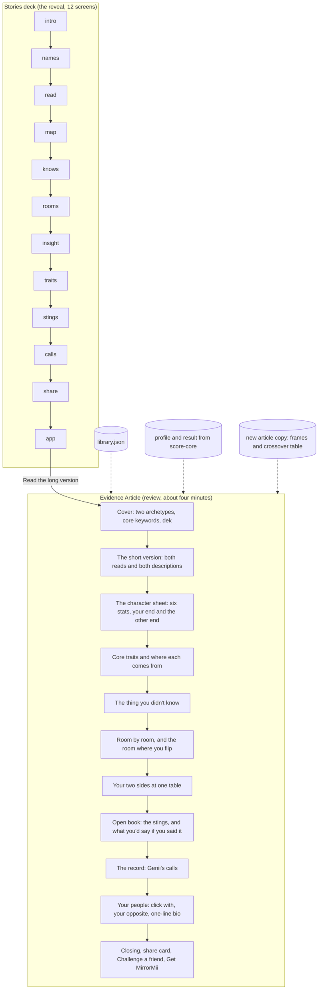

> **Design record (built).** The locked spec [LAUNCH-SPEC.md](../../docs/LAUNCH-SPEC.md) wins (sections 3 and 7); current labels are in its section 6, so the stat and archetype labels in the examples below are retired. Section numbers cited below refer to the pre-lock spec, now [history](../../docs/history/LAUNCH-SPEC-2026-09-29-full.md).

# The Evidence Article

**What this is.** The Stories deck stays the reveal. When the player reaches its end, the result opens into a long-read page, the Evidence Article, where they review everything at their own pace and find more than the story showed. This file sets the bar (section 1), the references (section 2), what the article says and where each line comes from (sections 3 to 5), how it talks (section 6), three visual concepts built as clickable prototypes (section 7), their scores (section 8), the recommendation (section 9), the build plan (section 10) and what Jerry decides (section 12).

**Look at it first.** `python3 -m http.server 8793 --directory research/result-page-wireframes`, then http://localhost:8793/article/ (index), `concept-a.html`, `concept-b.html`, `concept-c.html`; add `?voice=heart` for Heart to heart. The server root is `research/result-page-wireframes`, which cannot reach `quiz64/public`, so the prototypes use copies of the world assets in `article/assets/` (about 230 KB). Contact sheet: `research/result-page-wireframes/article/CONCEPTS.png`.

**Recommendation in one line.** Build A's editorial look on C's review structure, with one signature from B (the sky moving from night to morning). Section 9 has goods and bads.

---

## 1. The bar: how Awwwards scores a site

Read from awwwards.com/about-evaluation, the FAQ and live scorecards (2026-09-29):

| Site of the Day criterion | Weight |
|---|---|
| Design | 40% |
| Usability | 30% |
| Creativity | 20% |
| Content | 10% |

- At least 18 jurors score each site out of 10 per criterion; the 3 scores furthest from the average are dropped and the rest averaged. Every scorecard shows the four sub-scores and one weighted overall out of 10.
- Honorable Mention at 6.5 or higher. Site of the Day has no published cutoff (the highest score of the day wins); recent winners checked scored 7.31 to 7.92.
- Awwwards publishes no definitions of the four criteria, only names and weights. The working definitions we score against are ours: Design (visual identity, type, layout, finish), Usability (clarity, navigation, mobile, reading comfort, access), Creativity (ideas and expression nobody else could ship), Content (quality, relevance and voice of what is said).
- **Developer Award**: every SOTD winner goes to a developer jury that scores six criteria out of 10 (Semantics/SEO, Animations/Transitions, Accessibility, WPO, Responsive Design, Markup/Meta-data); above 7 wins. On every recent scorecard checked, Animations scored highest (8.0 to 9.0) and Accessibility lowest (6.6 to 7.6): getting accessibility and semantics right beats most winners on their weakest axis.
- Mobile Excellence (with Google, 2017, 75 of 100 for the badge) may be discontinued; no 2025 or 2026 scorecard carried it. We design phone first anyway.

**What this means for us.** Design is 40%, so the page needs one unmistakable visual idea and flawless finish. Usability is 30%, so a long-read on a phone must be easy to navigate and never hide reading behind a gesture. Content is only 10% on Awwwards but it is the whole point for Jerry: the words are what people screenshot.

## 2. References (verified 2026-09-29)

| # | Reference | Award | Why it scores | One idea we adapt |
|---|---|---|---|---|
| 1 | Chekhov Is Alive (Resn, Google Creative Lab), chekhov.withgoogle.com/alive | Awwwards SOTD 2015, 7.49 (Usability 7.72 highest) | A character quiz with 28 drawn archetypes in a strict 3-color palette; the result is a picture, not a paragraph | Keep the palette strict so the archetype names and Genii carry the page |
| 2 | Your 2018 Wrapped (Spotify, Active Theory), spotifywrapped.com | Awwwards SOTD 2018, 7.66; Dev 7.03 (Animations 8.6) | Personal stats told as typographic beats | Animate the type, not the chrome; one big idea per beat |
| 3 | Spotify Wrapped 2022 (mobile) | Webby, Best Mobile Visual Design | Full-screen, thumb-first cards made for screenshots | Every article section doubles as a clean screenshot |
| 4 | Spotify Wrapped Party (Active Theory), wrapped-party.activetheory.dev | Awwwards SOTD 2026-07-24, 7.31 (Usability 6.92 lowest) | Compare personal results with up to 9 friends | Friend comparison one tap deep, never a maze (our party slots) |
| 5 | NYT "How Y'all, Youse and You Guys Talk" (Josh Katz) | Peabody; reported as the most-viewed NYT page ever | "A story about yourself" built from a quiz | Open with a concrete "you are" line, then show the map |
| 6 | NYT Snow Fall (John Branch) | Pulitzer 2013, Peabody | Six named parts, one visual between text blocks | Short named sections, one visual moment each, never a wall |
| 7 | The Pudding, The Birthday Paradox Experiment | The Pudding: Peabody 2017 (publication) | The reader becomes a data point | Show the player inside the island map, not beside it |
| 8 | The Pudding, How Bad Is Your Streaming Music | Viral; publication Peabody | A voice with a character, and a plain data-trust note | Genii's voice in the frames; "Genii keeps your answers on this device" |
| 9 | Poor Charlie's Almanack (Stripe Press), stripe.press/poor-charlies-almanack | Awwwards SOTD 2024, 7.51; Dev 7.54 | A long book on the web: calm column, one 3D moment per chapter | Quiet reading column, one glass moment per section |
| 10 | Untold (/nk.studio), untold.site | Awwwards SOTD 2025-10-27, 7.5 (Creativity 7.94) | Editorial minimalism with touch-first micro-interactions | Serif hierarchy plus gestures tuned for thumbs |
| 11 | Messenger (Abeto), messenger.abeto.co | Awwwards SOTD 2025-11-10, 7.92; Dev 8.21 (WPO 8.8) | Heavy 3D that still loads fast | Performance budget: 3D Genii as a lazy WebP, no WebGL on reading screens |
| 12 | Apple AirPods Pro page | Awwwards inspiration entry (not an award) | The standard for scroll-scrubbed product storytelling | Scroll-linked state changes (our gem, our sky) with a static fallback |

Not verified and dropped: GitHub Unwrapped, Linear's year in review, Octoverse, Duolingo Year in Review (no award found). The Guardian "Firestorm" was a nominee only.

## 3. Content architecture

The story is the trailer; the article is the film. Every story screen expands into a section with more substance, and five new sections exist only in the article. Nothing is repeated word for word between sections (the prototype's model enforces this: a stat's "what Genii knows" line appears once, either on the sheet or on the trait it backs).

| Article section | Story screen it grows from | What it adds beyond the story | Data (all from the player's run) | New copy? |
|---|---|---|---|---|
| Cover | 2 names | Magazine-style cover lines from the core keywords; the hook line as a pull quote | `names` slide (halves by pole), `publicCore` keywords, the clearest finding | Dek and issue line (frames) |
| The short version | 3 read | Both reads and both longer descriptions, as a lede | library `relationship[].read/desc`, `life[].read/desc` by type code | No |
| The character sheet | 4 map + 5 knows | Each stat explored: your end, level, plain line, what Genii knows, and **what the other end looks like** at the same level | `map.groups` rows (pips, band, note), library `axes[].sheet` for the other end, `knows.findings` | Section title and intro (frames) |
| Core traits | 8 traits | Each keyword with **where it comes from** (a top trait by name, or a stat end) | `traits.core` (tag or stat source), tag `line`, stat `plusKnow/minusKnow` | "Comes from" label |
| The thing you didn't know | 7 insight | Given a full spread; belief first, the turn second | `insight` (split first, else half fallback) | No |
| Room by room | 6 rooms | Every room played with a clear lean (not only 4), up to 2 lines per room, and **the room where you flip** | profile axes evidence per chapter (same rule as `roomsFor`: 2 or more cards, lean 0.3 or more), library `rooms[ch][axis]` | Flip sentence (frame with stat ends) |
| Two sides at one table | none (new) | Where the people half and the life half team up and where they argue | Strongest decided stat end of each half, crossed | **Yes: crossover table** |
| Open book | 9 stings | The stings in open-book tone, then the first-person heart lines as "what you'd say, if you said it" | halves `sting/heart`, shown tags `sting/heart` (never marriage or kids tags) | Intro lines (frames) |
| The record | 10 calls | All eight scenes with their status, the one number allowed | `checkSealed` rows, `callInfo` titles and poles | No |
| Your people | share screen's opposite line | **Who you click with** and your opposite, as named archetypes | Wild card stat flipped within its half; every pole flipped (`oppositeOf`) | Two lines per voice (frames) |
| One-line bio | none (new) | A copyable line: both archetype names and three core keywords | names + `publicCore` | Title only |
| Closing and CTAs | 11 share, 12 app | Share card, Challenge a friend, the real island, Get MirrorMii | `share`, `app` slides | Closing line |

## 4. Five new expansion ideas (the screenshot hooks)

| Idea | Hook (why someone screenshots or sends it) | Data it uses | Needs new library copy? |
|---|---|---|---|
| **The other end** | Each stat shows what the opposite end looks like in real life: "send this to your Solo friend". Turns a self-read into a read of your friends | `axes[].sheet` both ends at the player's level (already written, both voices) | No |
| **Your two sides at one table** | "You're soft on everyone's feelings and hard on your own goals. Everyone gets your patience except you." A spicy line no generic test has, because it crosses two independent halves | Strongest stat end of the people half crossed with the strongest of the life half; one "team up" cell and one "argue" cell | **Yes**: a 36-cell crossover table (3 people stats x 3 life stats x 2 x 2 ends), each cell typed team or clash, both voices. 4 cells written for the demo (article-copy.json) |
| **The room where you flip** | "Everywhere else you lean Home Base. At play, you're Wanderlust." Range, not contradiction; checkable by friends | A room whose local lean runs against the overall end (`differs` in the room rule) | No (a frame that inserts stat ends) |
| **Your people: click with and opposite** | Two named archetypes to tag: "Know a Straight Shooter who's also an Explorer?" Drives the friend challenge | Click with = the wild card stat flipped inside its half (Home Base to Wanderlust makes The Slow Burner into The Go-Getter); opposite = every pole flipped (existing `oppositeOf`) | Two frame lines per voice |
| **Your one-line bio** | Copy button; people paste it into Instagram and TikTok bios, which carries the brand into profiles | Archetype names + first three public core keywords | No |

Also carried: "What you'd say, if you said it" (the first-person `heart` lines, already written, never quoted answers) and "Save as a story" on any pull quote (the existing share-image pipeline can render a quote card).

## 5. Reading length

Target: **3 to 5 minutes on a phone**, about 900 to 1,100 visible words, set in 11 sections, each readable in under 30 seconds and each ending on something to look at.

Measured on the demo player: the prototype model holds about 1,950 words per voice (including text behind flips and drawers), about 1,500 visible, which is 6 to 7 minutes. The build cuts to target by: showing "what Genii knows" only for the signature and wild card stats, capping the heart lines at 4, one line per room plus the flip, collapsing the record to scene titles with a status mark, and folding the short version into the cover on desktop.

## 6. Voice guide: natural, never a brick

**The brick test.** Read the line aloud to a friend. If it sounds like a report, a test result or a system message, it is a brick. A line passes when it:
1. Says what the person does or feels, with a concrete noun (the spare key, the group order, the side door), not what they "are" in abstract terms.
2. Uses second person, present tense, contractions.
3. Carries one idea per sentence, 22 words or fewer.
4. Never uses system words: score, data, analysis, result, profile, evidence, axis, percent, predicted, based on, indicates.
5. Never quotes the player's answers, never lists their data, never catches them out ("You'd say X. Last three times, you Y."), never plays a sitcom beat ("Genii called this before you answered"), never "X with Y energy".
6. States it as fact, warmly. Confident, not clinical; open book, not a secret.

| # | Brick (before) | Natural (after, as used in the prototypes) |
|---|---|---|
| 1 | Based on your responses, you scored high on Delivery: Gentle. | You could tell someone their idea is bad and they'd thank you. |
| 2 | Your Orbit stat indicates a preference for group activities. | Plans get better when your people are in them, so you make sure they are. |
| 3 | Evidence: 3 cards supported this trait. | Comes from: Says it with actions. |
| 4 | You chose "stay in" on 4 of 6 social cards. | Your own company is a top-tier plan. A cancelled plan feels like a gift. |
| 5 | Analysis complete. Your full profile is below. | Forty answers, one read. The story was the trailer. This is the long version. |
| 6 | Genii predicted your answers with 87.5% accuracy. | Genii saw most of you coming. 7 of 8, called exactly. |
| 7 | Warning: this section contains sensitive insights visible only to you. | Everyone has a part like this. Here's yours, out in the open, because it's more charming than you think. |
| 8 | Your archetypes show a conflict between interpersonal softness and goal orientation. | You're soft on everyone's feelings and hard on your own goals. Everyone gets your patience except you. |
| 9 | Compatibility result: your opposite type is Straight Shooter / The Explorer. | Your opposite: Straight Shooter and The Explorer. Everything you lean, they lean the other way. Know one? Send them this. |
| 10 | Download the MirrorMii app to continue your journey. | Your real day powers the game. Snap a moment of your day and Miia, your digital twin, lives it. |

Heart to heart keeps the meaning and slows the rhythm: "Most of the time you lean Home Base. At play, you lean Wanderlust, and that's worth knowing." Make it fun keeps it quick: "Everywhere else you lean Home Base. At play, you're Wanderlust."

Applied to all prototype copy: every frame in `article-copy.json` passed the test; the never-say list (streaks, gacha, lottery, jackpot, predicts, clinically, diagnose, treat, cure, prevent, genie, lamp) and percent signs were scanned in `data.json` and `article-copy.json` (none); no em dashes in any file.

## 7. Three concepts

All three share one model (`article/shared.js`): the same sections, the same lines, the same voice switch that re-sets the whole page in place. They differ in how it looks, moves and is navigated. All are phone first (390) and laid out for 1440.

### A. Mirror Magazine (the gazette, grown up into a glossy cover story)

- **Idea.** You are on the cover of the issue about you. The masthead "Mirror" runs across the top; the mirror arch (the real mirror city inside) overlaps it the way a cover model overlaps a masthead. Your two names are the cover lines.
- **Layout.** Phone: one column, 16 px gutters, full-bleed cover, a contents page, then features. Desktop: 3-column cover (names left, arch center, keyword cover lines right), lede in two columns (text and pull quote), a 3 x 2 grid of stat cards, a sticky island image beside the rooms.
- **Type.** Fraunces SOFT 100: masthead 88 to 290 px at weight 250 with -0.055em tracking; names 44 to 80 px at 640 (people) and 380 italic WONK (life); section heads 34 to 64 px; pull quotes 27 to 46 px; outlined stat names 46 px. Figtree body 17/28 phone, 18 desktop.
- **Motion.** One orchestrated cover moment: the fog on the arch clears and the city settles (1.4 s); after that, only responses to the reader.
- **Creative expression.** (1) The specular band on the cover glass follows the pointer or the phone's tilt. (2) Stat cards turn over to show the other end, keeping your end named on the back. (3) Pull quotes save as a 9:16 story card. (4) A night spread for the thing you didn't know. (5) A contents page that reads like cover lines, from real findings.
- **Assets.** Mirror city in the cover arch and the share card; CGI Genii perched on the arch, beside the insight and as the columnist's portrait for the open book; the island above the rooms and in the app panel.
- **Access and speed.** Semantic article with one h1, stat cards as buttons with managed focus and aria-hidden on the hidden face, sticky section strip, reduced motion stops the sweep and the fog, contrast from the brand tokens. Only the cover image is eager; about 190 KB of images total.

### B. Night to Morning (cinematic scrollytelling)

- **Idea.** The reveal happened at night; the article is waking up with it. The sky moves from the brand's night scale through dusk to morning, and the page ends on the island in daylight: the game.
- **Layout.** Each section is a sticky plate (the mirror in a new state) with frosted copy panes scrolling over it. Phone: plate full screen, panes rise over it. Desktop: plate pinned left, panes right, labeled chapter rail on the far right.
- **Type.** Fraunces weight 330 to 480 with a soft glow on night plates; section heads 34 to 60 px; Figtree body on dark glass at 80% opacity.
- **Motion.** The sky color per section (900 ms ease), stars fading and a dawn glow rising with scroll progress; everything else waits for the reader.
- **Creative expression.** (1) The mirror is fogged; wipe it with a finger (it also lifts by itself after 3 s). (2) The six stats form a gem; the vertex of the stat you are reading lights up. (3) The thing you didn't know is written backwards on the glass; hold to turn it upright (it turns itself after 2 s on screen). (4) The island lights the room you are reading. (5) Genii's eight panes un-frost one by one. (6) Your opposite shown as a mirrored arch.
- **Assets.** Mirror city in the arches, the island as the rooms plate and the morning ground, CGI Genii at the mirror's edge and above the island.
- **Access and speed.** No reading depends on a gesture (both gestures resolve on their own); the gem has a full text label; one canvas only (the fog), capped at DPR 1.5; reduced motion shows the clear mirror and the upright text at once.

### C. The Codex (a cozy game's character page)

- **Idea.** The article as the character page of the game you are about to play: a stat block, collectible trait cards, a map, achievements and a party.
- **Layout.** Sticky tab bar (Stats, Traits, Secret, Rooms, Open book, Record, Party, Play) with scroll spy. Phone: stacked blocks, trait cards in a snap carousel. Desktop: hero split (Genii on the island left, name plates right), cards in a 3 x 2 grid, map and room note side by side.
- **Type.** Fraunces weight 700 to 800 for names and card keywords (chunky, cozy), Figtree 800 for UI labels, glass bead pips.
- **Motion.** Genii idles on its pedestal; cards tilt under the pointer and flip with a spring; drawers open with a height ease.
- **Creative expression.** (1) Holo trading cards for core traits: tilt, foil sheen, tap to flip, provenance on the front. (2) Stat drawers compare your end and the other end side by side. (3) An island map with room pins; the flip room glows rose. (4) The thing you didn't know as a sealed rare card. (5) Achievements ring for Genii's calls. (6) Party slots with an empty "Challenge a friend" slot, the friend game as the missing party member.
- **Assets.** Genii on a glass pedestal over the island in the hero; the island as the room map and the play panel; Genii on every card front.
- **Access and speed.** Tabs are links; pins are toggle buttons with a live note region; cards are buttons with full text labels; no canvas.

## 8. Scores

Awwwards weights (Design 40, Usability 30, Creativity 20, Content 10). Codex scored the phone and desktop captures before the one round of fixes; the fixes it asked for are listed below and are in the prototypes now.

| Concept | Self: D / U / Cr / Ct | Self overall | Codex: D / U / Cr / Ct | Codex overall |
|---|---|---|---|---|
| A. Mirror Magazine | 8.0 / 7.0 / 7.4 / 8.0 | 7.58 | 7.8 / 7.2 / 7.3 / 7.6 | **7.50** |
| B. Night to Morning | 7.8 / 6.4 / 8.4 / 7.6 | 7.48 | 7.5 / 6.3 / 8.0 / 7.2 | **7.21** |
| C. The Codex | 7.2 / 8.1 / 7.4 / 8.0 | 7.59 | 7.3 / 8.0 / 7.2 / 7.8 | **7.54** |

All three land inside the recent SOTD band (7.31 to 7.92). Codex's verdict: **hybrid**. "C provides the strongest phone-first review structure, while A supplies the most polished visual identity. B contributes atmosphere, but its proposed interaction demands are poorly suited to revisiting evidence." Its recipe: C's navigation, pip sheet, visible trait provenance, room map and party; A's typography, mirror imagery, spacing and dark insight spread; B's restrained night-to-morning color and island ending; every finding readable without flipping, wiping or holding.

Codex's top fixes, and what was done (one round):

| Concept | Fix asked | Done |
|---|---|---|
| A | Sticky section navigation with a current state | Added a sticky section strip with scroll spy |
| A | Keep your result visible when showing the other end; smaller stat headings | Back of each card names your end and level; outlined stat names cut from 64 to 46 px |
| A | Clear friend challenge, then the island download | Already present below the share card (the capture stopped above it) |
| B | Labeled navigation | Rail shows chapter names on desktop, labels for screen readers on phone |
| B | Nothing essential behind wiping or holding | Fog lifts by itself after 3 s; the reflection turns upright after 2 s on screen |
| B | Clearer gem, stronger contrast | Gem labels show stat and end; glass panes 62 to 80% opaque |
| C | Provenance on every card front | "Comes from" line on each card front |
| C | Obvious tab overflow | Fade edge on the tab bar |
| C | Distinct final conversion | A primary "Challenge a friend" button above the play panel |

Raw jury output: `research/result-page-wireframes/article/CODEX-JURY.json`.

## 9. Recommendation: A's skin on C's bones, with B's sky

**Build one page**: the Mirror Magazine look (cover with the arch over the masthead, Fraunces display, pull quotes, the night spread for the insight) on the Codex's review structure (sticky section tabs, stat rows with a drawer that shows your end beside the other end, provenance on every trait, the island map with room pins, the party slots with the Challenge slot), with Night to Morning's sky moving from night at the top to morning at the app panel as the one ambient motion.

**Goods**
- Scores: it combines the two highest Codex sub-scores where they matter (A's Design 7.8, C's Usability 8.0); the blend projects to about 7.7 by the same weights.
- It reads as MirrorMii and nobody else: the mirror over the masthead, Genii as a real CGI character, the real island, the glass.
- It is a review page first: tabs, drawers and pins make it easy to come back to one finding, which is the brief ("where they review everything").
- The sky from night to morning ties the story (night) to the game (morning) without asking anything of the reader.
- Every expansion idea from section 4 has a home, and every line still traces to evidence.

**Bads**
- More components than any single concept (about 12), so more to test; estimate 2 to 3 build days plus copy.
- The crossover table (36 cells x 2 voices) is new library writing that must pass Jerry's spice bar before launch; without it, "your two sides" is cut.
- Holo cards and the magazine cover pull in two directions visually; the build keeps C's cards glass and quiet (no foil) under A's type to avoid a busy page.
- B's most creative moments (fog wipe, backwards reflection) are dropped from the build; they stay in the Stories deck where a gesture fits.

**What I'd push back on.** Do not ship B alone: it is the most creative and the least usable for a page people come back to, and Codex scored its usability 6.3. Do not ship C alone: it risks the rounded-card look the brand is trying to leave.

## 10. Build plan (after Jerry picks)

**Where it lives.** A new view after the Stories deck, inside the result screen, not a new route: `PersonaResult` gains an `article` view. It opens from a "Read the long version" button on story screens 11 and 12 and at the deck's end, and from "How Genii read you". The URL hash becomes `#article` so the browser back button returns to the deck, and a reload reopens the article.

**Files (proposed).**

| File | Role |
|---|---|
| `src/persona/article/article-data.js` | `buildArticle(view, lib, voice)`: a pure projection over `buildStories()` output plus library; ports `research/.../article/shared.js` |
| `src/persona/article/ArticlePage.jsx` | Page shell, sticky section tabs, sky progression, voice switch |
| `ArticleCover.jsx`, `StatSheet.jsx` (row + drawer), `CoreTraits.jsx`, `InsightSpread.jsx`, `RoomMap.jsx`, `TwoSides.jsx`, `OpenBook.jsx`, `TheRecord.jsx`, `YourPeople.jsx` (party + bio), `ArticleClose.jsx` (share card, challenge, app) | One component per section |
| `src/persona/article/article.css` | Tokens from `src/system/tokens.css` only |
| `research/persona-quiz-v2/final/library.json` | New `article` block (frames, both voices) and `crossover` table; nothing else changes |

**Data sources.** The same inputs as `resultView`: `resultFor(state)` (profile, result, sealed), `LIB`, voice from the lobby, `callInfo`, `chapterOf`. No new scoring. Rooms use the existing room rule; click with and opposite use pole flips over library names.

**Loading.** `React.lazy` for `ArticlePage`, prefetched when the deck reaches screen 9; images `loading="lazy"` except the cover arch; AVIF with WebP fallback for the island; no WebGL on the article; budget 35 KB gzipped for the chunk, LCP under 2.0 s on the mid phone profile, CLS under 0.02.

**Tests (the reveal-accuracy rule, extended).**
1. `article-accuracy.test.mjs`: for the same simulated players as `reveal-accuracy.test.mjs`, every visible line in the rendered article is either a library line that an independent recomputation selects from that player's evidence, or an `article` frame from the library. The crossover cells match the player's strongest ends; click with equals the wild card flipped; the opposite equals every pole flipped; the room flip exists only when a room's local lean runs against the overall end.
2. Never on the page: percentages, digits other than the calls count, internal pole names, quoted answer text (checked against every option text in `cards.json`), the words evidence, axis or sealed, the never-say list, em dashes.
3. Never on anything shareable (share card, bio line, saved quote cards): stings, marriage and kids tags.
4. Both voices render every section; "Just the cards" reads as Make it fun.
5. Accessibility: axe clean, one h1, tabs and drawers keyboard operable, focus visible, reduced motion and reduced transparency respected, 200% zoom without horizontal scroll at 390.
6. Visual: phone and desktop captures added to the existing Codex judge round.

## 11. New copy (all in `article/article-copy.json`, both voices)

Frames only; none makes a claim by itself.

| Key | Make it fun | Heart to heart |
|---|---|---|
| readTime | About four minutes | About four minutes, at your pace |
| cover.dek | Forty answers, one read. The story was the trailer. This is the long version. | Forty answers, read slowly. The story was the first look. This is the long version, yours to keep. |
| cover.issue | The issue about you | The issue about you |
| sheet.title / intro | The character sheet / Six stats, two ends each. Here's where you land, and what the other end looks like, so you can spot it in your friends. | Your six stats, up close / Six stats, each with two ends. Here's where you sit on each one, and what the other side looks like, so you can recognize it in the people you love. |
| sheet.yours / other / showOther | Your end / The other end / Show the other end | Your side / The other side / See the other side |
| core.title / from | Your core traits, and where they come from / Comes from | Your core traits, and what's behind them / Grows from |
| rooms.intro | Same person, different rooms. Here's how you show up in each one you walked through. | You're the same person everywhere, but each room brings out something. Here's what came through in each. |
| rooms.flipTitle / flipLine | The room where you flip / Everywhere else you lean {overall}. {room}, you're {roomEnd}. | The room where you change / Most of the time you lean {overall}. {room}, you lean {roomEnd}, and that's worth knowing. |
| said.title / intro | What you'd say, if you said it / Nobody says these out loud. So here they are, in your voice. | Things your heart already knows / The quiet things underneath the traits, in words that sound like you. |
| stings.intro | Everyone has a part like this. Here's yours, out in the open, because it's more charming than you think. | Everyone carries a part like this. Here's yours, said gently and out in the open. |
| sides.title / intro | Your two sides at one table / {people} and {life} live in the same body. Here's where they team up, and where they argue. | Where your two sides meet / {people} and {life} are both you. Here's where they help each other, and where they pull in different directions. |
| sides.team / clash | Where they team up / Where they argue | Where they help each other / Where they pull apart |
| party.title | Your people, sorted | Who you'd find your way to |
| party.click | You click with: They're you, on the day your wild card swings the other way. | You'd feel at home with: They're who you are on the days your closest call goes the other way. |
| party.opposite | Everything you lean, they lean the other way. Know one? Send them this. | Where you lean one way, they lean the other. If you know one, they'd love to see this. |
| bio.title | Your one-line bio | A line for your bio |
| closing | That's the long version. The short one fits on a card, and the real test is whether your friends can guess it. | That's you, read slowly. The short version fits on a card, and the people who love you can find out how well they know it. |
| saveStory / fog / flipHint | Save as a story / Wipe the glass / Hold to turn it around | Keep this one / Clear the glass gently / Hold to turn it around |
| Section tabs (prototype UI) | Stats, Traits, The surprise (Secret in C), Rooms, Two sides, Open book, The record, Your people, Challenge, Play | same |
| Footer | Genii keeps your answers on this device. | same |

**Crossover cells written (new library copy, 4 of 36):**

| Cell | Type | Make it fun | Heart to heart |
|---|---|---|---|
| Own Lane x Read the Room | team | You don't follow scripts, and you can tell when a rule is hurting someone. Put together, you're the one who rewrites the plan so it works for everyone in it. | You make your own way, and you notice when a rule is hurting someone. Together, that makes you the one who quietly rewrites the plan so it fits the people in it. |
| Gentle x Full Send | clash | You're soft on everyone's feelings and hard on your own goals. Everyone gets your patience except you. | You're gentle with everyone else and demanding with yourself. The kindness you give so easily is the kindness you're slowest to give you. |
| Crew x Full Send | clash | You want everyone at the table, and you also want the win. Some weeks the group chat loses to the goal, and you feel it. | You want your people close, and you want to get somewhere. Some weeks one of them has to wait, and you feel it either way. |
| Gentle x Read the Room | team | You read the room and you say things kindly. People walk out of hard conversations with you feeling better than they walked in. | You notice what people need and you speak with care. Hard conversations with you tend to end softer than they started. |

**The demo player** (`data.json`, built by `article/build-data.mjs`): a consistent leaner (warm, gentle, own lane; pushes hard, reads the room, mild on Compass) plays the real step machine with every room open; Golden Retriever and The Slow Burner, six core traits (Trailblazer, Perceptive, Dependable, Tactful, Competitive, Loyal), signature Code (Read the Room), wild card Compass (Home Base), 7 of 8 calls exact, the room flip at play. Rebuild with `node research/result-page-wireframes/article/build-data.mjs`.

## 12. Open decisions for Jerry

| # | Decision | My pick |
|---|---|---|
| D1 | Which direction: A, B, C or the hybrid | Hybrid (section 9) |
| D2 | Write the 36-cell crossover table (both voices) for "your two sides at one table" | Yes; it is the spiciest new section and the one no other test has |
| D3 | "You click with" rule: the wild card stat flipped inside its half | Yes; it is honest (it names who you are on the other side of your closest call) |
| D4 | The one-line bio with a copy button (names plus three keywords; never stings or marriage and kids tags) | Yes |
| D5 | Length: cut to 3 to 5 minutes (section 5) or keep the fuller 6 to 7 | Cut |
| D6 | "What you'd say, if you said it": show the first-person heart lines as the player's voice | Yes, capped at 4 |
| D7 | Entry: a "Read the long version" button, or open the article automatically when the deck ends | Button on screens 11 and 12, plus auto-open after the last screen |
| D8 | "About four minutes" on the cover (a number word, not a score) | Keep |
| D9 | Should the article get its own shareable link (needs a backend; today everything stays on the device) | Not for launch; share the card and the bio |
| D10 | The new frames and tab names in section 11 | Approve as written, or mark lines to rewrite |
