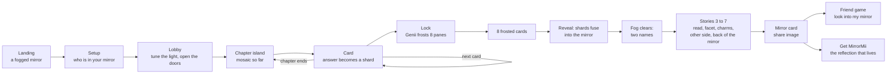
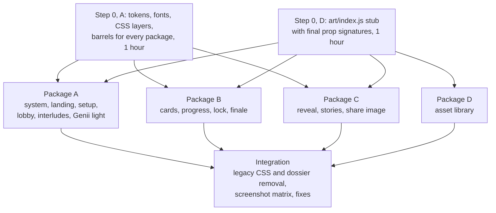

> **Partly superseded (2026-09-29).** The locked spec [LAUNCH-SPEC.md](../../docs/LAUNCH-SPEC.md) wins; its section 7 lists what this page no longer governs (the arched mirror, Genii as light only, code-made islands, the facet gem, the old stat labels and invite line). Section numbers cited below refer to the pre-lock spec, now [history](../../docs/history/LAUNCH-SPEC-2026-09-29-full.md).

# Mirror, Mirror: design direction for the MirrorMii launch survey

**How to use this file.** Section 3 is the idea. Section 4 is the system every package shares. Section 5 is the per-screen contract (phone first, then desktop). Section 6 lists every asset to make in code. Section 7 splits the work into four parallel packages with file ownership, contracts and acceptance checks. Section 8 lists what is held for Jerry. LAUNCH-SPEC.md still wins on content, evidence and flow; this file wins on how it looks, moves and reads.

Reference images: [design-refs/phone-card-390.svg](design-refs/phone-card-390.svg) (card layout and fold budget), [design-refs/reveal-storyboard.svg](design-refs/reveal-storyboard.svg) (the final reveal).



---

## 1. Benchmark study

Twelve references, chosen for the three jobs this survey has: keep a phone player tapping through 48 cards, land a reveal that feels like it was made from them, and produce an image people post. For each: what to steal, and where to see it.

| # | Reference | Why it is on the list | Steal this (1 or 2 techniques) | Where |
|---|---|---|---|---|
| 1 | **Spotify Wrapped 2025** (Vucko with Spotify in-house) | The current bar for a data-to-identity reveal; biggest Wrapped yet (200M users day one) | (a) A **motion system, not a template**: every card is built from the same few kinetic moves (type slams, shape wipes, texture layers), so 17 story types feel like one piece. We get one reveal grammar: shard, fog, pane, flip. (b) **Texture over flat color**: layered grain and print texture make a phone screen feel like an object | [vucko.co/project/wrapped-2025](https://vucko.co/project/wrapped-2025/), [Spotify design notes](https://spotifynews.substack.com/p/designing-2025-wrapped-turning-a), [Creative Review on motion identity](https://www.creativereview.co.uk/vucko-motion-design-brand-identity-etsy-spotify-wrapped/) |
| 2 | **Spotify Wrapped 2024** (Music Evolution) | The cautionary year: panned for generic AI copy and missing beloved cards | (a) **Full-bleed saturated card per idea, one idea per card, 9:16 native**: every screen is already a share. (b) The lesson: names must be earned by the data ("why pilates?" backlash). Our archetype names get a sigil built from their own poles so the name visibly comes from the player | [Fast Company](https://www.fastcompany.com/91239913/spotify-wrapped-2024-music-evolution), [TODAY on the backlash](https://www.today.com/popculture/music/spotify-wrapped-2024-controversy-rcna183189) |
| 3 | **Duolingo Year in Review** | A second, identity card on top of stats lifted share rates | (a) **Identity card after facts**: warm up, then name them. (b) **Reward for sharing**: a badge that only unlocks after the share. Our version: "Do you really know me?" unlocks the friend game view of your mirror | [Duolingo, behind the scenes](https://blog.duolingo.com/year-in-review-behind-the-scenes), [UX Design newsletter](https://newsletter.uxdesign.cc/p/has-duolingos-year-in-review-outshone) |
| 4 | **Co-Star** | Screenshotted daily for its voice and its restraint | (a) **Editorial serif plus generous emptiness**: one sentence per screen, big, set like a book, not a UI. (b) One consistent voice character. We take the typography, never the meanness (Wrapped research section 4) | [costarastrology.com](https://www.costarastrology.com/) |
| 5 | **Sky: Children of the Light** (thatgamecompany) | The cozy-game reference for light as a character and for UI that stays out of the art | (a) **The guide is light**: spirits and candles are glow, not faces; Genii becomes a light presence the same way. (b) **Constellation menus**: navigation drawn as stars and lines over the world, not boxed tabs. Our chapter map is a constellation of islands | [Apple, Behind the Design: Sky](https://developer.apple.com/news/?id=zm47it7t), [Menus reference](https://sky-children-of-the-light.fandom.com/wiki/Menus_and_Controls) |
| 6 | **Animal Crossing: New Horizons** (NookPhone, menus) | The warmest menu system in games; readable at a glance | (a) **Chunky rounded tiles with one bright icon each**, generous padding, playful but calm. (b) **Menus as objects in the world** (a phone, a board). Our setup and lobby become objects: doors for rooms, a dial for voice | [Interface In Game: ACNH](https://interfaceingame.com/games/animal-crossing-new-horizons/) |
| 7 | **Chekhov Is Alive** (Resn with Google Creative Lab), Awwwards Site of the Day | The award-level personality quiz: 28 illustrated archetypes, 3-color system | (a) **Every archetype has its own drawn emblem**, so the result is a picture, not a word. We do this without characters: a code-built sigil per half (16 sigils). (b) Strict palette discipline makes a large illustration set feel like one family | [Awwwards SOTD](https://www.awwwards.com/sites/chekhov-is-alive), [The FWA](https://thefwa.com/cases/chekhov-is-alive) |
| 8 | **Igloo Inc**, Awwwards Site of the Year winner | Ice, glass and particles assembling into structures, on the web, performant | (a) **Particles that assemble into an object** as the core reveal (our shards into the mirror). (b) Cool refractive palette on near-white; glass reads as glass because of rim light and caustics, not blur alone | [Awwwards](https://www.awwwards.com/sites/igloo-inc), [igloo.inc](https://www.igloo.inc/) |
| 9 | **Lusion** (studio site and work), Awwwards Site of the Day | Research-grade glass materials and soft 3D in the browser | (a) **Soft 3D glass with caustic highlights** on pastel fields: the dreamy-glass look Jerry wants, achieved with light, not polygons. (b) **Pointer as light source**: the scene answers the cursor. Our landing mirror clears its fog where your finger or cursor passes | [Awwwards SOTD](https://www.awwwards.com/sites/lusion), [lusion.co](https://lusion.co/) |
| 10 | **Apple Liquid Glass** (iOS 26, WWDC25) | The platform material our players now see every day | (a) **Glass = refraction + specular rim + adaptive tint**, not a grey blur. (b) **Honors Reduce Transparency and Increase Contrast** by becoming solid. Our glass tokens copy that behavior | [Meet Liquid Glass, WWDC25](https://developer.apple.com/videos/play/wwdc2025/219/), [Apple newsroom](https://www.apple.com/newsroom/2025/06/apple-introduces-a-delightful-and-elegant-new-software-design/) |
| 11 | **Receiptify** | 20 followers to 1M+ uses, because the result is a familiar object | (a) **Frame the result as an everyday object** people already know how to read and post. Ours is a mirror card (and the receipts card is literally a receipt). (b) Monospace-free itemised layout with dotted leaders reads as "real" | [The Tartan](https://thetartan.org/2021/2/8/pillbox/receiptify) |
| 12 | **The Pudding, How Bad Is Your Spotify** | A reveal told as a live conversation that builds suspense before the verdict | (a) **Suspense beat before the verdict**: the machine "looks" first. Our Genii light moves behind the fog before the names show. (b) Opt-in voice: the roast only because the player asked; our voice tap does the same | [pudding.cool](https://pudding.cool/2021/10/judge-my-music/) |

**Technique library (not a benchmark, a toolbox):** [Paper Shaders](https://shaders.paper.design/) (Apache 2.0, zero-dependency WebGL: mesh gradient, grain gradient, gem smoke, smoke ring, fluted glass). It covers the backdrop and Genii-smoke shaders without writing GLSL, and passes the "build over buy" rule because it is open source. Fallback when WebGL is off: the same palette as static CSS gradients.

### 1.1 What the benchmarks agree on (the bar we score against)

1. **One idea per screen, set big.** Wrapped, Co-Star, Duolingo.
2. **The result is an object, not a paragraph.** Receiptify's receipt, Chekhov's portrait, Wrapped's card.
3. **The reveal is assembled in front of you.** Igloo's particles, Pudding's "looking" beat.
4. **The guide is a presence, not a mascot sticker.** Sky's light, Co-Star's voice.
5. **Material honesty.** Glass reads as glass through rim light and refraction; it goes solid when the OS asks.
6. **Every card is a 9:16 share with the brand small.**

---

## 2. Critique of the current build

Scored from the 76 screenshots against the six-point bar above. Scale 1 to 10; 8 is "stands next to the benchmarks", 10 is "a benchmark". Dimensions: **Hook** (is there one thing you'd screenshot), **Craft** (type, spacing, material finish), **Mirror logic** (does it feel like MirrorMii), **Phone fit** (390x844 ergonomics), **Motion** (as far as stills and code show), **Share** (would anyone post it).

| Screen group | Hook | Craft | Mirror logic | Phone fit | Motion | Share | Mean |
|---|---|---|---|---|---|---|---|
| Landing | 5 | 7 | 2 | 6 | 5 | 2 | 4.5 |
| Setup and lobby (5 screens) | 2 | 5 | 1 | 4 | 3 | 0 | 2.5 |
| Chapter interlude | 4 | 6 | 2 | 5 | 4 | 1 | 3.7 |
| Cards (11 captured formats) | 2 | 4 | 1 | 2 | 3 | 1 | 2.2 |
| Lock and post-lock | 4 | 6 | 2 | 5 | 4 | 1 | 3.7 |
| Result stories (9, two voices) | 3 | 5 | 1 | 6 | 3 | 3 | 3.5 |
| **Benchmark bar** | 8 | 8 | 8 | 9 | 8 | 8 | 8.2 |

### 2.1 Top five failures (the ones that matter most)

1. **Answers sit below the fold on phone.** On scenario, real, receipts, reply and others cards the prompt is set at about 34 px bold across five or six lines inside two nested glass panels, so the first answer starts around 74% down the 844 px screen and options D, E and the exits are off screen (phone-card-scenario, -real, -receipts, -reply, -others). The player must scroll on the majority of 40 cards. This alone breaks the "tap, tap, tap" rhythm the format depends on.
2. **The reveal is flat and has no mirror.** "You are" shows two white rectangles with the names in them on a pale field (phone-result-fun-02); the map is six settings-style sliders (04); traits are five identical white cards (05); the share card is a text block (08). Nothing is assembled, nothing is revealed, nothing is an object. The 40 answers the player just gave never visibly become anything. A MirrorMii result without a mirror is a generic personality test, which LAUNCH-SPEC section 1 forbids.
3. **Generic, repeated card chrome with no format identity.** Eleven formats share one template: kicker, bold headline, A to E letter tokens (school-test look), a decorative bubble that collides with the headline ("Your friend reads their" is overlapped on phone-card-others), and a card-in-card-in-card glass stack. A bet, a receipt, a text thread and a feeling look the same, so the format's fun never lands visually. The two voices look identical (phone-heart-card vs phone-card-scenario).
4. **No visual hooks between cards and no progress you can feel.** Genii's line is a rotating generic tip ("No cool answer here. Just yours." appears on unrelated cards), not a reaction. Progress is shown three times and disagrees with itself ("Card 4 of 40" next to "3 / 40 cards", plus a slider and an 8-icon ribbon), with the counter in a monospace face that reads as a dev tool. Setup shows "Question 2 of 2" at 50%.
5. **Dev-tool and library leakage.** The lock screen shows a hex hash ("d36a 7907 1138 cfda") in monospace as the headline artifact of the most dramatic moment; the chapter kicker "CHAPTER 1 OF 7" renders in ui-monospace; the error state is an amber "Bad run id" banner; the same library Genii render repeats at hero size on landing, interlude and lock (the founder brief now retires it). Thirteen CSS files layered by previous builds (about 12,000 lines, 60+ `!important`) fight each other, which is why details drift.

### 2.2 Screen by screen

**Landing (phone-01, desktop-01).** Works: the headline copy "Let's get oddly specific." is good and the violet second line has punch; the CTA is clear. Fails: a centered SaaS hero with a 4-line promise paragraph; the Genii render sits below the CTA and is half cut by the fold on phone; the speech bubble "Small talk? In this economy?" floats as a web chat widget; the "Genii" chip in the header does nothing; nothing says mirror, reflection or twin; the silk background is a stock "glass ribbon" texture that reads as a wallpaper. Versus Lusion or Igloo: no interaction on first touch, no object. Score 4.5.

**Setup 1 and 2 (phone-02, -03).** A two-tap routing step dressed as a full quiz card: 6 stacked full-width tiles for "closest person" run off screen; A to F letters imply a test; the progress bar is wrong (2 of 2 at half). Genii's line duplicates the counter ("Two quick taps, then the lobby."). Versus Animal Crossing menus: no objects, no icons, no warmth. Score 2.5.

**Lobby 1 to 3 (phone-04 to -06).** "How should Genii talk to you?" is the most consequential tap in the run (it sets voice for 48 cards and the result) and it looks like a form. Choosing a voice changes nothing visible. Rooms use checkboxes with "Open" as grey text. The decorative bubble in the top-right of the card panel crowds the title. Score 2.5.

**Chapter interlude (phone-07, desktop-07).** Best screen of the run in composition (desktop split is balanced), but: the monospace kicker, a generic phone icon in a rounded square, six grey bars for "6 cards", and the same Genii render again. No sense of a world or of progress so far. Versus Sky: the world should carry the chapter; here the chapter is a word. Score 3.7.

**Cards (all formats).** Common: see failures 1, 3, 4. By format:
- *Scenario, "Picture this"* (phone-card-scenario): prompt 6 lines at display size; options at the fold; the absurd worlds in the bank (a polite tornado, a mermaid housemate, a ten-year nap) get zero visual support.
- *Real, "From your life"*: identical to scenario; nothing signals "this is about what you actually did".
- *Receipts*: the prompt "Receipts check. Unlock your phone. Tap everything..." both repeats the kicker and breaks LAUNCH-SPEC section 21 ("never ask the player to open an app"); the counter line "0 tapped." is set in violet display type; pill-shaped chips look like buttons, not a checklist. The best format idea in the bank has no receipt.
- *Bet*: "Guilty / Never" as two full-width tiles plus two huge pill exits, i.e. the exits outweigh the answers. (Section 21 moves bets to 3 to 5 own answers; the layout must scale.)
- *Reply*: the thread is the right idea but sits in a panel inside the prompt panel; the options do not look like replies and choosing one does not "send" anything.
- *Others*: bubble overlaps the headline; nothing distinguishes judging someone else.
- *Feeling*: five tiles of words; feelings with no color or form.
- *Role*: "Planner. Makes the poll..." reads as one run-on line; the role noun is not a title.
- *This or that, pick two*: not verifiable. Both captures (phone and desktop) show the landing with a "Bad run id" banner, so these formats have no screenshot evidence; treat as unreviewed and capture them in QA.
- *Rank, eyes, sealed*: not captured. Code shows rank is tap-in-order, not drag.
- *Heart to heart voice*: visually identical to Make it fun.
- *Desktop*: the card column is fine, but the right rail repeats Genii and a second "4 of 5" counter; "Genii studio" label is internal language.

**Lock (phone-lock, desktop-lock) and post-lock (phone-finale).** Good copy ("Eight cards. Eight guesses."). Fails: the ritual is a button; the "08" badge is a sticker; after locking, the hero artifact is a monospace hash with a "What's this?" disclosure. The moment that should feel like Genii sealing envelopes feels like a checksum. Score 3.7.

**Result, Make it fun and Heart to heart (phone and desktop result-01 to -09).**
- *01 "40 answers in. Here's you."*: a violet field with a plain sphere; tap to continue. No anticipation beat.
- *02 names*: two white boxes; large dead space above; "Two sides. Both you." is a good line wasted at body size.
- *03 the read*: three white cards; readable, but indistinguishable from a settings list.
- *04 map*: six sliders; the chosen pole is bolded on alternating sides, which reads as noise; the caption card floats. Nothing a player would screenshot.
- *05 traits*: five identical white cards on a peach wash; trait names in the text face.
- *06 the thing you didn't know*: strongest copy moment; set well; no visual device.
- *07 stings*: the dark screen works emotionally; left pink rules are a blog-quote style.
- *08 share card*: a text block with heart icons; no image preview; this is the screen Wrapped would make the loudest.
- *09 get MirrorMii*: the app CTA shares the screen with download, delete and start-over links, which makes the handoff feel administrative.
- *Global*: the app header stays on top of full-screen stories on phone (two chromes); a "Save" pill on every screen competes with tapping; desktop shows a phone-width column in a sea of empty silk; the story font (Manrope in share-image.js) differs from the app (Satoshi); both voices look the same.

### 2.3 What to keep

The copy spine ("Let's get oddly specific.", "Eight cards. Eight guesses.", "40 answers in. Here's you.", "Two sides. Both you.", "Genii has only met you on paper."), the Stories structure and its nine screens (section 21), the dark treatment for stings, lavender as the base light, one-card-at-a-time taps, save-on-device messaging, reduced-motion plumbing (MotionConfig, `useReducedMotion`), the StoryDeck keyboard and focus handling, and the canvas share-image approach (local, nothing uploaded).

---

## 3. The concept: Mirror, Mirror

### 3.1 The logic

MirrorMii is built on a mirror. The World Mirror sits at the center of Genii's island; Miia is your digital twin, "a reflection of you who lives her own life" (PRODUCT-TRUTH section 2). The survey is the first time a player looks into that mirror. So the whole game is one metaphor, played literally:

| Survey moment | Mirror logic | What the player sees |
|---|---|---|
| Landing | The mirror is fogged; Genii is a light behind it | A tall arched mirror; your finger or cursor clears the fog where it passes, and a glimpse of light shows through |
| Setup | Who stands next to you in the mirror | Object tiles for your closest person |
| Lobby | Tune the light, open the doors | Voice picks the light (day, dusk, clear) and the page changes with it; rooms are doors that open and dim |
| Chapter islands | Each chapter is a floating island reflected in still water | The island scene, and the mirror mosaic showing how much of you is already there |
| Every answer | An answer is a shard of reflection | Your picked answer lifts off as a glass shard and flies into the shard rail |
| Lock | Genii writes 8 guesses behind frosted glass | Eight small panes frost over one by one, each stamped with a seal glyph |
| Finale | You answer behind the frost | Frosted card material; panes stay frosted |
| **The Reflection (final reveal)** | Your shards become your mirror; the fog clears; you see yourself as two archetypes | Section 3.2 |
| Share | A mirror card | Your two names in the two panes of your arch, your facet gem, your charms |
| Friend game | "Do you really know me?" = look into my mirror | Friends see your arch, fogged, and clear it by guessing |
| App | The reflection that lives | The mirror becomes a phone-shaped glass tablet and Genii's light moves into it: Miia is the reflection that lives your real day |

### 3.2 The big idea for the final reveal: The Reflection

Story screen 1 opens in the brand's night scale (#171625). Your 40 shards, one per answered card, each tinted by its chapter, drift in a slow orbit around Genii's light. "40 answers in. Here's you." Hold, and the orbit speeds up (anticipation); tap or release, and the shards rush in, chapter by chapter, and fuse into a tall arched mirror whose mosaic pattern is seeded by your run, so no two mirrors crack the same way. The glass fogs. Genii's light slides behind it; the fog wipes from the center out; and in the two panes of the arch, split by a thin silver mullion, your two names resolve: **With your people** above, **With your life** below, each with its own sigil (a small emblem built from that half's three poles). The lower name casts a faint reflection on the glass floor. Then the stories walk through the rest of the mirror: the read is etched on three glass tablets; your six leans cut a **facet**, a gem whose shape is yours alone (people above the waterline, life below); your traits hang as charms on the frame; the thing you didn't know rises as a reflection and flips upright; the stings are written on the back of the mirror; and the share card is the mirror itself.

**Why it is unique and shareable.** Every personality quiz ends on a badge or a paragraph; this one ends on an object assembled in front of you from the exact pieces you gave it, which is both the Igloo-style spectacle and the brand's own product truth (a mirror, a reflection, a twin), so it could not belong to any other company. The mirror card is a familiar, postable object (the Receiptify lesson), and the seeded crack pattern plus the facet shape make two friends with the same archetypes still look different (the Wrapped 2025 "role inside the club" lesson), which gives a reason to post side by side and to play "Do you really know me?". It also teaches the app before the download: the World Mirror is the center of Genii's island.

### 3.3 Genii as light (no character art)

Genii appears only as code-made light: a luminous core, a wisp of lamp smoke that curls around it, and sparkles. No face, no eyes, no body, no redraw of the library render. She is expressed through motion (breath, lean, pulse, flare) and through her lines, which are always set in Fraunces italic so her voice has a typeface. The library renders (`public/assets/genii-*.webp`, `genii-*.png`, `halo-scene.png`, `badge-*.png`) stop being used; the files stay on disk until Jerry decides (section 8, D1).

### 3.4 Voice sets the light

The lobby voice tap changes the world, not only the words.

| Voice | Theme name | Light | Motion | Genii |
|---|---|---|---|---|
| Make it fun | **Day** | Lavender day: #F8F8FF canvas, sky and violet glows, crisp rim light | Base durations, springy, sparkle bursts | Reacts on about 40% of cards, playful lines |
| Heart to heart | **Dusk** | Lavender to rose haze: #F7F2FB canvas, peach-rose glows, softer rims | Durations x1.25, no bursts, slower breath | Reacts on about 40% of cards, warm lines |
| Just the cards | **Clear** | Day palette, backdrop quieter (glows at 50%) | Durations x0.85, no sparkle bursts | Small static orb; no lines; still pulses on answer |

The result follows the same theme on its light screens (3, 5, 8); the night screens (1, 2, 4, 7) are the same for everyone.

---

## 4. The system

All tokens live in one new file, `src/system/tokens.css`, as CSS custom properties, mirrored in `src/system/tokens.js` for canvas and motion code. Nothing outside `src/system/` defines a color, font, radius, shadow, duration or easing literal (enforced by a test, section 7.6).

### 4.1 Type

**Display: Fraunces** (variable; axes wght, opsz, SOFT, WONK). A soft, warm "old style" serif with an optical-size axis: at SOFT 100 its terminals round off, which gives the storybook, cozy-game warmth Jerry's liked draft (stories.html used Fraunces) already had, and its italic gives Genii a voice. Install `@fontsource-variable/fraunces` and import the full-axes file for Latin only.
**Text: Figtree** (variable; wght 300 to 900). A friendly geometric sans with open apertures and very good small-size legibility on phones; warmer than Manrope, less corporate than Inter. Install `@fontsource-variable/figtree`.
**No monospace anywhere player-facing.** Counts use Figtree with `font-variant-numeric: tabular-nums`.
**Wordmark**: `public/assets/mirrormii-wordmark.svg` unchanged; never set "MirrorMii" in Fraunces as a logo.

Retire: Satoshi (`public/fonts/Satoshi-Variable.woff2`, launch.css @font-face) and `@fontsource/manrope` after package C switches share-image.js. Considered and rejected for display: Bricolage Grotesque (too editorial-tech), Young Serif (single weight, no italic), Gloock (too high-contrast at small sizes).

Loading: preload the Figtree woff2 (text renders first); Fraunces with `font-display: swap` and a metric-matched fallback so nothing jumps (`@font-face { font-family: "Fraunces Fallback"; src: local("Georgia"); size-adjust / ascent-override computed with the Fontaine Vite plugin }`). Budget: both Latin subsets together at or under 220 KB woff2; if Fraunces full axes exceeds 150 KB, subset with pyftsubset to Latin plus typographic punctuation.

Fraunces settings: upright `font-variation-settings: "SOFT" 100, "WONK" 0`; italic (Genii) `"SOFT" 100, "WONK" 1`; `font-optical-sizing: auto`.

| Token | Face | Phone size/line | Desktop size/line | Weight | Tracking | Use |
|---|---|---|---|---|---|---|
| `--type-hero` | Fraunces | 44/46 | 80/80 | 600 | -0.025em | Landing H1, archetype names on reveal |
| `--type-display` | Fraunces | 36/40 | 60/62 | 600 | -0.02em | Chapter titles, lock headline, story titles |
| `--type-prompt-s` | Fraunces | 30/34 | 40/46 | 560 | -0.015em | Card prompt up to 70 characters |
| `--type-prompt-m` | Fraunces | 26/30 | 34/40 | 560 | -0.01em | Card prompt 71 to 120 characters |
| `--type-prompt-l` | Fraunces | 22/27 | 28/34 | 540 | -0.005em | Card prompt 121 to 170 characters (over 170: flagged to the bank checker) |
| `--type-title` | Fraunces | 22/28 | 26/32 | 580 | -0.01em | Trait names, share-card names at small size, sheet titles |
| `--type-genii` | Fraunces italic | 15/20 | 17/24 | 420 | 0 | Every Genii line |
| `--type-quote` | Fraunces italic | 24/31 | 30/38 | 460 | -0.01em | Stings and the second half of the insight (chat bubbles use `--type-answer`) |
| `--type-body-l` | Figtree | 18/27 | 20/30 | 450 | 0 | Landing promise, story body |
| `--type-answer` | Figtree | 16/21 | 17/23 | 500 | 0 | Answer tiles, chips, bubbles |
| `--type-body` | Figtree | 16/24 | 16/24 | 400 | 0 | Notes, sheets |
| `--type-small` | Figtree | 14/20 | 14/20 | 500 | 0.005em | Exits, meta, captions |
| `--type-kicker` | Figtree | 12/16 | 13/16 | 700 | 0.12em, uppercase | Kickers, pane labels |
| `--type-micro` | Figtree | 11/14 | 11/14 | 600 | 0.04em | Share-card fine print, rail labels |

Line lengths: body 30 to 42 characters per line on phone (natural at 358 px), max 64 characters on desktop (`max-width: 34em` for body, `18em` for prompts, `14em` for hero). Headlines use `text-wrap: balance`; body uses `text-wrap: pretty`. Never justify. Never set more than 3 lines of Fraunces italic in a row outside stories.

### 4.2 Color

Brand-canonical values: violet #8071E4, gradient #988DEA to #5B8BEB, near-white lavender #F8F8FF, dark scale from #171625. Contrast checked (WCAG 2.2): white on #8071E4 is 3.89 and white on the brand gradient is 2.86 to 3.31, so **white text never sits on raw brand violet or the brand gradient**; those carry ink text or no text. Text-bearing violet uses the deep values below.

**Light (Day)**

| Token | Value | Use | Contrast note |
|---|---|---|---|
| `--c-canvas` | #F8F8FF | Page | |
| `--c-canvas-2` | #EFEDFC | Lower gradient stop, wells | |
| `--c-surface` | rgba(255,255,255,.72) | Glass sheet fill | |
| `--c-surface-solid` | #FFFFFF | Answer tiles, reduced transparency | |
| `--c-ink` | #1E1B2E | Primary text | 15.9 on canvas |
| `--c-ink-2` | #4A4560 | Secondary text | 8.6 |
| `--c-ink-3` | #6E6987 | Tertiary, exits, meta | 4.9 (AA body) |
| `--c-line` | #E2DEF7 | Hairlines, tile borders | |
| `--c-violet` | #8071E4 | Brand accents, icons, shards, focus glow (no text) | 3.7, non-text only |
| `--c-violet-300` | #B3AAF0 | Rails, inactive shards | |
| `--c-violet-100` | #E9E6FB | Wells, selected wash | |
| `--c-violet-text` | #5646C0 | Kickers, links, violet text | 6.6 |
| `--c-violet-strong` | #6A5AD6 | Primary button fill | white text 5.2 |
| `--g-brand` | linear-gradient(135deg, #988DEA, #5B8BEB) | Decorative fields, shard highlights, ink text only (ink 5.4 to 6.2) | |
| `--g-deep` | linear-gradient(135deg, #5A4ED6, #4A63D3) | Selected answer, CTA, story 6 field; white text 5.2 to 6.0 | |
| `--c-focus` | #5646C0 | 3 px focus ring plus 2 px #FFFFFF inner | |
| `--c-danger` | #B4235A | Delete only | |

**Dusk (Heart to heart) overrides**: `--c-canvas` #F7F2FB, `--c-canvas-2` #F6E9F1, glows swap sky for rose #F2C4D8 and peach #F8D5C6, `--g-deep` becomes linear-gradient(135deg, #5A4ED6, #8A4FB8) (white text 5.6).

**Night (brand dark scale; reveal screens 1, 2, 4, 7, lock, desktop result stage)**

| Token | Value | Use |
|---|---|---|
| `--n-900` | #171625 | Base |
| `--n-800` | #1F1D33 | Raised |
| `--n-700` | #2A2744 | Panes, sheets |
| `--n-600` | #38345A | Hairlines strong |
| `--n-ink` | #F3F1FF | Text (16.0) |
| `--n-ink-2` | #C9C4EE | Secondary (10.7) |
| `--n-ink-3` | #9A94C0 | Tertiary (6.3) |
| `--n-violet` | #A99CF5 | Accents and violet text (7.4) |
| `--n-glow` | radial-gradient(closest-side, rgba(201,194,246,.55), rgba(128,113,228,0)) | Genii and mirror glows |

**Chapter tints** (pastel members of the brand world; used for shards, island scenes, vignettes and charms; never as text colors; ink on each is at least 8:1)

| Chapter | Tint | Deep (icons on tint) |
|---|---|---|
| 1 Your phone | Sky #8FB8F2 | #3D6FC4 |
| 2 Friends | Peach #F4B8A0 | #B5603F |
| 3 Love and your person | Rose #F2A7C3 | #B0426E |
| 4 Money and treats | Butter #F2D48A | #9A7419 |
| 5 Work, school and ambition | Mint #96D8C4 | #2E8A6E |
| 6 Family and home | Lilac #C9B3F0 | #6A4BB8 |
| 7 Play, rules and you | Aqua #8EDBE6 | #2A8595 |
| Extras | Pearl #DCE3F2 | #5B6A8C |
| Finale | Frost #E6E4F5 with violet rim | #5646C0 |

**Emotion beads** (feeling cards; mapped from `option.emotion`, 12 values in the bank): delight and pride to butter; warmth and relief to peach; longing and worry to sky; guilt and cringe to rose; irritation, resentment and envy to lilac; sting to frost. Unknown or missing: chapter tint.

### 4.3 Materials

| Material | Recipe | Where | Rules |
|---|---|---|---|
| **Glass sheet** (light) | fill `--c-surface`; `backdrop-filter: blur(22px) saturate(150%)`; border 1px rgba(255,255,255,.85); inset 0 1px 0 rgba(255,255,255,.95); rim light: a `::before` with `linear-gradient(160deg, rgba(255,255,255,.9), rgba(255,255,255,0) 35%, rgba(152,141,234,.25) 100%)` masked to a 1.5 px ring | Card sheet, sheets, header | At most 3 backdrop-filtered elements visible at once on phone. Answer tiles are never backdrop-filtered |
| **Glass tile** | `--c-surface-solid` at 88% alpha, 1px `--c-line`, radius 18, e1 shadow | Answers, chips, setup tiles | Solid enough to read on any backdrop |
| **Glass dark** | fill rgba(31,29,51,.55); blur 24px; border rgba(201,196,238,.18); rim gradient to rgba(169,156,245,.35) | Night panes, lock panes, desktop result stage | |
| **Frost** | glass tile plus an overlay of an SVG turbulence texture (D asset `frost.svg`, 6% white) and `filter: blur(0.3px)`; text under frost is ink-2 | Finale cards, sealed panes, fog | |
| **Mirror** | three layers: silver backing (`linear-gradient(180deg,#EEF0FA,#C9CCE0)` at 20%), glass (`--g-brand` at 18%), specular sweep (a 30% wide white gradient band at -20 degrees, animated only on reveal and hover) | Mirror arch, mirror card, favicon | |
| **Grain** | 160 px tile, monochrome noise, 3.5% opacity, `mix-blend-mode: soft-light` (D asset `grain.png`, generated by a script) | Backdrops and night screens only | Never on text surfaces |
| **Glow** | radial gradients from `--c-violet`, chapter tint or `--n-glow`; `filter: blur(40px)` only on elements under 400 px | Behind Genii, behind mirror, island rims | |

Reduced transparency (`prefers-reduced-transparency: reduce`, and the existing header motion toggle does not affect it): every glass becomes `--c-surface-solid` or `--n-700`, blur removed, rims kept. Forced colors: materials drop to system colors; shards and glyphs use `CanvasText`.

### 4.4 Space, radii, elevation, layout

- **Spacing scale (px):** 4, 8, 12, 16, 20, 24, 32, 40, 56, 72, 96, 128. Phone page gutter 16; card inner padding 20 (phone) and 32 (desktop); gap between answers 8; section gap 24 (phone) and 40 (desktop).
- **Radii:** 8 chips and kbd hints; 14 small tiles and glyph wells; 18 answers; 28 sheets; 36 hero panes and story stage; 999 pills; arch top radius = half the arch width.
- **Elevation:** e1 `0 1px 2px rgba(23,22,37,.06), 0 0 0 1px rgba(226,222,247,.9)`; e2 `0 10px 28px -10px rgba(86,70,192,.22)`; e3 `0 28px 64px -24px rgba(86,70,192,.32)`; glow-g1 `0 0 0 1px rgba(255,255,255,.6) inset, 0 0 44px rgba(152,141,234,.35)`. Night: e3 becomes `0 30px 80px -20px rgba(0,0,0,.55)`.
- **Breakpoints:** xs under 360 (reduce prompt sizes one step, gutter 12); phone 360 to 599 (default); tablet 600 to 1023 (single column, sheet max 560 centered, mirror niche collapses into the rail); desktop 1024 and up (two columns, section 5); wide 1440 and up (content max 1240, backdrop grows, content does not).
- **Safe areas:** `env(safe-area-inset-*)` padding on header, bottom action bars and story stage.
- **Viewport height:** use `100svh` for full-screen scenes (never `100vh` on phone).

### 4.5 Iconography

- **Glass glyphs** (new, package D): 24 px grid, 1.75 px stroke, round caps and joins, one filled accent shape in the chapter or format tint, drawn in SVG. Sets: 9 chapter and phase glyphs, 13 format glyphs, 18 world-device glyph families (section 6). These replace lucide icons for chapters and formats.
- **UI icons** stay lucide-react (menu, close, arrows, share, download, lock, check) at 1.75 stroke, 20 px, color `--c-ink-2`.
- **Sigils** (new, package D): 16 archetype emblems built from poles (section 6, A-12).
- **Sparkle**: one four-point star shape (not the lucide Sparkles icon), used everywhere sparkle appears.

### 4.6 Motion

Principles: (1) **Content first**: every screen's heading and primary controls are visible and interactive within 300 ms of navigation; no entrance animation delays readable text beyond 300 ms, and total stagger within a screen is at most 280 ms. (2) **Motion carries meaning**: shards travel to where your progress lives, fog clears to reveal, panes frost to seal. Decorative loops stay slow (at least 6 s cycles) and small. (3) **Never block a tap**: taps during an animation complete it instantly and act. (4) **One hero motion per screen.**

| Token | Value | Use |
|---|---|---|
| `--d-instant` | 90 ms | Press feedback, toggles |
| `--d-quick` | 160 ms | Hover, chip select, exits |
| `--d-base` | 240 ms | Card enter, sheet open, text crossfade |
| `--d-slow` | 420 ms | Scene transitions, shard flight |
| `--d-scene` | 700 ms | Interlude arrival, insight flip |
| `--d-reveal` | 1600 ms | Shard assembly (reveal only) |
| `--e-out` | cubic-bezier(.2,.8,.2,1) | Entrances |
| `--e-in-out` | cubic-bezier(.65,0,.35,1) | Travel (shards, panes) |
| `--e-in` | cubic-bezier(.4,0,1,1) | Exits |
| spring `tap` | stiffness 520, damping 34 | Press and release on tiles |
| spring `settle` | stiffness 180, damping 24 | Glass arriving, names settling |

Entrance choreography (every screen): background and chrome present at 0 ms; heading fades and rises 8 px over 240 ms starting at 0 ms; primary controls follow at 60 ms steps (max 4 steps); decoration (glyphs, Genii, glows) last, up to 700 ms. Exits: 160 ms fade and 6 px lift, then the next screen enters. Page transitions never slide horizontally on phone except inside this-or-that rounds and stories.

Reduced motion (OS setting, or the header's Motion off): no travel, no parallax, no shader animation (a single static frame), no auto-advance; every transition becomes a 120 ms crossfade; shard flights become an instant rail fill with a 120 ms brightness pulse; the reveal shows the assembled mirror with names immediately (fog fades out over 200 ms). Background shaders pause when the tab is hidden or the canvas is off screen.

### 4.7 Accessibility contract

WCAG 2.2 AA: text contrast as in 4.2; non-text contrast at least 3:1 for tile borders against their backdrop when selected state relies on it (selected state also changes fill and adds a check); tap targets at least 48 x 48 px (exits 44 px tall with 48 px hit area); focus ring always visible on keyboard focus (`:focus-visible`), never on tap; heading focus on every screen change (existing behavior kept); `aria-live="polite"` for Genii reactions and counters, never for decoration; all art `aria-hidden`; every visual that encodes data (rail, facet, panes) has a text equivalent (section 5). Supports 200% text zoom without horizontal scroll at 390 px (prompt size classes step down, answers wrap). Dialog focus trapping and Escape (existing `useDialogFocus`) kept for sheets.

### 4.8 Performance budget

- JS added by this pass at or under 70 KB gzipped (art components, shader wrapper lazy loaded; the Paper Shaders chunk loads only on landing, interludes, lock and result).
- LCP at or under 2.0 s on a mid phone profile (Lighthouse "Moto G Power", 4G); CLS under 0.02; INP under 150 ms on card taps.
- At most one WebGL canvas alive at a time; DPR capped at 1.5; 30 fps cap for backdrops; canvases paused off screen and when `document.hidden`.
- Card screens never run a shader: they use static CSS gradients plus grain.
- No video, no GIF, no raster larger than 60 KB (only `grain.png` and the OG image are raster).

---

## 5. Per-screen specs

Every screen spec gives: purpose, phone layout (390 x 844 reference, 16 px gutters), desktop layout (1440 x 900 reference), hierarchy, copy rules, interactions, motion, the visual hook and the accessibility note. Copy shown in quotes is current or proposed copy; copy owners stay as LAUNCH-SPEC says (LOBBY_COPY in `lobby.js`, library and cards in the research folder). Where this file proposes new copy, it is marked "proposed" and needs Jerry's read before it ships (section 8, D6).

### 5.0 Global chrome

**Backdrop** (`<Backdrop scene>` from package D): a full-viewport layer under everything. Scenes: `day`, `dusk`, `clear`, `night`, `island-n` (chapter 1 to 7, extras, finale). Content: two or three slow glows (chapter tints or brand), faint horizon line at 62% height (the "still water" of Genii's island, a 1 px gradient line at 20% opacity), grain. On landing, interludes, lock and result it may run the Paper mesh-gradient shader (30 fps, speed 0.15); on cards it is static CSS. Replaces AmbientWorld's silk ribbons.

**Header, phone.** Height 52 plus safe area; glass sheet material flush to top (no floating rounded bar, which cost 20 px and looked like a SaaS nav). Left: wordmark at 15 px cap height (the SVG scaled to 104 px wide). Center (only during cards and finale): the **shard rail** (5.8). Right: a 44 px round menu button (lucide Menu) opening the More sheet (Chapter map, How this works, Save and leave, Motion on/off, Your data). Remove the "Genii" chip and the "N answers saved" text from the header. On result stories the header is hidden entirely; the story's own top bar replaces it.

**Header, desktop.** Height 64, content max 1240. Wordmark left; shard rail center during cards (wider, with chapter labels on hover); right: "Chapter map", "Save and leave", menu. Motion toggle moves into the menu.

**Errors and notices.** Replace the amber banner with a glass toast at the top of the content (not over the header): radius 18, ink text, a small frost glyph, one sentence and at most two text buttons. Proposed copy for the save mismatch: "This save is from an older version of the game. Keep a copy, then start fresh." Buttons: "Keep a copy" and "Start fresh". Never show "run id", "hash", "kit" or error codes.

### 5.1 Landing

**Purpose.** In 3 seconds: this is a game, it is about you, it is MirrorMii, tap to start.

**Visual hook.** The fogged mirror. A tall arched mirror (arch geometry A-01) stands on a small glass plinth reflected in still water; Genii's light glows behind the frosted glass. Drag a finger (phone) or move the cursor (desktop) across the mirror and the fog clears along the path (canvas mask, radius 36 px, the fog refills over 2.5 s), showing a soft violet-sky "inside" with drifting sparkles and, for 1 s after the first wipe, Genii's light brightening as if noticed. It foreshadows the reveal and gives the first touch a reward.

**Phone layout (390 x 844).**
- 0 to 52: header.
- 72: kicker, `--type-kicker`, `--c-violet-text`: "A personality game. Genii is taking notes." (keep).
- 96 to 196: H1 `--type-hero` 44/46, two lines, left aligned (not centered): "Let's get" / "oddly specific." with the second line in `--c-violet-text` and a reflection of the second line below it (scaleY(-1), 14% opacity, masked by a linear gradient, 20 px tall; the "reflection type" device, used only on landing, chapter titles and the reveal names).
- 212 to 262: promise, `--type-body-l`, max 2 lines, `--c-ink-2`. Proposed shortening of `LOBBY_COPY.landing.promise`: "40 quick cards about your real life. Genii locks in 8 guesses. You get two archetypes that are weirdly you." (current copy is 4 lines on phone).
- 286: primary CTA, full width minus gutters, height 56, radius 999, `--c-violet-strong` fill with a top highlight, white `--type-answer` 17 px weight 650: "Meet Genii" plus arrow. Resume state keeps the existing labels.
- 360 to 760: the mirror, 220 px wide, 360 px tall, centered, plinth and reflection below. Its top third is above the fold at 844 (the arch invites a scroll).
- Below the fold: three glass chips in a horizontal row (swipeable, snap): "40 cards, no typing", "8 guesses, locked", "Then: do your friends know you?" and the "How this works" button. Copy for the chips comes from existing `journey-fact` strings, shortened to 4 words or fewer each.

**Desktop layout (1440 x 900).** 12-column grid, content 1240. Left 6 columns: kicker, H1 at 80/80 (three lines max: "Let's get / oddly / specific." is acceptable), promise 20/30 at 30em, CTA at auto width (min 240), chips in a row below. Right 6 columns: the mirror at 360 x 560, vertically centered, with the island horizon behind it, the pointer-clearing fog, and a light parallax (mirror 6 px, glows 14 px) on pointer move.

**Motion.** 0 ms: backdrop, header, H1 visible (fade 240 ms). 60 ms steps: promise, CTA. 300 to 700 ms: mirror rises 12 px and fades in; Genii light breath begins (4.8 s cycle). Fog clearing is pointer driven; under reduced motion the fog is static and a single tap on the mirror shows the inside for 1.5 s with a crossfade.

**Accessibility.** Mirror is `aria-hidden`; the wipe is optional play, never required. CTA is the first focusable element after the header.

### 5.2 Setup (2 taps)

**Purpose.** Two routing taps that feel like choosing who stands next to you in the mirror, finished in under 8 seconds.

**Hook.** Object tiles. No A to F letters.

**Tap 1, "Who's your closest person right now?"** (keep copy; note line keep). Phone: kicker "Before we start" and a 2-dot progress (filled dot = current; no bar, no "Question 1 of 2"); title `--type-display` 32/36 phone (one step down from display for fit); note `--type-body` ink-2, max 2 lines; then a **2 x 3 grid** of square-ish tiles (each 171 x 104 at 390 width, gap 8): glyph well 40 px (object glyph, chapter-neutral violet), label `--type-answer` below it. Objects (D asset set A-09): best friend = two mugs clinking; partner = two interlocked rings; crush = a folded note with a small heart; sibling = two matching sneakers; parent = a house key on a ring; someone else = a single sparkle. All six tiles fit above the fold (title top at 92, grid from 250 to 474). Tap selects (fill `--g-deep`, white label, glyph turns white), 220 ms later advances.
**Tap 2, pronoun** (keep copy). Three pills in one row (she / her, he / him, they / them), each 110 x 52; Back as a quiet text button bottom left.
**Genii.** Size s orb top-left of the sheet with one line (`LOBBY_COPY.setupGuide`, keep), no second counter.
**Desktop.** Centered sheet 640 wide; grid becomes 3 x 2 at 190 x 120 per tile; Genii line to the left of the title on the same baseline.
**Motion.** Tiles enter in a 3-step stagger (60 ms); on select, the tile's glyph does a 1.08 scale pop (spring tap) and the other tiles fade to 60% for 160 ms before the step changes with a 240 ms crossfade.

### 5.3 Lobby (3 taps): tune the mirror

**Purpose.** The player chooses how the game treats them, and sees it happen.

**Tap 1, "How should Genii talk to you?"** (keep; note keep). Three large voice cards stacked (phone, each 358 x 112) or side by side (desktop, 360 x 200):
- each card: theme swatch (a 44 px orb in that theme's light: Day lavender and sky, Dusk rose and peach, Clear pearl), name (`--type-title`), and **a live sample line in that voice** in Fraunces italic ("Make it fun" sample: an existing FUN_HOST line; "Heart to heart" sample: an existing HEART_HOST line; "Just the cards": "No commentary. Just you and the cards.", proposed).
- **Hook:** hovering (desktop) or pressing (phone) a card previews its theme on the whole page backdrop (300 ms crossfade); choosing it commits the theme for the run. The player sees the world change before the first card.
**Tap 2, "How personal can Genii get?"** (keep). Two tiles: "Keep it light" and "Ask me anything", each with a small dial glyph at two positions. One row on desktop, two stacked rows on phone.
**Tap 3, "Which rooms can Genii visit?"** (keep). Three **doors** (D asset A-10, one per room: love = rose door with a heart knocker; work = mint door with a small plaque; family = lilac door with a lit window). Open state: door ajar, warm light spilling, label "Open"; closed state: door shut, desaturated to 40%, label "Closed". Tap toggles with a 240 ms door swing (rotateY 0 to -28 degrees on the door leaf, perspective 600). Below: the always-open chapters as four small island chips ("Your phone, Friends, Money, Play are always in", from the existing note). Continue button right aligned (phone: full width at bottom). Three doors side by side at 390: each 112 x 150, fits.
**Progress.** Three dots, not "Question 1 of 3".
**Desktop.** Same sheet 720 wide, doors 180 x 240.
**Accessibility.** Doors are toggle buttons with `aria-pressed` and labels "Love and your person, open"; preview-on-hover does not trigger on focus alone (it triggers on focus plus 400 ms, so keyboard users get it without flashing).

### 5.4 Chapter interludes (7 chapters, extras, finale)

**Purpose.** A breath between chapters, a sense of place, and visible progress toward the reflection.

**Hook.** The island. Each chapter has an island scene (D asset A-03): a floating glass-pastel island reflected in still water, carrying that chapter's objects; the chapter tint lights the scene. Beside or under it, the **mirror mosaic** (A-01 at small size) shows every shard filled so far, so the player watches their reflection grow chapter by chapter.

**Phone layout.**
- Header (no rail on interludes).
- 64 to 420: island scene, full width, 356 px tall, floating (6 s bob, 6 px), with Genii's light (size m) hovering near it and the chapter intro line (`chapter.intro`, keep) under the light in `--type-genii`, max 2 lines.
- 440: kicker, `--type-kicker`: "Chapter 2 of 7" in Figtree (never monospace).
- 462 to 540: title `--type-display` 36/40 with the reflection-type device.
- 552: sub line, `--type-body` ink-2, one line (keep "Tap what you'd actually do. Skip anything that isn't yours." only on chapter 1; later chapters show nothing here, or a Genii line, to cut repetition).
- 590 to 650: the chapter's shard preview: N small shards (N = cards in this chapter) in the chapter tint, unfilled, in a row, replacing the grey bars; to its right, a 72 px mirror mosaic thumbnail of the run so far.
- 680: Start (primary, full width). "Save and leave" moves to the menu (it is in the menu already; removing the second button reduces choice at a moment that should be a single tap).

**Desktop.** Two columns: island scene left (6 columns, 560 x 520) with the mosaic mirror standing on the island's far edge; text right (kicker, 60 px title, Genii line, shard preview, Start).

**Extras interlude** ("Two more cards and Genii can call it", keep): pearl scene "Genii's notebook" (an open notebook with drifting sparkles). **Finale interlude**: this is the lock screen (5.10).

**Motion.** Island rises from the water (translateY 24 px to 0, 700 ms `--e-out`) while title and Start are already visible at 0 to 240 ms; reflection in the water shimmers (CSS mask animation, 8 s); shard preview fills its first shard only after the first card is answered (never on the interlude itself). Arriving from a card: the last shard you placed flies from the rail into the mosaic (420 ms).

### 5.5 The card shell (common to every format)

See [design-refs/phone-card-390.svg](design-refs/phone-card-390.svg).

**Phone vertical budget (390 x 844):** header 0 to 52 (rail inside); Genii line 60 to 92 (size xs orb 24 px plus one line, 60 characters max, ellipsis never, the pool is written short); card sheet from 100 to the end of the exits; sheet padding 20.

**Inside the sheet, top to bottom:**
1. **Kicker row** (height 20): format glyph 16 px + format name + " · " + chapter name, `--type-kicker`, `--c-violet-text`. Finale: "Final 3 of 8".
2. **Vignette** (48 x 48, radius 16, top right, `--c-violet-100` well): the world-device glyph for absurd cards (`deviceFor(card)`), the chapter object for unusual cards, nothing for everyday cards. The prompt wraps around it (the vignette floats right with a 12 px margin; prompt lines under it run full width). It never overlaps text.
3. **Prompt**: size class by character count (4.1 table), `text-wrap: balance`, color ink. Quoted speech inside prompts keeps curly quotes.
4. **Format body** (thread, receipt paper, split slabs, etc.; per format below).
5. **Answers**: see 5.6.
6. **Exits row**: text buttons ("Skip", "Not my life", "No recent example"), `--type-small` weight 600, `--c-ink-3`, 44 px tall, left aligned, 20 px apart. Never pill-shaped.
7. **Save hint**: one line, `--type-micro`, ink-3, only on the first card of each chapter ("Saved on this device"), to cut noise.

**Fold rule (acceptance):** at 390 x 844, cards with up to 5 options and prompts up to 140 characters show every option and the exits row without scrolling; at 375 x 667 the first two options are visible. The bank checker should warn over 140 characters (package B adds a test that renders every bank card at 390 x 844 in a headless browser and reports overflow).

**Desktop (1440 x 900).** Two columns inside 1240: left 5 columns is the **mirror niche**: the arch mirror (320 x 480) showing the live mosaic, the chapter island faintly behind it, Genii's light (size m) at the arch's shoulder and her line under the mirror (`--type-genii` 17/24). Right 7 columns: the sheet (max 680 wide, padding 32), vertically centered with a minimum top of 112. Keyboard hints appear on hover or after the first key press: small `kbd` chips 1 to 5 on the right edge of answers, S for Skip, N for Not my life, R for No recent example, Enter for Done.

**Card enter and exit.** Enter: sheet fades in and rises 10 px (240 ms, `--e-out`), answers stagger 30 ms each (max 5 steps, total under 300 ms). Exit on answer: see 5.9 (shard flight), sheet fades out and lifts 6 px (160 ms).

### 5.6 Answer tiles (all single-choice formats)

Full-width tiles, min height 52, padding 14 x 18, radius 18, glass tile material, text `--type-answer` ink, left aligned. **No letter tokens.** A 10 px shard glyph sits at the left inside a 20 px column, `--c-violet-300`, becoming `--c-violet` on hover and white on select. Hover (desktop): border becomes `--c-violet-300`, e2 shadow, 1 px lift. Press: scale 0.985 (spring tap). Selected: `--g-deep` fill, white text, shard glyph lights, a 1 px inner white rim, and a check (lucide Check 18) at the right. Disabled siblings after a choice: 55% opacity. Long answers (over 60 characters, which the template disallows) wrap to at most 3 lines; tiles never truncate.

### 5.7 Every card format

Each format below lists only what differs from 5.5 and 5.6.

**Scenario ("Picture this").** Hook: the vignette shows the absurd world's device (a polite tornado, a magic bell, a mermaid tail fin; section 6 A-05). For absurd cards the prompt gets a faint sparkle trail along its first line's baseline (4 sparkles, 1.2 s, once). Copy rules: hook 15 words or fewer, total prompt at or under 140 characters, options 12 words or fewer (card template). Desktop: the mirror niche shows the device glyph at 96 px floating in front of the island for this card.

**Real moment ("From your life").** Hook: memory framing. The prompt sits on a slightly warmer tile inside the sheet with a thin top strip "The last time" in `--type-kicker` and a small clock glyph; the sheet's backdrop tint shifts 4% toward peach (memory warmth). The exit "No recent example" is shown first in the exits row for this format. Answers are first-person past tense (content rule, already in the bank).

**Receipts check.** Hook: an actual receipt. The body is a receipt strip: off-white paper tone (#FFFEFB) on the glass, zigzag top and bottom edges (SVG mask), a header line "Receipts. Right now." (proposed; replaces the prompt duplication), and items as rows: a 22 px square check box on the left, the item text, and a dotted leader to a right-aligned tick mark. Ticked rows get a violet check stamp and the text stays ink (strike-through would imply "wrong", so no strike). A running tally at the bottom of the receipt: "Total: 3" in Figtree tabular (proposed). "None of these" is the last row, visually separated by a dashed line, exclusive (existing logic). The Done button is styled as a primary pill labeled "Tear it off" (proposed) and triggers a 420 ms tear animation (the receipt's bottom edge rips and the strip drops 20 px, fading). Content fix required (package B raises it to the bank owner, not in this file's scope): the current receipts prompt says "Unlock your phone", which LAUNCH-SPEC section 21 forbids; the heading should read as memory ("Tap what's true about your phone right now").
Phone fit: 7 items x 44 px rows = 308 px; with the header line and Done, fits under a 2-line prompt.

**Genii's bet.** Hook: Genii places a chip. Genii's bet line is the prompt, set in `--type-prompt-*` but in **Fraunces italic** (Genii is speaking), preceded by a small glass chip glyph that spins once on enter (360 degrees, 700 ms). Answers are 3 to 5 own answers (section 21) as standard tiles; for the 6 legacy two-answer bets, the two tiles sit side by side (each 171 wide, 64 tall), because a two-way bet reads better as a split. After the pick, Genii's orb does the "noted" pulse and the chip glyph lands on the chosen tile for 300 ms. No "called it" language here: bets are evidence, not guesses.

**Reply picker ("Your reply").** Hook: a real-feeling thread that sends your reply. Body: a phone-chat panel (radius 22, `--c-canvas-2` fill, no nested glass) with incoming bubbles left aligned (white, radius 18 with a 6 px tail corner, sender name `--type-micro` violet-text above the first bubble only). Bubbles appear in sequence: first at 0 ms, each next one at 180 ms after a 3-dot typing indicator (so all content is visible within 300 ms for 2 bubbles, 480 ms for 3; threads are at most 3 incoming bubbles). Answers render as **draft reply chips** under the thread, right aligned, violet-100 fill, radius 18 with the tail on the right, `--type-answer`. Tap a chip: it flies up into the thread as an outgoing bubble (`--g-deep`, white), a "Delivered" micro label fades in under it (300 ms), then the card exits. Desktop: the chat panel is 420 wide, chips under it in the same column.

**Other people ("First thought").** Hook: overheard. The friend's action is set as the prompt; the kicker glyph is an eye; answers render as **thought tiles**: standard tiles with a small thought-tail (two 6 px and 4 px circles) at the tile's top-left corner, only on the unselected state, to say "this is what goes through your head". Proposed kicker: "First thought" (keep).

**This or that (rounds of 3).** Hook: the split. The body is two tall slabs, each a glass pane tinted differently (left or top: chapter tint at 30%; right or bottom: violet-100), with the option text centered in `--type-title` (these options are short). A 44 px "or" coin sits on the seam (Fraunces italic "or"). Phone: slabs stacked (each 358 x 150) with the coin between; desktop: side by side (each 300 x 280). Round pips (3 dots) sit in the kicker row: "Quick round 2 of 3" (keep text, add pips). Interaction: tap a slab, or swipe the card toward a slab (up/down on phone, left/right on desktop, threshold 64 px); keyboard 1 and 2 or arrow keys. On choice: the chosen slab expands 4% and brightens, the other dissolves into 8 sparkles (320 ms), and the next round slides in from the side within the same sheet (240 ms). Only format allowed horizontal slide.

**Role ("Pick your role").** Hook: a cast list. Parse each option: when it matches `^([A-Z][A-Za-z' -]{1,22})\.\s+(.+)$`, render the first group as a **role title** (`--type-title`, Fraunces) and the rest as the line (`--type-small` ink-2) under it; otherwise render as a standard tile. Tiles get a small name-badge glyph at left (a lanyard clip shape). Prompt keeps the trailing "you're the..." ellipsis.

**Pick two.** Hook: two empty slots. Under the prompt, two slot outlines (dashed, radius 14, 40 px tall) labeled "1" and "2". Options render as a **2-column grid of short tiles** on phone when every option is 42 characters or fewer (6 options: 3 rows x 171 x 72), otherwise single column. Tapping a tile fills the next slot with a mini copy (the tile's text, truncated with a fade at 1 line) and marks the tile selected; tapping a filled slot or the selected tile removes it. When both slots fill, a 600 ms settle (a thin progress ring around the second slot) then submit; any tap in those 600 ms cancels. This replaces the current instant submit and makes mistakes recoverable. Counter text (for screen readers): "1 of 2 picked".

**Rank it (drag).** Hook: a podium list. Items (4) render as tiles with a grip handle (six dots) at right and a position badge at left (1 to 4, Fraunces 20 in a 32 px violet-100 circle). Drag to reorder with motion's `Reorder.Group` (already in the `motion` dependency), 8 px lift and e3 shadow while dragging, siblings slide 200 ms. The rank label sits above the list ("First to cancel" at top and "Last" at bottom, from the card; if absent, "First" and "Last"). Tap fallback (keeps the current code path): tapping items in order places them (badge fills); keyboard: focus an item, Space to pick up, arrow keys to move, Space to drop, with `aria-live` "Gym, moved to position 2 of 4". Done is enabled once the player has either dragged at least once or placed all four by tap (starting order counts if they confirm it; Done label reads "This order").

**Through a friend's eyes.** Hook: a second lens. The kicker glyph is a pair of glasses; the vignette shows two overlapping circles (two perspectives) in the chapter tint. Answers render as quote tiles: the option text in `--type-answer` wrapped in large soft quote marks (Fraunces, 28 px, violet-300) at start. Proposed kicker: "Through your best friend's eyes" when setup.closest is best friend, otherwise the existing "Through a friend's eyes".

**Feeling ("First feeling").** Hook: feelings as light. Options render as **emotion beads**: pill tiles (height 56) with a 28 px glowing bead at left in the emotion's tint (4.2 emotion beads) and the label. Phone: single column (these lines can be long, like "A sting. My friend wasn't who I thought."); desktop: 2 columns. On select, the bead blooms (scale 1.4, glow 24 px, 300 ms) and the whole sheet takes a 6% wash of that tint for the exit. Feeling cards follow a card; the Genii line on a feeling card is always hidden (the moment is the player's).

**Sealed (the 8 finale cards).** Hook: frost. Same shell with the **frost material** on the sheet; the rail is replaced by 8 small panes (5.8); kicker "Final 3 of 8" with a pane glyph; Genii is in "hush" mood (orb dim, no line). After the tap, the chosen tile is "etched": its fill becomes frosted white with violet text and a thin engraved underline, the pane in the rail frosts with a seal glyph stamp (scale 1.2 to 1, 240 ms), then the next card. The save hint line reads "Each answer locks when you tap it." (keep, finale only).

**Depends and "What would flip you?"** (existing flip). The chosen tile stays at top in selected style; the flip question is a `--type-title` under it; three preset flips as chips (2 per row), Skip as text button, "Pick a different answer" as a link. Same sheet, crossfade 160 ms.

### 5.8 Progress and chapter navigation

**Shard rail (phone header center, desktop header center).** 40 shard glyphs (plus extras when served; the rail uses `step.total`), grouped by chapter with a 6 px gap between groups; each shard 7 x 11 px (phone) or 9 x 14 (desktop), a slightly irregular quadrilateral (8 variants from D, chosen by index). Unfilled: `--c-violet-300` at 35%. Filled: the chapter tint with a 1 px white rim. Current: an outlined shard with a soft pulse (3 s). Finale: the rail crossfades to 8 panes (12 x 14 rounded rects, frosted when answered). The rail is a button: tap opens the Chapter map sheet. Text equivalent: `aria-label` "Card 7 of 40, Friends. Open the chapter map." One counter, one source of truth: no "Card 4 of 40" line, no "3 / 40 cards", no progress slider, no icon ribbon.

At 390 px the rail is 40 x 7 + 39 x 2 + 6 x 6 = 394 px, too wide; phone therefore shows **the current chapter's shards at full size plus other chapters as 3 px dots** (collapsed groups), which fits in 200 px. Desktop shows all 40 at full size.

**Chapter map sheet.** Bottom sheet on phone (max 80% height, drag handle, glass), centered dialog on desktop (560 wide). Content: a **constellation of islands**: the 7 chapter glyphs (plus extras and finale) placed along a gentle S-curve path with dotted lines between them (Sky's constellation idea); done chapters lit in their tint with a small shard count ("6 of 6"); the current one pulsing; closed rooms drawn as dimmed glyphs with "Closed" under them; future ones outlined. Below, a plain list version for screen readers (visible on desktop as a two-column legend). No navigation jumps (the picker is linear); the sheet is for orientation. Replaces `PersonaChapterMap`.

### 5.9 Genii between cards

**Presence on cards.** Size xs (24 px) at the start of the Genii line row on phone; size m in the desktop mirror niche. Moods: `listening` (card shown: slow 4.8 s breath, faint lean toward the card), `noted` (answer tapped), `thinking` (lock), `hush` (finale, feeling cards), `sure` (reveal).

**The answer moment (the "shard flight"), every card.** On tap (after the 90 ms press): the selected tile emits a shard (a 12 px glass shard in the chapter tint) from the tap point; it travels on a gentle arc to its slot in the rail (desktop: into the mosaic in the mirror niche) over 420 ms `--e-in-out`, leaving a 6-particle sparkle trail (Day theme only); the slot fills with a 120 ms brightness pulse; Genii's orb does the `noted` pulse (scale 1.12 and back, 300 ms). In parallel, the sheet exits at 160 ms and the next card enters at 200 ms, so the next prompt is readable 440 ms after the tap. Reduced motion: slot fills instantly, no flight.

**Reactions.** Genii's line row on the next card shows a reaction to the previous answer on about 40% of cards (deterministic from the run seed, never two in a row, always on the card after a bet and never on feeling or finale cards), otherwise the existing host line. Reactions come from a new pool (`src/persona/reactions.js`, package B), keyed by the chosen option's `emotion` (12 values) and voice (fun, heart), 4 lines per key per voice to start (96 lines), each at most 48 characters, never naming a trait or tag, never judging, never quoting the answer (masking rule, section 6 of the spec). Examples (proposed): delight, fun: "Oh, you enjoyed that one." heart: "That one made you smile." cringe, fun: "Felt that from here." heart: "That one is a little tender." relief, fun: "Crisis averted, apparently." heart: "Some ease in that answer." The line crossfades in (160 ms) at the start of the next card, stays for the whole card, and is announced once by the polite live region. "Just the cards": no lines at all, but the `noted` pulse still plays.

### 5.10 Lock moment

**Purpose.** Make "Genii commits before you play" feel like a ritual, and make it trustworthy without showing a hash.

**Hook.** Eight panes frost over. The screen uses the Dusk-night blend (`night` backdrop with a violet horizon). Center: the mirror (mosaic full, all 40 shards lit) with **8 small panes** orbiting it in an ellipse (each 36 x 44, clear glass, a tiny sparkle inside).

**Phone layout.** Mirror scene 64 to 420 (mirror 180 x 300). Kicker "Your cards are done" (keep). Title `--type-display`: "Eight cards." / "Eight guesses." (keep; second line `--n-violet`). Body `--type-body-l` `--n-ink-2`, max 3 lines (keep copy, trimmed if over 3 lines). Note (keep "Your answers so far stay put...") as a glass-dark note with a small lock glyph, not a left-rule quote. CTA "Lock in Genii's guesses" with lock icon (primary, full width). "Save and leave" in the menu only.

**The lock animation (on tap, 2.2 s, skippable by tap).** Genii's light (size l) leaves the mirror and passes each pane in turn (90 ms apart); each pane frosts (frost material fades in over 200 ms) and gets a seal glyph stamped (scale 1.3 to 1, spring settle); the panes then line up in a row under the mirror. Title crossfades to the locked copy "Genii has made its guesses." (keep).

**Locked state.** The 8 frosted panes in a row are the artifact. Under them, one line: "Locked before you play. They stay hidden until the end." (proposed, merges the current body). Disclosure "How do I know Genii can't cheat?" (proposed, replaces "What's this?") opens a small sheet: the existing explanation plus the full code set in Figtree tabular, 13 px, ink-3, grouped in fours. No monospace, no code on the main screen. CTA "Play the final 8" (keep).

**Desktop.** Mirror scene left (6 columns), text right; panes orbit in 3D-ish ellipse (CSS transforms, no WebGL needed).

### 5.11 Finale run

Covered by 5.7 Sealed and 5.8 (rail becomes panes). The finale has no interlude of its own beyond the lock screen. After the 8th answer, a 600 ms "all panes etched" beat (panes brighten in sequence), then story 1.

### 5.12 The result: twelve story screens (round 2)

**Round 2 order (LAUNCH-SPEC sections 21 and 23, in force 2026-09-29).** Twelve screens; the specs below keep their first-build numbers in brackets where a screen moved.

| # | Screen | Look | Round 2 |
|---|---|---|---|
| 1 | "40 answers in. Here's you." (shards assemble the mirror) | night | kept |
| 2 | The two archetypes in the mirror's panes | night | kept, plaque under the arch |
| 3 | The read: two glass tablets, one per half | light | kept |
| 4 | Your map: six labelled opposing pairs, a glass rod each, a lit bead where you land, no numbers | night | redrawn (was the facet) |
| 5 | What Genii knows best: 5 to 6 findings, clearest first, each with a clarity gem (table, crown and girdle rings light as the evidence firms up; a flex finding is a two-color gem); the clearest opens as a large crystal card | deep | new |
| 6 | Room by room: each room walked through on its own chapter island, one line each from that room's answers, the clarity dots, and a note where a room leans the other way from the overall map (shown when 2 or more rooms have a line) | light | new |
| 7 | The thing you didn't know (the flip under the waterline) | deep | kept (was 6) |
| 8 | Your top traits as charms | light | kept (was 5) |
| 9 | Only you: the stings | night | kept (was 7) |
| 10 | Genii's calls: the locked guesses as panes (clear and lit for a hit, frosted for a miss, dim for a pass), the one number allowed, "N of M called exactly" (shown when guesses were locked) | deep | new, from the old optional sheet |
| 11 | Your card (the mirror card) | light | kept (was 8), simpler share card |
| 12 | Get MirrorMii: a glass phone with one in-game moment (you snap lunch, Miia lives it), one CTA; the friend game, "How Genii read you" and "Your data" as small links | deep | redrawn (was 9) |

One WebGL light (`StageLight`) runs behind every screen and eases to each screen's look; screens change like a camera moving through the mirror room. Every displayed line traces to the player's own score (`tests/reveal-accuracy.test.mjs`, which also proves the calls count matches the sealed check, including partial hits).

**Stage.** Phone: full-bleed, 100svh, safe-area padded; the app header is hidden; a top bar inside the stage holds one progress segment per screen (12 in round 2) (3 px, radius 3, 4 px gaps, 12 px from the top safe area), a size-xs Genii orb with "Genii" label at left, and a single **share icon** at right (lucide Share, 44 px hit) that opens the share sheet for the current screen (replaces the per-screen "Save" pill; on story 7 the sheet offers "Save for me" only). Tap zones: left 30% back, right 70% forward; press and hold pauses any running animation; no auto-advance except 1 to 2. Keyboard: arrows, Space, Escape to the summary. Bottom: arrows remain for pointer users (44 px, glass-dark or glass) but "TAP TO CONTINUE" text is removed after the first screen.
Desktop: the stage is a 9:16 panel, 480 x 854 max (scaled to fit 900 tall with 24 px margins), centered on a full-viewport night mirror-room scene (large blurred mirror arch behind the stage, glows, grain); previous and next arrows sit outside the stage at 32 px from its edges; the story's own art may bleed beyond the stage by up to 60 px as light (never text). A text link under the stage: "See it all on one page" (optional, section 8 D4).

**Themes per screen (round 2).** 1 night, 2 night, 3 light (Day or Dusk), 4 night, 5 deep, 6 light, 7 deep, 8 light, 9 night (deepest), 10 deep, 11 light, 12 deep.

**Story 1: "40 answers in. Here's you."** (keep copy; sub "Tap to see it." becomes "Hold. Then let go." proposed for Make it fun, "Take your time with this one." kept for Heart).
Layout: title centered at 58% height, `--type-display`, `--n-ink`; the shard orbit fills the upper 55%: 40 shards (their real chapter tints, in the order answered) on 3 elliptical orbits around Genii's light (size l); orbit speed 0.08 rev/s, parallax on device tilt disabled (permission prompts), pointer parallax on desktop.
Interaction: hold speeds orbits to 0.4 rev/s and brightens Genii (anticipation, capped at 2 s); release or tap starts the assembly: shards fly to their mosaic positions chapter by chapter (7 waves, 1.6 s total, `--e-in-out`), the arch outline draws itself (stroke-dashoffset, 600 ms), the glass fogs (400 ms), and the deck auto-advances to story 2. Reduced motion: title plus the assembled, fogged mirror; tap advances.
Visual hook: seeing your 40 answers as 40 lights.

**Story 2: The two archetypes.** (Screen 2 of section 21; share-worthy.)
Layout (phone): the mirror arch centered, 300 x 520, top at 96. The arch has a horizontal silver mullion at 50%. Upper pane: kicker (stats.js HALVES, "With the people you love") (`--type-kicker`, `--n-ink-2`), sigil (48 px, A-12), name in `--type-hero` 40/42 phone (Fraunces 600, white), centered, balanced to 2 lines max. Lower pane: "With your life", sigil, name. Under the arch: "Two sides. Both you." (keep; Heart: "Two sides of you, both worth knowing.") in `--type-genii` 17/24 `--n-ink-2`. The lower name casts a reflection on the floor line beneath the arch (reflection type).
Reveal: the fog wipe (radial from the center, 900 ms) reveals the panes; names settle with spring `settle` from 8 px below and 96% scale; Genii's light passes behind the glass once (a moving radial highlight inside the arch, 1.2 s), then rests at the arch's top as a small glow. Sparkles (6) pop at the names' first letters (Day only).
Desktop: same composition inside the stage; the room behind shows a large soft echo of the arch.
Copy rules: names from `library.json` (never glued, never "X with Y energy", section 21); labels come from `stats.js` HALVES ("With the people you love", "Day to day"; LAUNCH-SPEC 26), and each name carries its defining line directly under it.
Accessibility: the heading (sr-only today) becomes visible text; the fog is decorative; names are in the DOM from frame 0.

**Story 3: The read.** Light theme.
Layout: kicker "The read" at top 120; three **glass tablets** stacked (each full width minus 32, radius 28, padding 22, gap 12), each carrying one read line in `--type-title` 22/29 (Fraunces 560), ink. A small sigil (24 px) sits top-right of tablets 1 and 2 (the half it came from), a chapter glyph on tablet 3 when it comes from a tag. Background: Day or Dusk canvas with the mirror arch as a faint 8% watermark behind the tablets.
Motion: tablets rise in sequence at 0, 120, 240 ms (all readable within 300 ms of the screen), each with a specular sweep across its glass (600 ms, once).
Copy rules: exactly 3 lines, each 80 characters or fewer, written as fact, no quotes, no numbers (section 21).

**Story 4: Your map (the facet).** Night.
Layout: kicker "Your map", title "Where you land" (keep) at top; the **facet** (A-11) centered, 300 x 300 phone (420 on desktop stage): six spokes at 60 degrees, the three people axes on the upper half (R1 at 90 degrees, R2 at 30, R3 at 150) and the three life axes on the lower half (L1 at 270, L2 at 330, L3 at 210); a dashed horizontal "waterline" through the center labeled nothing; each vertex sits on its spoke at a distance of 0.28 + 0.72 x |lean| of the spoke length (Flex axes at 0.28 with a shimmering double vertex), and the vertex nudges 8 degrees toward the pole it leans to; at each spoke tip, the **leaning pole** in `--type-kicker` `--n-ink` and the other pole under it at 11 px `--n-ink-3` (for example "WE" over "me"). The polygon fills with `--g-deep` at 85%, internal facet lines connect opposite vertices at 30% white, and a specular highlight sweeps across it on entry. Caption (existing `s.caption`) under the facet in `--type-genii`, max 2 lines.
A "Read it as a list" text button under the caption opens an inline list (replacing the facet with 6 rows: "With your people: We over Me", etc., plus Flex rows "Right between Soft and Direct") for players who prefer words and for screen readers (the list is always in the DOM, visually hidden until toggled).
Motion: spokes draw (300 ms), vertices travel from center to position (spring settle, staggered 40 ms), fill fades in, sweep (700 ms).
Hook: a gem shape that is yours; it also appears on the share card.
No numbers anywhere (section 13).

**Story 8 [was 5]: Your top traits (charms).** Light.
Layout: kicker "Your top traits", title "What makes you, you" (keep) in `--type-display` 32/36; below, up to 5 **charms**: each a horizontal glass tile (radius 22) hanging from a thin 1 px line that runs up to a rail at the top (the mirror frame's lower edge, drawn as a slim silver bar under the title), so the tiles read as charms on a chain; each charm: chapter glyph in a 36 px tinted well at left, name in `--type-title` (Fraunces), line in `--type-body` ink-2 under it (one sentence, 90 characters or fewer). 5 charms at about 96 px each fit within 844 with the title.
Motion: charms drop in from 12 px above with a tiny pendulum settle (rotate 2 degrees to 0, spring settle), 50 ms apart.
Empty state (existing `noTraits` copy): a single frosted charm with the copy inside.

**Story 7 [was 6]: The thing you didn't know (the other side).** Deep gradient (`--g-deep`; Dusk uses its dusk variant).
Layout: kicker "The thing you didn't know" (keep) at 30% height; the insight is split at its sentence boundary: the first sentence (the belief) in `--type-display` 30/36 phone, white, centered; a 1 px white waterline at 54% height; the second sentence (the behavior) in `--type-quote` (Fraunces italic) below the line.
Hook, the flip: the second sentence first appears **upside down and mirrored under the waterline** (scaleY(-1), 35% opacity, 2 px blur), holds 400 ms, then flips upright (rotateX from 180 to 0 degrees, 700 ms, `--e-in-out`) and sharpens. The belief reflects and the behavior answers it. When the insight is a fallback line with a single sentence, no split: it sits centered with a slow reflection under it.
Reduced motion: both sentences upright, the reflection shown as a static 12% ghost under the line.
Copy rules: 2 sentences, each 70 characters or fewer; no quotes; never "you'd say X, you did Y" (section 13 ruling).

**Story 9 [was 7]: Only you (the back of the mirror).** Night, deepest (`--n-900` with a faint silver foxing texture: 20 to 30 soft specks from grain at 6%, suggesting old mirror backing).
Layout: badge "Only you see this" (keep) as a glass-dark pill with lock glyph at top 140; title "The part that stings" (Heart: "The tender part") `--type-display` 32/36; stings (2 to 3) in `--type-quote` 22/30 phone, `--n-ink`, each preceded by a thin silver 24 px rule above rather than a pink left border; spacing 24 between.
Motion: slow (Dusk timing for everyone): lines fade in 0, 150, 300 ms; no sparkles; Genii orb dimmed to 40% in the top bar.
Share sheet on this screen: "Save for me" only (no share targets).

**Story 11 [was 8]: Your card (the mirror card).** Light (share-worthy).
Layout: kicker "Your card" (keep); a live DOM preview of the share image (section 5.13) at 78% of stage width (phone: 280 x 498 for 9:16), with a format toggle under it (two chips: "Story" 9:16, "Post" 4:5); then the primary CTA "Do you really know me?" (keep, `--g-deep` pill, full width) which opens the existing friend flow (FriendsPanel sheet); secondary row: "Share image" (Web Share API level 2 with the PNG file when `navigator.canShare({files})`, else download) and "Copy link" text buttons. Sub line (keep): "Send it. See who actually knows you."
Proposed addition (section 8 D3): a small "Your opposite: Lone Wolf and The Wanderer. Know one?" line under the CTA (computed by flipping every pole; names from the library), the black cat and golden retriever hook from the Wrapped research.
Motion: the preview card rises with a 3 degree tilt that settles to 0 (spring settle), then a single specular sweep across its mirror.

**Story 12 [was 9]: Get MirrorMii.** Deep gradient.
Layout: the mirror from story 2 shrinks (600 ms) into a phone-shaped glass tablet (the app, drawn as a rounded rectangle 150 x 300 with a soft island scene inside, no Miia art) and Genii's light floats into it; kicker "Get MirrorMii" (keep); title "Genii has only met you on paper." (keep) `--type-display` 32/36 white; body (keep per voice) `--type-body-l` white at 88%; primary CTA "Get MirrorMii" (white pill, ink text, 56 px); note "Free to join." (keep); secondary: "Do you really know me?" as a ghost pill and "How Genii read you" as a text link. The data actions (Download my data, Start over, Delete my data) move behind one text button "Your data" that opens a sheet (same actions, same confirm dialogs), so the handoff screen has one job.
Copy rule: only what the app does today (section 19 decision 6); never describe 2.0 features as live (PRODUCT-TRUTH section 8).

**Summary view (desktop and Escape).** Optional, section 8 D4: a scrollable single page with every screen's content in an editorial layout (mirror top, read, facet, charms, insight, share card, CTA); stings excluded unless the owner expands "Only you".

### 5.13 The share image (mirror card)

Drawn on canvas by `share-image.js` (package C) from the same geometry module the DOM uses (package D `art/geometry.js`), after `document.fonts.load` resolves for Fraunces 600, Fraunces italic 420 and Figtree 600 (timeout 1.5 s, then system fallback). Nothing uploaded. Two formats; two themes (Night default; Day for Heart to heart players who prefer it, toggled in the sheet).

**Story 1080 x 1920 (Night).**
- Background: `--n-900` to `--n-700` vertical gradient; an aurora band of the brand gradient at 28% opacity across the top third (blurred 160 px); grain at 4%.
- 120 to 180: wordmark (the SVG rasterized, 220 px wide, white at 90%), centered.
- 240 to 1240: the mirror arch 640 x 1000, centered, with the player's seeded mosaic crack pattern in the glass at 22% (the same seed as their reveal), silver rim, mullion at 50%. Upper pane: "WITH YOUR PEOPLE" (Figtree 700, 26 px, tracking 0.14em, `--n-ink-2`), sigil 88 px, name (Fraunces 600, 84 px, white, max 2 lines, auto-shrink to 64 px). Lower pane: same for life.
- 1180 (overlapping the arch base): the facet at 220 px, glowing, as the "jewel" on the arch's plinth.
- 1320 to 1700: charms: up to 5 rows, each: chapter glyph dot (18 px, tint), trait name (Fraunces 600, 40 px, white) and the heart line (Figtree 500, 28 px, `--n-ink-2`, 1 line, truncated at 44 characters with no ellipsis by choosing the short heart; package C asks the library for `heartShort` when present).
- 1760: "Do you really know me?" (Fraunces italic 52 px, `--n-violet`), centered.
- 1840: the game URL in Figtree 600, 26 px, `--n-ink-3` (placeholder until the link is decided, as APP_LINK is today).
**Post 1080 x 1350.** Arch 520 x 780 at left 80, top 150; charms to its right (up to 4, 34 px names); facet under the charms; invite line and URL at the bottom band.
**Never on the share image:** stings, quoted answers, numbers, the guess score, the words "evidence", "axis", "sealed" (section 13), health claims, Miia or Genii character art.
**Story-screen images** (the per-screen "Save" from the share icon): every story screen can render a 1080 x 1920 PNG of itself through the same canvas helpers (existing `downloadStoryImage`), restyled to the new themes.

### 5.14 "How Genii read you"

Opened from story 9 (and from the summary view). A sheet (phone: full-height sheet on night; desktop: 560 wide dialog on night).
Hook: panes defrost. The 8 frosted panes from the lock screen sit in a 4 x 2 grid (each 76 x 92 phone). On open, they defrost left to right, 120 ms apart; inside each pane: a 3-line clamp of the card's prompt (`--type-small`), and a status pill: "Called it" (violet fill, check), "Missed" (outline), "Passed" (frost), "Skipped" (ink-3). Tapping a pane expands it (a 320 wide popover) with the full prompt. Above the grid, the score in Fraunces: "5 of 8" (display, white) and "called exactly" (`--type-genii`), from `GUESS_COPY` (keep strings). The one place a number is allowed (section 21).
Motion: defrost (frost opacity 1 to 0 and blur 6 to 0 px, 400 ms per pane). Reduced motion: shown defrosted.

### 5.15 Friend game and friend results

Out of scope for new layouts; must inherit the system (tokens, type, answer tiles, sheets) so it does not look like an older app. Package B applies the answer-tile and sheet styles to `FriendGame.jsx` and `FriendResultsView.jsx` without layout changes. The friend entry screen gets the owner's fogged mirror arch (with the owner's names hidden behind fog and the pronoun-based line) as its hero: "Do you really know {them}?" (existing copy), cleared progressively as the friend answers (the fog amount maps to levels completed). That is the only new friend-side visual, owned by package C.

### 5.16 Dialogs, sheets, empty and edge states

- Sheets: glass, radius 28 top corners (phone bottom sheets) or 28 all (desktop dialogs), 24 padding, title `--type-title`, close button 44 px. Scrim rgba(23,22,37,.36) with 6 px blur.
- Confirm dialogs (delete, start over): keep behavior; danger button uses `--c-danger` fill with white text (7.1 contrast), cancel is the primary-outline.
- Storage unavailable: a single toast on landing and the existing sentence on story 9's data sheet.
- Very long names or lines: every text container has a tested maximum from the library (archetype names 18 characters, trait names 4 words, read lines 80 characters) and auto-shrinks one type step before wrapping to a third line.

---
## 6. Asset list (all generated fresh, in code)

Nothing from the Eagle library or the marketing asset folders. No character art, no faces, no Genii or Miia drawings, no redrawn logo (the wordmark SVG is used as is). Every asset takes its colors from CSS custom properties (so Day, Dusk, Clear and Night apply automatically) and is `aria-hidden`.

| ID | Asset | Used in | Technique | Owner |
|---|---|---|---|---|
| A-01 | **Mirror arch and seeded mosaic** (`archPath(w, h)`, `mosaic(seed, count, arch)` returning shard polygons, and `<MirrorArch>`) | Landing, interludes (thumbnail), desktop mirror niche, lock, reveal, share image, friend hero | Pure JS geometry: seeded PRNG (mulberry32 from the run id), a crack pattern made of 5 to 7 radial cracks from a seeded impact point plus 2 to 3 concentric rings, clipped to the arch, split until `count` cells exist; cells ordered by distance from the impact point so shards fill center out. SVG renderer in React; the same polygons feed canvas. Props: `seed, filled (array of {chapter} in answer order), fog (0 to 1), glow (0 to 1), mullion (bool), size` | D |
| A-02 | Shard glyphs (8 quadrilateral variants, 12 x 18 viewBox) | Rail, shard flight, story 1 orbit | Hand-tuned SVG path strings in `art/shapes.js` | D |
| A-03 | **Chapter island scenes** (9: Your phone "Notification Isle": a glass phone slab lying on the island, notification-bubble clouds, a charging-cable path; Friends "Group Chat Cove": three cushions round a sparkle campfire, speech-bubble balloons; Love "Two-Cup Terrace": two teacups tied with a ribbon, a heart-shaped kite; Money "Treat Market": a glass coin jar, a paper shopping bag, a tiny fountain of coins; Work "Ambition Ridge": a ladder of stacked books, a paper plane, a trophy cup; Family "Home Harbor": a small house with a lit window, a key, a set dining table; Play "Rulebook Arcade": two dice, a board-game path, a whistle; Extras "Genii's Notebook": an open notebook with drifting sparkles; Finale "The Mirror": the arch with 8 small panes) | Interludes, desktop mirror niche (ambient), chapter map | SVG React components built from primitives (ellipses, rounded rects, paths), each with: an island base (lens-shaped glass with a rim-light stroke gradient and chapter-tint underglow), objects in tint plus white highlights, a water reflection (the group mirrored with `scale(1,-1)`, 18% opacity, masked). Three variants per scene: `scene` (320 x 320), `ambient` (silhouette at 8%), `vignette` (the hero object alone, 48 x 48). No people, animals with faces or text inside | D |
| A-04 | Chapter and phase glyphs (9) | Kickers, rail groups, chapter map, charms | 24 px glass glyph style (4.5) | D |
| A-05 | **World-device glyph families** (18: wish lamp, bell, door, fortune (8-ball, cookie), time (clock, hourglass, moon-phase for a long sleep), shop (awning), weather (tornado swirl), water (wave, tail fin, whale tail), treasure (chest, coin pot, golden egg), trace (paw print, feather, bone), house (a haunted house as a tilted roof with a ghostly window glow), bottle (a stoppered bottle with a heart), riddle (pyramid with a question mark), dream (cloud and crescent), lens (glasses), frame (empty portrait frame with sparkle), machine (gear with antenna), scroll (rolled contract with a star seal)) and `deviceFor(card)` | Scenario vignette, desktop niche, reply and others vignettes | SVG glyphs at 24 and 48 px; `deviceFor` matches `card.fp.device` and the prompt against a keyword table (for example `/bell|doorbell/ -> bell`, `/genie|genii|wish|fairy/ -> wish lamp`, `/8-ball|fortune/ -> fortune`, `/sleep|time|future/ -> time`); unmatched absurd cards fall back to the chapter vignette; unusual cards use the chapter vignette; everyday cards return null | D |
| A-06 | Format glyphs (13: scenario spark, real clock, receipts ticket, bet chip, reply bubble, others eye, this-or-that split, role badge, pick-two slots, rank podium, eyes glasses, feeling bead, sealed pane) | Kicker row, chapter map legend | 16 and 24 px glass glyphs | D |
| A-07 | **Genii light** (`<GeniiLight mood size line voice>`; moods listening, noted, thinking, hush, sure, idle; sizes xs 24, s 32, m 72, l 160, xl 280) | Everywhere Genii appears | Layers: core (radial gradient white to #C9C2F6 to #8071E4), bloom (blurred radial), lamp-smoke wisp (two blurred, rotating SVG paths with `feGaussianBlur` for xs to m; the Paper Shaders "smoke ring" or "gem smoke" component for l and xl, lazy loaded), orbiting sparkles (A-15). Mood is motion only: breath rate, lean, pulse, flare, dim. An event bus `geniiEvents.emit("noted")` lets cards trigger the pulse. Reduced motion: static core and bloom | A |
| A-08 | **Backdrops** (`<Backdrop scene>`: day, dusk, clear, night, island-1 to island-9) | Every screen | CSS layered radial gradients from tokens plus a horizon line plus grain; optional `MeshGradient` from `@paper-design/shaders-react` on landing, interludes, lock and result (speed 0.15, 30 fps, DPR 1.5, paused off screen), static CSS fallback when WebGL is unavailable or motion is off | D |
| A-09 | Setup object glyphs (6: two mugs, two rings, folded note with heart, matching sneakers, key on ring, sparkle) | Setup tap 1 | 40 px glass glyphs | D |
| A-10 | Room doors (3, love, work, family) with open and closed states | Lobby tap 3 | SVG with the door leaf as its own group (for rotateY), light spill as a gradient polygon, knocker/plaque/window details in tint | D |
| A-11 | **Facet** (`facetGeometry(axes)` pure; `<Facet axes size theme>`) | Story 4, share image, summary | Pure geometry (section 5.12, story 4 rules) returning vertices, facet lines, label anchors; SVG renderer with `--g-deep` fill, facet lines, specular sweep; same data drives canvas | D (C composes the screen) |
| A-12 | **Sigils** (16, one per half archetype; `sigilFor(code)`) | Story 2, 3, share image | Generative from the half's three poles, composed on a 48 grid: R1 We = two interlocked rings, Me = one ring; R2 Direct = a straight vertical stroke through the center, Soft = a wave stroke; R3 Classic = a round arch over the top, Own = a small four-point star at the top. L1 Steady = a ground bar, Venture = a chevron rising right; L2 Push = a peak triangle, Easy = a crescent; L3 Rules = a square frame, Context = a dotted circle. Stroke 2.5, round caps, white or ink. Checked for 16 distinct silhouettes | D |
| A-13 | Emotion beads (12 emotions to 6 tints) | Feeling cards | CSS radial gradients with an inner highlight and outer glow, from tokens | D |
| A-14 | Frost texture and fog mask | Finale material, lock panes, landing fog, reveal fog, guess sheet | `frost.svg` (feTurbulence baseFrequency 0.85, 2 octaves, alpha 0.06) as a background image; fog as a canvas 2D layer: filled with a frosted gradient, cleared with `destination-out` brush strokes (landing, pointer driven) or an expanding radial (reveal) | D (texture), A (landing wipe), C (reveal wipe) |
| A-15 | Sparkle (four-point star) and `<SparkleBurst count origin>` | Genii, shard trail, reveal, this-or-that dissolve | One SVG path; burst via Web Animations API (transform and opacity only), max 12 particles, Day theme only | D |
| A-16 | Receipt paper (zigzag mask, dotted leader, tear edge) | Receipts card | SVG mask for edges; CSS dotted leaders; the tear as a second mask animated with `clip-path` | D (shapes), B (card) |
| A-17 | Seal glyph and lock panes | Lock, finale rail, guess sheet | 36 x 44 rounded pane SVG with frost and a small star-seal glyph | D |
| A-18 | App tablet (glass phone outline with a tiny island scene inside) | Story 9 | SVG composed from A-03 finale scene at small scale inside a rounded-rect glass frame | D |
| A-19 | Night foxing texture | Story 7 | SVG with 24 seeded soft specks (radial gradients) at 6% | D |
| A-20 | Canvas helpers (`drawArch`, `drawMosaic`, `drawFacet`, `drawSigil`, `drawGlyph`) | Share image and story images | Path2D from the same path strings as the SVG components (single source in `art/shapes.js` and `art/geometry.js`) | D (helpers), C (layout) |
| A-21 | **Favicon set**: `favicon.svg` (the arch with a sparkle at its shoulder, violet gradient, works at 16 px), `apple-touch-icon.png` 180, `og.png` 1200 x 630 (fogged mirror with "Let's get oddly specific." in Fraunces) | `index.html` | SVG authored by hand; PNGs rendered by `scripts/render-icons.mjs` with `@resvg/resvg-js` (open source, dev dependency) | D |
| A-22 | Reflection-type utility (`.reflect` class and `<Reflect>` wrapper) | Landing H1 line 2, chapter titles, story 2 names | A duplicated `aria-hidden` span with `transform: scaleY(-1)`, a vertical mask gradient and 14% opacity (no `-webkit-box-reflect`, which Firefox lacks) | A |
| A-23 | Constellation layout for the chapter map | Chapter map sheet | SVG path (S-curve) with node positions computed from chapter count; dotted connectors | B (uses A-04) |
| A-24 | Chat thread parts (bubble tails, typing dots, "Delivered") | Reply card | CSS only | B |

Budgets: `src/art` total at or under 45 KB gzipped (without the shader package); any single scene component at or under 7 KB minified; SVGs pass svgo with `removeViewBox: false`.

---

## 7. Build plan

### 7.1 Order and parallelism



Step 0 runs first (A and D in parallel, about an hour). After that, A, B, C and D run in parallel in separate worktrees. Each package builds against the D stub and the A tokens; D replaces stubs with finished art without changing signatures.

**Step 0, A (scaffold):**
1. `src/system/tokens.css` and `src/system/tokens.js` with every value in section 4, themes via `html[data-theme="day|dusk|clear"]` and scoped `[data-scene="night"]`.
2. Fonts: add `@fontsource-variable/fraunces` and `@fontsource-variable/figtree`; import in `src/system/fonts.css`; add the Fontaine plugin to `vite.config`; preload Figtree in `index.html`.
3. CSS layers: `src/system/layers.css` declares `@layer legacy, system, art, play, reveal, screens;` and imports the 13 existing CSS files into `legacy` (`@import url("../styles.css") layer(legacy);` and so on). New CSS goes in named layers, so no `!important` is needed to win.
4. Barrels, each pointing at today's implementation so the app still runs: `src/persona/screens/index.js` (A), `src/persona/play/index.js` (B: PersonaQuizView, LockView, PersonaChapterMap), `src/persona/reveal/index.js` (C: PersonaResult, FriendMirrorHero placeholder), `src/system/index.js` (A: GeniiLight placeholder). `PersonaApp.jsx` switches its imports to these barrels once, then only A edits it.

**Step 0, D (stub):** `src/art/index.js` exporting every component and function in section 6 with its final props and a simple placeholder render (flat shapes in tokens), plus `art/geometry.js` real implementations of `archPath` and `mosaic` (needed early by B and C).

### 7.2 File ownership (no two packages edit the same file)

| Package | Owns (create or edit) | Must not edit |
|---|---|---|
| **A: system, landing, setup, lobby, interludes, Genii** | `index.html`, `vite.config.*` (font plugin only), `src/main.jsx`, `src/PersonaApp.jsx`, `src/system/**`, `src/persona/screens/**` (Landing, Setup, Lobby, Interlude, Header, Toast), `src/persona/PersonaScreens.jsx` (becomes a re-export shim, then removed at integration), `src/persona/PersonaDialogs.jsx` (More, How, Confirm dialogs; restyle only), `src/components/GeniiStage.jsx` and `AmbientWorld.jsx` (retired: A removes their use), `tests/system-*.test.mjs`, `tests/screens-*.test.mjs` | `src/art/**`, `src/persona/play/**`, `src/persona/reveal/**`, `src/persona/stories/**`, bank and library files |
| **B: cards, progress, lock, finale** | `src/persona/play/**` (Quiz.jsx, Lock.jsx, CardShell.jsx, formats/*.jsx one per format, AnswerTile.jsx, ShardRail.jsx, ChapterMapSheet.jsx, play.css), `src/persona/PersonaCard.jsx` (moved into play, then removed), `src/persona/reactions.js` (new), `src/persona/FriendGame.jsx` and `FriendResultsView.jsx` (restyle, and placing C's hero), `tests/play-*.test.mjs`, `tests/visual/fold.mjs` | Scorer, `session.js` picker logic, `lobby.js` (A's copy file; B reads `hostLine`), story files |
| **C: reveal, stories, share** | `src/persona/reveal/**` (Reveal.jsx, Story screens, Facet screen, InsightFlip.jsx, GuessSheet.jsx, DataSheet.jsx, FriendMirrorHero.jsx, reveal.css), `src/persona/PersonaResult.jsx`, `src/persona/stories/**` (StoryDeck, StoryScreens, stories.css; story-data.js presentation fields only, copy constants flagged in D6), `src/persona/share-image.js`, `src/persona/views.js`, `src/persona/FriendsPanel.jsx` (restyle), `tests/reveal-*.test.mjs`, updates to `tests/persona-result.test.mjs` | `library.json`, scorer, play and screens folders |
| **D: asset library** | `src/art/**`, `public/favicon.svg`, `public/apple-touch-icon.png`, `public/og.png`, `scripts/render-icons.mjs`, `scripts/make-textures.mjs`, `package.json` devDependencies for `@resvg/resvg-js` and `svgo` and dependency `@paper-design/shaders-react`, `tests/art-*.test.mjs`, `docs/design-refs/**` | Everything else |
| **Integration** (after A to D) | Removes the `legacy` layer files that nothing uses (dossier CSS and components, per LAUNCH-SPEC step C), removes retired assets only after Jerry's D1, runs the screenshot matrix, owns `tests/visual/capture.mjs` | |

`package.json` dependencies: A adds the two fontsource packages and Fontaine; D adds the shader package and dev tools. To avoid a merge conflict, Step 0 A adds all of them at once (the list is in this section), and packages only use them.

### 7.3 Interfaces between packages

```js
// src/art/index.js (D). Every component: aria-hidden, colors from CSS vars, className passthrough.
export function MirrorArch({ seed, filled = [], fog = 0, glow = 0.6, mullion = false, size = 320, className })
export function IslandScene({ chapter /* 1..7, "extras", "finale" */, variant = "scene" /* scene|ambient|vignette */, size })
export function ChapterGlyph({ chapter, size = 24 })
export function FormatGlyph({ type, size = 16 })
export function DeviceGlyph({ id, size = 48 }); export function deviceFor(card) // -> id | null
export function SetupGlyph({ id /* best_friend|partner|crush|sibling|parent|other */, size = 40 })
export function RoomDoor({ room /* love|work|family */, open = true, size })
export function Facet({ axes /* [{key, lean: -1..1, flex, unfinished, plus, minus}] */, size = 300, theme = "night" })
export function Sigil({ code /* e.g. "We·Soft·Own" */, size = 48 }); export function sigilFor(code)
export function EmotionBead({ emotion, size = 28 })
export function Sparkle({ size = 12 }); export function SparkleBurst({ count = 8, origin })
export function LockPane({ state /* clear|frosted|sealed|hit|miss|pass */, size })
export function AppTablet({ size })
export function Backdrop({ scene /* day|dusk|clear|night|island-1..9 */, animated = true })
export * as geometry from "./geometry.js" // archPath, mosaic, facetGeometry, sigilParts (pure, canvas-ready)
export * as shapes from "./shapes.js"     // SVG path strings shared with canvas

// src/system/index.js (A)
export function GeniiLight({ mood = "listening", size = "xs", line = null, voice = "fun" })
export const geniiEvents // .emit("noted" | "thinking" | "sure"), .on(fn)
export function Reflect({ children, as = "span" })
export const motion // durations and easings from tokens.js, voice multipliers applied
export function useTheme() // { theme: "day"|"dusk"|"clear", setTheme, scene }

// src/persona/reactions.js (B)
export function reactionFor({ card, optionIndex, voice, seed, cardIndex, previousWasReaction }) // -> string | null

// src/persona/reveal/index.js (C)
export function PersonaResult(props) // unchanged props from PersonaApp
export function FriendMirrorHero({ ownerSeed, fog /* 0..1 */, pronoun })
```

### 7.4 Acceptance criteria per package

**Package A**
1. Every token in section 4 exists with the exact value; `data-theme` switches Day, Dusk and Clear with no layout shift; `data-scene="night"` scopes night tokens.
2. Fraunces and Figtree load from fontsource; Satoshi is never requested (network log); font bytes at or under 220 KB; landing CLS under 0.02.
3. `GeniiLight` renders every mood and size with zero raster images; honors reduced motion; pauses when the tab is hidden; `geniiEvents` works across components.
4. No source file references `genii-opal`, `genii-glass`, `genii-ribbon`, `genii-alert`, `genii-curious`, `genii-attentive`, `genii-skeptical`, `badge-mood`, `badge-radiant` or `halo-scene` (test).
5. Landing, setup, lobby and interludes match 5.1 to 5.4 at 390 x 844, 375 x 667 and 1440 x 900: setup tap 1 shows all six tiles without scrolling at 390 x 844; lobby doors fit in one row at 390; fog wipe works with touch and mouse and is skippable.
6. Voice preview changes the backdrop within 300 ms; the committed theme persists through the run and the result.
7. Header per 5.0: no Genii chip, no saved-count text; the More sheet holds Chapter map, How this works, Save and leave, Motion, Your data.
8. A style test fails when a CSS file outside `src/system`, `src/art` and the legacy layer contains a hex color, a `font-family`, or a raw duration.
9. All existing tests pass (`npm test`), plus new `tests/system-*.test.mjs` and `tests/screens-*.test.mjs`.

**Package B**
1. All 13 formats render per 5.7 in both voices and all three themes.
2. Fold test (`tests/visual/fold.mjs`, headless Chromium) renders every card in `cards.json` at 390 x 844: every card with up to 5 options and a prompt up to 140 characters shows all options and the exits row without scrolling; at 375 x 667 the first two options are visible. The report lists every card that fails, for the bank owner.
3. One progress indicator (the shard rail); no "Card N of 40", no "N / 40 cards", no slider, no icon ribbon; rail `aria-label` correct; collapsed groups at phone width.
4. The next card's prompt is readable 440 ms (plus or minus 60) after an answer tap, measured with performance marks; taps during animations are never lost.
5. Rank: drag (motion `Reorder`), keyboard pick-up and move, tap fallback; pick two: 600 ms cancel window; this or that: tap, swipe and keys; reply: sent-bubble animation; receipts: receipt paper and tear; feeling: beads by emotion.
6. `reactions.js`: 96 or more lines; each at most 48 characters; none contains a tag name, type name or pole word from `library.json`; none contains an em dash; frequency rules hold over 1,000 simulated runs (about 40%, never two in a row, always after bets, never on feeling or finale cards).
7. Lock ritual and locked state per 5.10: no hash on the main screen; the full code only in the disclosure sheet, in Figtree tabular.
8. Evidence untouched: the values passed to `onAnswer` (index, index arrays, exit ids, `ms`, `flip`) are identical to today for the same taps (test drives each format and compares with the current PersonaCard outputs).
9. Friend game and friend results use the new tiles and sheets with no layout or logic change; existing friend tests pass.

**Package C**
1. Nine screens per 5.12 in both voices; themes per screen as listed; app header hidden on the result.
2. Reveal timings per the storyboard; any tap completes the current animation; reduced motion shows the assembled mirror and names at once.
3. Facet: geometry tests (Flex and unfinished axes sit at 0.28 of the spoke with the double vertex, leans move toward the right pole, people axes upper half, life axes lower half); "Read it as a list" present and always in the DOM.
4. Insight flip works for two-sentence insights and degrades for single-sentence fallbacks.
5. Share image: 1080 x 1920 and 1080 x 1350 PNGs render locally after fonts load (1.5 s timeout fallback); a test on the print spec proves no sting, answer text, number, guess score or the words "evidence", "axis", "sealed" appear; Web Share with files when supported, download otherwise.
6. Stings screen: share sheet offers "Save for me" only.
7. Story 9 has one primary job; data actions live in the "Your data" sheet with the existing confirm dialogs.
8. "How Genii read you" defrost grid per 5.14.
9. Desktop: 9:16 stage on the night mirror room, arrows outside the stage, keyboard navigation intact; existing `persona-result` tests updated and passing.

**Package D**
1. Every asset in section 6 exists with the stated API; the stub ships in the first hour and signatures never change after it.
2. Deterministic geometry: `mosaic(seed)` returns identical polygons for identical seeds and different ones for different seeds (snapshot tests); `facetGeometry` unit tests shared with C.
3. `deviceFor` maps all 38 devices in the current bank (`bank/*.json` `fp.device`) to a family or to an intentional chapter fallback (test iterates the bank).
4. Budgets met: `src/art` at or under 45 KB gzipped; no scene over 7 KB minified; svgo clean.
5. No faces, characters, animals with faces, text baked into art, or logo redraws (review checklist item, signed off by the lead).
6. All colors come from CSS custom properties (a test fails on hex literals in `src/art` except in `tokens`-mirrored defaults for canvas).
7. `Backdrop` shader lazy loads, keeps at most one WebGL canvas, pauses off screen and when hidden, and falls back to static CSS with no console errors when WebGL is blocked.
8. Favicon, apple-touch-icon and OG image generated by `scripts/render-icons.mjs` and committed; favicon legible at 16 px.

### 7.5 Visual QA checklist (integration, before Jerry sees it)

Capture tooling: a Playwright script `tests/visual/capture.mjs` that replays the demo run and writes `screens-after/` with the same 76 file names as `screens-before/`, plus the screens that were missing or broken: `*-card-this_or_that`, `*-card-pick_two`, `*-card-rank`, `*-card-eyes`, `*-card-sealed`, `*-chapter-map`, `*-lobby-voice-preview`, `*-card-dusk`, `*-share-sheet`, `*-guess-sheet`, `*-reduced-motion-reveal`, at 390 x 844, 375 x 667 and 1440 x 900. Then a side-by-side contact sheet (before left, after right).

- [ ] Fold: every captured card shows all answers and exits at 390 x 844 (fold test green).
- [ ] One progress indicator on card screens; numbers agree with the run.
- [ ] No monospace anywhere player-facing; only Fraunces and Figtree render (check computed styles).
- [ ] No library Genii render, no badge PNGs; Genii appears only as light.
- [ ] No faces or characters in any new art; wordmark untouched.
- [ ] Every format visibly different from the others at thumbnail size (squint test on the contact sheet).
- [ ] Day, Dusk and Clear are distinguishable in the first card screenshot of each.
- [ ] Reveal: shards to mirror to fog to names plays on phone and desktop; the names are readable 3.0 s after the tap on story 1.
- [ ] Facet, charms, insight flip and stings back render per spec in both voices.
- [ ] Share image PNGs: correct sizes, fonts rendered (not fallback), no banned content.
- [ ] Contrast: axe-core (via `@axe-core/playwright`) reports zero contrast violations on all captured screens; manual check of text over glass on busy backdrops.
- [ ] Keyboard: full run with keys only (1 to 5, S, N, R, Enter, arrows, Space); visible focus everywhere.
- [ ] Reduced motion and reduced transparency: capture both; no travel, no blur; everything readable.
- [ ] 200% text zoom at 390 px: no horizontal scroll.
- [ ] Performance: Lighthouse mobile on landing and a card screen: LCP at or under 2.0 s, CLS under 0.02, INP under 150 ms; one WebGL canvas max (DevTools).
- [ ] Copy: no em dashes (grep), nothing from the never-say list (PRODUCT-TRUTH section 8), none of "evidence", "axis", "sealed", "run id", "hash" on player screens.
- [ ] Score each screen group with the section 2 rubric; target mean 8 or higher per group, no dimension under 7.

**Tooling (with alternatives).** Screenshot matrix and fold test: Playwright (open source; alternative: the desktop Browser pane by hand, about 10 times slower and not repeatable). Accessibility: `@axe-core/playwright` (alternative: Lighthouse accessibility audit, less complete). Performance: Lighthouse CI (alternative: WebPageTest, needs a public URL). Font fallback metrics: Fontaine (alternative: Capsize, manual numbers). Shaders: Paper Shaders, Apache 2.0 (alternative: hand-written GLSL on a bare canvas, about 2 days more; or three.js, about 150 KB heavier). Icon rendering: resvg-js (alternative: Sharp, heavier native install). SVG hygiene: svgo. Drag reorder: motion's `Reorder` (already installed; alternative: dnd-kit, +12 KB).

### 7.6 Guardrails for every package

- Evidence first (LAUNCH-SPEC section 1): no change to scoring, picking, locking, option order or what `onAnswer` receives. Visual shuffles of options are forbidden.
- Copy lives where the spec says; proposed copy in this file ships only after Jerry's D6.
- No em dashes in code comments, copy or docs.
- No new analytics, no network calls, no uploads (answers stay in the browser, section 15).
- Every new motion has a reduced-motion path and a test that renders it with `MotionConfig reducedMotion="always"`.

---

## 8. Held for Jerry

| # | Decision | Default in this plan | Why it needs you |
|---|---|---|---|
| D1 | Retire the library Genii renders and badge PNGs from the UI (files stay on disk) and use Genii-as-light only | Retire | Your brief says fresh assets and no reuse; removing the files themselves is your call |
| D2 | Fonts: Fraunces (display) and Figtree (text) replace Satoshi and Manrope | Adopt | Brand-level type choice |
| D3 | "Your opposite" line on the share screen (flip every pole; names from the library) | Include | New content on the result, based on the Wrapped pairing hook |
| D4 | "See it all on one page" summary view on desktop and on Escape | Include as optional (package C stretch) | Adds a view beyond the nine Stories screens |
| D5 | Facet gem on the share image | Include | It is a visual of the six axes on a public card (no numbers) |
| D6 | Proposed copy: landing promise, "Just the cards" sample line, story 1 sub for Make it fun, receipts header "Receipts. Right now." and "Tear it off", receipts tally, lock line and disclosure title, error toast, reaction lines | Ship only after your read | Copy changes |
| D7 | Share image default theme: Night for everyone, Day as an option | Night default | Brand look of the most public artifact |
| D8 | Rarity line ("one of the rarer pairs") | Not designed in | Only honest if the simulation frequencies support it; needs data work |
| D9 | Story 1 "hold to build up, release to reveal" | Include (tap also works) | Adds a gesture players must discover |
| D10 | Content fix for the bank: receipts prompts that say "Unlock your phone" break section 21 | Flag to the bank owner | Content, not design |
| D11 | Genii's calls (story 10) redesign | Genii (the full slime, `GeniiLight` evolution 1) beside the one number (96 px Fraunces "5", "of 8", "called exactly"), the verdict line, then the eight locked guesses as numbered glass panes in the order they were played (two columns, read left to right). Each pane carries a short scene title ("The shared sailboat"), a status and, for a hit, the stat end Genii called ("Called it" + "Solo"). Panes arrive face down and flip into place 90 ms apart; a hit turns clear and lit with a check and a glint; a miss where Genii had the right side turns half clear, "Right side" (an honest partial, never counted in the number); a surprise turns frosted and a hairline crack draws across its corner, "Surprised Genii" (Heart: "A surprise"); a pass or skip stays dim and dashed. Genii's face follows the tally: happy above half, curious at half, alert (delighted to be surprised) below, thinking with no calls | Shape of the one screen with a number |
| D12 | Scene titles for sealed cards | Derived at build time by `kit-strip.mjs` from the card's scene device (`src/persona/scene-titles.js`, with a small rewrite table), kept as `title`; the fingerprint itself is still stripped. Nothing in `research/` changes | New player-facing words per card |
| D13 | Reply format | The whole reply bubble is the button; the per-row send icons are gone; one "Tap a reply to send it" cue with the send mark sits above the replies; replies run the full width of the reply column (18 px inset from the thread); the sent bubble shows "Delivered" and holds 1.18 s (hold + 360 ms) before the next card | Interaction pattern |
| D14 | Readable progress in play | "Card N of 40" (13 px, ink-2, the number in ink) beside the rail mirror; on phone only the current chapter's shards show next to it (other chapters' capsules step back; desktop keeps them all); the finale reads "Final N of 8". Card-screen islands 18% smaller (296 px, 38svh band), chapter-intro island 20% shorter | Changes the 5.8 "one progress indicator" rule |
| D15 | Map as game stats (Jerry's labels, LAUNCH-SPEC 23) | Each row: the two ends at equal size (17 px), the end you lean to lit on a white chip, the stat name in violet small caps with a code-made glyph between them (`src/persona/reveal/StatGlyph.jsx`), a thinner rod (12 px) with 22 px bead and eighth ticks; subtitle "Six stats, set by your answers." The same labels drive the saved image, the findings, the rooms and the calls, from one table (`src/persona/stats.js`) | Jerry set the labels; the layout is Claude's |
| D16 | What Genii knows best | Findings on dark glass over a calmer deep light; each leads with the stat and its end ("CODE", "Read the Room" at 30 px on the top card); tier words say signal, never certainty ("Strong signal", "Clear signal", "Some signal", "Both sides"); one gem legend under the list replaces the per-row tier labels | Wording of certainty |
| D17 | Get MirrorMii (story 12) | Headline "Your real day powers the game." (Heart: "Your real day, turned into a cozy game."), body "Snap a moment of your day and Miia, your digital twin, lives it. Genii is waiting on the island."; Genii now sits on the island in the phone art; one App Store style button (dark, rounded, a code-made phone-and-arrow cue, "On the App Store" over "Get MirrorMii"; no platform logo) | App copy and button |
| D18 | Share screen (story 11) | Card preview 15% smaller; Share image is the one filled primary; the friend game becomes "Challenge a friend" with "They guess your answers..." under it; Copy link a secondary pill | Order of actions |
| D19 | Small R3 fixes in play | Lobby light names (Day, Dusk, Clear) hidden on the voice cards; the card kicker puts the chapter on its own smaller line; Genii's perch moves 8 px inward with a narrower line; the receipt's "Tear it off" reads as a light violet primary before a tick; rank shows "Drag the handle, or tap in order"; the lock mirror 15% smaller | None of these change content |

**Decided 2026-09-29 evening by Claude (package G6, round 2 lift) as defaults, reversible:** D11 to D19 as written above.

**Decided 2026-09-29 by Claude under Jerry's standing go ("complete this task, pursue it as a goal"), reversible, for his morning review:** D1 retire from the UI (files stay on disk); D2 adopt; D3 include; D4 include as stretch; D5 include; D6 ship the proposed copy, flagged in the morning brief for his read; D7 Night default; D8 not designed in; D9 include (tap also works); D10 fixed in the bank revision pass.

## 9. Changes

- 2026-09-29 (G6): Section 8 D11 to D19: Genii's calls redesign, scene titles, reply format, readable progress, the map as game stats (Jerry's labels), knows best on dark glass, the app handoff and share screen, small play fixes. Codex judge R4 in `VISUAL-JUDGE-CODEX-R4.json`.

- 2026-09-29: Section 5.12 updated to the round 2 twelve-screen deck (knows best, room by room and Genii's calls added; map and app screens redrawn; order table and looks).
- 2026-09-29: Rewritten for the launch visual pass: benchmark study, screen-by-screen critique of 76 screenshots, the Mirror, Mirror concept and The Reflection reveal, the full system, per-screen specs for every screen and format, the asset list, four parallel packages with ownership and acceptance, and held decisions. Reference images in `design-refs/`.
- 2026-09-17: First version (Genii conversation design for the dossier build), superseded; see git commit 8eff355.
